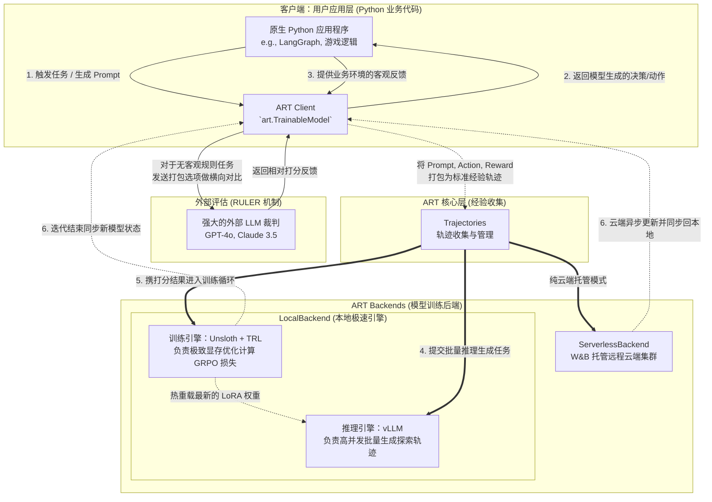

# ART (Agent Reinforcement Trainer) 项目笔记

## 1. 项目定位与核心概念

ART (Agent Reinforcement Trainer) 是由 **OpenPipe** 组织主导开发的一个开源强化学习框架。OpenPipe 是一家成立于 2023 年（YC W23）的 AI 基础设施初创公司，专注于为企业提供微调（Fine-tuning）和部署垂直领域专属 LLM 的平台，致力于让开发者能以极低的成本，用小模型取代昂贵的通用大模型。2025年9月，算力云巨头 CoreWeave 宣布收购了 OpenPipe 以增强其 AI Agent 的强化学习训练能力。
* **GitHub 项目地址**: [https://github.com/OpenPipe/ART](https://github.com/OpenPipe/ART)

其核心目标是提供一个符合人体工程学的（ergonomic）、易于集成的工具，使基于大语言模型（LLM）的智能体（Agent）能够通过**经验学习（Learn from experience）**来提升性能和可靠性。

### 1.1 什么是“经验学习”？
在 ART 中，“经验学习”指的是智能体在实际执行任务的过程中自我进化的能力。具体流程如下：
1. **探索 (Rollouts)**：针对给定的任务（场景），智能体会尝试生成多种不同的解决方案或执行轨迹（Trajectories）。
2. **评估 (Scoring)**：系统会通过自动化的方式（如内置的 RULER LLM 裁判，或开发者自定义的客观指标）对每一次尝试进行打分（分配 Reward）。
3. **优化 (Training)**：模型通过 GRPO（组相对策略优化）算法分析这些尝试。它会对比同一个任务下的不同轨迹，自动调整模型权重（LoRA），使得模型在未来更有可能采取那些获得高分的策略，并极力避免导致低分的错误行为。

简而言之，模型不再是静态地依赖预训练知识或复杂的提示词，而是像人类一样，通过不断试错和评估，动态地在特定任务上越来越精通。

### 1.2 ART 与传统 LLM 强化学习（如 RLHF）的区别
传统大模型的强化学习（如用于模型对齐的 RLHF）通常极其复杂且昂贵，而 ART 将其平民化并专门为智能体（Agent）应用场景进行了改造：
1. **无需人工标注与独立的奖励模型**：
   * **传统 RL**：需要海量的人工标注偏好数据（Human Preferences）来提前训练一个庞大的奖励模型（Reward Model），成本极高。
   * **ART**：引入了 RULER 机制，直接在训练循环中使用强大的闭源模型（如 o3, Claude 等）作为“实时裁判”进行零样本（Zero-shot）打分。这完全免去了人工标注和前置训练奖励模型的负担。
2. **算法更轻量高效 (GRPO vs PPO)**：
   * **传统 RL (PPO)**：通常需要同时在显存中加载策略模型、参考模型、奖励模型和价值网络（Critic），显存开销巨大。
   * **ART (GRPO)**：采用 GRPO 算法，通过对比同一组输入下的多个输出进行**相对评分**，从而省略了庞大的价值网络（Critic），大幅降低了计算和显存开销，使得低成本训练智能体成为可能。
3. **面向应用层而非基础模型层**：
   * **传统 RL**：通常由大模型提供商在基础模型发布前进行通用能力上的对齐（Alignment）。
   * **ART**：被设计为直接嵌入到开发者的 Python 业务代码中。你可以针对你的专有任务（例如调用企业内部数据库、操作特定的 MCP 服务器工具、执行特定的业务工作流）对开源小模型进行专项特训，从而用小模型的推理成本达到甚至超越通用巨型模型的业务表现。

## 2. 核心功能特性

### 2.1 强化学习 (RL) 与 GRPO
*   **组相对策略优化 (GRPO)**：ART 默认使用 GRPO 算法，让 LLM 尝试多次解决同一个场景（生成多个 Trajectory），通过比较这些尝试的相对奖励（Reward）来更新模型权重，强化成功的行为，抑制失败的行为。
*   **无需复杂标签数据**：只要能为任务定义明确的（客观的或通过 LLM-as-judge 评估的）奖励信号，即可进行训练。

### 2.2 RULER (Relative Universal LLM-Elicited Rewards) 与相对评分机制
*   **什么是相对评分？** 在传统的 PPO 算法中，模型需要一个独立的价值网络（Critic）来预测一个“绝对基准分”，以此来判断当前生成结果的好坏。而 GRPO（组相对策略优化）巧妙地通过在“组内比较”来消除对价值网络的依赖：对于同一个任务输入，让当前模型生成 N 个不同的执行结果（通常为 4-8 个 Trajectories）。对这 N 个结果进行打分后，算出它们的组内平均分。高于平均分的结果获得正向“相对优势（Advantage）”从而被强化，低于平均分的结果获得负向优势从而被抑制。
*   **相对评分从何而来（RULER 的工作原理）？** 对于有明确成败标准的任务（如游戏输赢），相对分数可直接由代码逻辑给出。但对于大量复杂/开放性任务，ART 提供了 RULER 机制，利用强大的模型（如 o3, Claude, GPT-4o）作为裁判生成分数，具体流程如下：
    1. **去重合并 (Deduplication)**：为了节省裁判模型的 Token 成本，ART 自动提取这 N 个轨迹中共享的上下文（如 System/User Prompt），避免重复发送。
    2. **组队送审 (Batching)**：将同一个输入下的 N 种不同智能体回复打包，一次性在同一个上下文中发给裁判 LLM。
    3. **LLM 裁判对比打分 (LLM-as-judge)**：裁判 LLM 在看到所有候选答案后进行“相对排序”。研究表明，大模型对多个结果进行横向对比和相对打分的能力，远高于给单一结果打绝对分的能力。
    4. **结构化输出**：裁判 LLM 会根据通用评估标准（Rubric，开发者也可自定义该标准）生成 JSON 格式的反馈，包含对每个轨迹的详细评语（Explanation）和 0~1 之间的具体得分（Score）。
    5. **反馈更新**：这些分数被交回给 GRPO 算法，进行上述的组内均值归一化，最终用于更新被训练模型的权重。
*   **零人工标注**：由于 RULER 实现了全自动的“生成-对比-打分”闭环，这极大地降低了编写复杂奖励函数和准备人工标注数据的门槛。

### 2.3 支持监督微调 (SFT)
*   **数据集微调**：支持从标准的 JSONL 文件（包含系统、用户、助手消息及工具调用）直接进行 SFT。
*   **模型蒸馏 (Distillation)**：可以利用强模型（如 Qwen-3 235B 或 o3）的输出，作为教师数据来训练更小、更便宜的开源模型（如 Qwen 2.5/3.6）。
*   **RL 预热**：允许先用 SFT 让模型掌握基本格式和能力，然后无缝切换到 RL 进一步优化。

### 2.4 客户端-后端分离与 Serverless RL
*   **ART Client (客户端)**：一个轻量级的对象（`art.TrainableModel`），负责与业务代码集成、执行工作流记录轨迹（Trajectory）。
*   **ART Backend (本地/云端后端)**：负责处理模型推理与权重更新。
    *   **ServerlessBackend (W&B 托管)**：针对“算力荒”与运维痛点，ART 提供了基于 W&B Training 的 Serverless RL 服务。在没有本地高端 GPU 的情况下，开发者可以直接将训练任务抛给云端共享的生产级集群。该架构通过多路复用（Multiplexing）不仅降低了约 40% 的训练成本，还彻底免除了环境配置的“基建灾难”（Infra headaches），且每次训练好的 Checkpoint 能即刻转化为在线推理 API 进行无缝部署。
    *   **LocalBackend**：适用于本地拥有充裕 GPU 算力的环境。

### 2.5 复杂 Agent 编排框架的无缝集成 (如 LangGraph)
*   **痛点突破**：传统的底层 RL 框架往往暴露出极其生硬的自建 API，极难插入到包含多步推理、重试机制或循环图逻辑的应用代码中。
*   **深度集成机制**：ART 并没有仅仅暴露一个冰冷的 OpenAI 兼容服务端点，而是专门在源码层（`src/art/langgraph/`）提供了一个带有“自动录像功能”的特制代理（Wrapper）。其工作原理如下：
    1. **接口伪装 (Runnable 代理)**：系统提供了一个 `LoggingLLM` 类（继承自 LangChain 的 `Runnable`）。对 LangGraph 而言，它看起来就像是一个普通的 `ChatOpenAI` 组件，完美原生支持 `bind_tools` 或 `with_structured_output` 等高级编排特性，开发者完全无需重写现有的状态图逻辑。
    2. **无感知的“间谍”日志追踪 (Spy Logging)**：当复杂的 Graph 在运转时，`LoggingLLM` 会在底层偷偷拦截所有的模型 `invoke` 请求，并在本地暗中记录每一次交互的完整 Prompt、模型原始输出以及当时的工具列表。
    3. **自动轨迹组装 (Trajectory Construction)**：配合 `wrap_rollout` 装饰器，当整个任务图执行结束时，ART 会自动读取刚刚录制下的散乱日志，将对话切片与函数调用智能拼装成 GRPO 算法严格要求的标准 `Trajectory`（轨迹数据）格式。这使得开发者在**零数据清洗代码**的情况下，就能让复杂的业务 Agent 在后台自我进化。

### 2.6 多平台可观测性生态 (Observability Integrations)
*   **链路追踪与 Debug**：强化学习的“黑盒”问题一直令开发者头疼。ART 除了深度集成 **W&B (Weights & Biases)** 自动记录奖励（Reward）、Loss 和算力吞吐外，还无缝支持了 **Langfuse** 和 **OpenPipe**。这使得开发者能在这些平台上直接查看每一次 Rollout 的完整“思维链路追踪（Prompt Traces）”，快速定位大模型是在哪一步调用工具出错或是产生了幻觉。

### 2.7 智能默认配置 (Intelligent Defaults)
*   **无需“炼丹”经验**：调试强化学习的超参数（如 KL 散度惩罚、PPO Clipping 阈值、学习率衰减等）常常需要极高的专业门槛。ART 内置了一套针对智能体（Agent）场景极限调优的**智能默认配置**，极大保障了训练初期的稳定性和收敛速度，使得普通的应用软件工程师即使不懂 RL 底层数学原理，也能享受“开箱即用”的模型强化红利。

### 2.8 MCP•RL (Model Context Protocol RL)
*   **工具调用自学闭环**：专门针对 MCP 协议，系统能读取任何外接 MCP 服务器的工具元数据，自动生成覆盖不同边缘场景的测试 Prompt，并通过内部的 RULER 裁判评估成效。这意味着无需人类写哪怕一条测试用例，模型就能在“沙盒”里不断摸索，自动掌握操纵未知外部工具的能力。

## 3. 系统架构与源码组成

### 3.1 架构差异：ART vs 传统基础框架 (veRL, OpenRLHF 等)
ART 与 `veRL`、`OpenRLHF` 或 `TRL` 等致力于**基础模型大规模分布式对齐**的底层基础设施框架，存在着显著的架构差异：ART 是一个**面向应用层 (Application-layer)** 的框架。

传统的底层 RL 框架通常要求开发者将业务逻辑重写并强行塞进他们庞大、复杂的分布式训练循环中（需要严格配置 Actor/Critic 节点与并行通信策略）。而 ART 采用了轻量级的**“客户端-后端分离”**架构：允许开发者在现有的原生 Python 应用（如 LangGraph 工作流、Web 后端服务、游戏逻辑）中无缝插入智能体客户端（Client），并在不干扰业务主流程的情况下，将沉重的“推理生成”、“经验收集”与“权重更新”卸载到本地或云端的训练后端（Backend）完成。

### 3.2 系统核心引擎：极致的训推分离组合
ART 的本地训练后端（LocalBackend）采用了一套业内公认的极致性能组合，将“推理生成”与“模型训练”功能解耦并无缝对接：
1. **推理引擎 (Inference/Rollout) —— vLLM**：强化学习（特别是 GRPO）需要针对同一输入快速生成多条回答。ART 会在后台接管一个专属的 vLLM 进程，凭借其强大的 PagedAttention 机制与吞吐量，以极速完成批量的轨迹探索（Rollout）。
2. **训练引擎 (Training/Update)**：探索打分完毕后，引擎切换并执行 GRPO 权重更新。针对不同算力规模，ART 提供了两套深度支持的训练引擎方案：
   * **单卡/轻量级引擎 (Unsloth + TRL)**：默认深度集成 Unsloth，实现极低的显存消耗和极快的 LoRA 反向传播速度，让普通开发者在消费级显卡（如 RTX 4090）上训练数十亿参数模型成为可能。
   * **多机/超算级引擎 (Megatron-LM)**：针对超大模型或多机多卡的超算集群，系统提供原生的第一方 Megatron 支持。它不仅拥有与 `LocalBackend` 平级的独立底层架构（`src/art/megatron/`），还通过专有的 `MegatronRuntimeConfig` 类和一键可选依赖包（`megatron-bridge` 等），允许开发者在同一套应用框架内无缝切换至工业级的 Megatron 集群。

以下是展示了训推解耦与经验流转的整体系统运作架构图：

### 3.3 源码目录结构

项目代码主要集中在 `src/art` 目录下，大量采用了面向协议的设计（Protocol-oriented design），以支持上述客户端与不同运行后端的解耦：

*   **`src/art/model.py`**：定义了客户端的核心类 `TrainableModel` 和 `Model`，负责连接 OpenAI API 客户端、收集轨迹信息并触发后端的训练流程。
*   **`src/art/backend.py`**：定义了 `Backend` 协议（Protocol），统一了本地和云端后端的接口规范（如 `register`, `train`, `_train_sft` 等）。
*   **`src/art/local/`**：包含了 `LocalBackend` 的具体实现，主要依赖于本地环境的 vLLM、Unsloth / torchtune 等进行推理和权重更新。
*   **`src/art/serverless/`**：包含了 `ServerlessBackend` 的实现，主要与 W&B 的远程训练服务进行通信和任务下发。
*   **`src/art/trajectories.py`**：核心数据结构。定义了 `Trajectory` (记录单次 Rollout 的消息、选择、工具和奖励) 和 `TrajectoryGroup` (包含多个 Trajectory，用于 GRPO 的按组对比更新)。
*   **`src/art/rewards/`**：包含了奖励相关的实现，特别是 `ruler.py`，实现了与各种 LLM 裁判的交互，并依据内置的通用评估标准（Rubric）给模型行为打分。
*   **`src/art/types.py`**：定义了各种关键的数据类型、模型配置项 (如 `TrainConfig`, `TrainSFTConfig`, `MegatronRuntimeConfig` 等) 以及返回结果结构。
*   **`src/art/mcp/`**：提供了与 MCP 集成的工具，例如 `generate_scenarios` 等辅助函数，用于快速建立 MCP 训练流程。
*   **`pyproject.toml`**：使用 hatch 构建，依赖包括 `openai`, `litellm`, `polars` 等基础库，并通过 optional-dependencies (`backend`, `megatron`, `langgraph`, `tinker`) 进行了详细的模块化依赖管理。
*   **`docs/` & `examples/`**：包含了非常详细的 MDX 格式文档和覆盖多个应用场景（如 2048, 井字棋, 邮件助手, MCP 工具等）的代码样例和 Notebooks。

## 4. 应用实践与场景 Demo

为了展示“经验学习”的实际效果，ART 项目在 `examples/` 目录以及官方提供的 Notebook 中提供了大量丰富的 Demo 和应用实践。这些案例证明了即使是小模型（如 Qwen 2.5 3B/7B 等），通过针对性训练也能在垂直任务上达到 SOTA（行业领先）表现。

**核心评估机制：两条腿走路**
值得注意的是，ART 的应用实践并没有单一地依赖某种反馈机制，而是根据任务类型采用了互补的两种奖励评估（Reward）方式：
1. **开放性任务依托 LLM-as-Judge (RULER)**：对于缺乏绝对标准答案、过程复杂的任务（如邮件搜索规划、未知 MCP 工具探索、文本摘要生成等），代码难以直接判定好坏。此时利用 o3 / Claude 等强模型作为裁判进行打分，是获取经验和奖励信号的最优解。
2. **确定性任务依托客观代码规则 (Code Environment)**：对于具有明确规则边界、成败一目了然的任务（如 2048、井字棋等游戏或时间解谜），ART 完全不使用大模型裁判，而是直接从代码环境中获取绝对客观的反馈（如游戏分数、胜负状态）。这种零 API 成本且绝对精确的反馈机制，是促使模型通过“自我博弈 (Self-play)”自发涌现高阶逻辑推理能力的核心。

以下是本项目提供的核心 Demo 及其通过经验学习所获取的收益总结表：

| 场景 Demo | 任务类别 | 奖励评估方式 | 经验学习带来的主要收益 (SOTA 表现) |
| :--- | :--- | :--- | :--- |
| **ART•E (Email Agent)** | 复杂工具调用 / 工作流 | RULER (LLM 裁判) | 小参数模型 (如 Qwen 14B) 在该垂直检索任务上超越 OpenAI o3，掌握了精准搜索与多步规划。 |
| **MCP•RL** | 未知 API 与工具使用 | RULER (LLM 裁判) | 实现了**零人工数据**训练。模型靠纯粹的探索和裁判打分，掌握了陌生 MCP 服务器的交互协议。 |
| **2048 游戏** | 逻辑推理 (长期规划) | 代码判定 (游戏得分) | 模型学会了长远规划与数字逻辑优化。展示了低门槛利用 Serverless GPU 获得经验的流程。 |
| **Tic Tac Toe (井字棋)**| 逻辑推理 (多轮博弈) | 代码判定 (游戏胜负) | 结合“自我博弈(Self-play)”，模型在无外界棋谱知识输入的情况下，通过不断试错自行领悟了必不败策略。 |
| **Codenames (代号桌游)**| 语义推理与联想 | 代码判定 (游戏胜负) | 极大提升了模型在词汇联想、多轮对抗对话和模糊语义推理方面的表现。 |
| **Temporal Clue** | 逻辑推理 (时间线索) | 代码判定 (解谜成败) | 针对性增强了模型处理具有复杂时间逻辑和依赖关系谜题的能力。 |
| **AutoRL [RULER]** | 零数据自我进化 | RULER (LLM 裁判) | 开创“零数据训练任意任务”范式。模型仅凭自动生成的提示词盲目试错，靠 RULER 纠正，最终学会任务。 |
| **Summarizer (摘要)** | 复合实践 (SFT + RL) | 自动指标 / RULER | 打通工业级训练链路：先通过 SFT 掌握格式规范，再通过 RL 的经验摸索逼近完美的文本摘要质量。 |
| **模型蒸馏 Distillation**| SFT (教师经验转移)| (匹配教师答案) | 将大模型 (235B) 成功执行的经验“传授”给小模型 (27B)，以极低推理成本获得高级 Text-to-SQL 能力。 |

### 4.1 工具调用与复杂工作流类
*   **ART•E (Email Agent) 邮件助手**：
    *   **场景**：训练模型成为一个能够查询和搜索电子邮件的智能体。
    *   **实践**：结合了 RULER 评估，通过多次让模型尝试使用搜索工具检索邮件。经过训练的小模型（如 Qwen 2.5 14B）在该垂直任务上的准确率甚至超越了 OpenAI 的 o3。该案例还展示了如何将 ART 训练无缝集成到 **LangGraph** 等多步智能体工作流框架中。
*   **MCP•RL (Model Context Protocol RL)**：
    *   **场景**：教导模型如何熟练掌握任意未知的 MCP 服务器工具。
    *   **实践**：完全不需要人工标注数据，ART 会自动探测目标 MCP 服务器的工具列表并生成模拟场景。模型在场景中尝试调用 API 解决问题，由 RULER 根据执行结果进行打分反馈。最终模型能学会如何在特定场景下正确、有效地搭配使用各种第三方工具。

### 4.2 逻辑推理与游戏类 (代码级明确奖励)
在这些任务中，由于成败和规则是确定的，系统不依赖 LLM 裁判，而是直接通过代码环境返回客观的 Reward（赢了得分，输了或违规扣分）。
*   **2048 (Serverless 演示)**：训练模型玩 2048 游戏，学习长远规划能力。这也是一个零门槛体验云端 Serverless RL 训练的绝佳入门教程。
*   **Tic Tac Toe (井字棋)**：包含了与基础规则引擎对弈，以及进阶的“自我博弈（Self-play）”演示。模型在不断的试错和对局经验中，自己领悟出必不败的策略。
*   **Codenames (机密代号)**：一款基于词汇联想的桌游，训练模型在语言推理、词义联想和多轮对话中的表现。
*   **Temporal Clue (时间线索)**：训练模型解决具有复杂时间逻辑依赖关系的谜题，增强其在时间序列上的推理能力。

### 4.3 零数据自我进化 (AutoRL)
*   **AutoRL [RULER]**：这是一个极具潜力的前沿实践。在没有任何人类标注答案的数据集的情况下，系统通过自动生成任务 Prompt，让模型进行无脑尝试，随后使用 RULER (LLM 裁判) 的评估结果作为经验进行 GRPO 训练。这实现了真正的**“零数据训练任意任务（Zero-Data Training for Any Task）”**。

### 4.4 SFT 结合 RL 的复合实践
*   **Summarizer (SFT + RL 摘要助手)**：展示了标准的生产级训练流程。首先用少量高质量数据进行监督微调（SFT 预热），使模型掌握摘要的基本格式要求；然后直接无缝切换到强化学习（RL）阶段，利用特定的奖励指标进一步逼近完美的摘要质量。
*   **Distillation (模型蒸馏)**：演示了如何将超大模型（如 Qwen 3 235B）成功执行的轨迹作为“教师经验”，通过 SFT 传授给小模型（如 Qwen 3.6 27B），从而以极低的日常推理成本实现高级别的任务能力（如 text-to-SQL）。

## 5. 学术与理论支撑

ART 框架中“经验学习”的设计并非凭空捏造，而是紧密结合了近年来大语言模型（LLM）强化学习领域的最前沿学术突破：

### 5.1 GRPO (组相对策略优化) 算法
ART 摒弃了传统 RLHF 中广泛使用的 PPO (Proximal Policy Optimization) 算法，转而采用 **GRPO (Group Relative Policy Optimization)**。
*   **学术出处**：GRPO 算法最初由 DeepSeek 团队提出（详见论文 *DeepSeekMath: Pushing the Limits of Mathematical Reasoning in Open Language Models*），并且是驱动近期爆火的推理模型 **DeepSeek-R1** 自我进化的核心算法。
*   **理论支撑**：相较于 PPO，GRPO 的重大理论突破在于**无需依赖庞大的 Critic (价值网络) 模型**。它通过针对同一输入生成多组候选输出，直接在组内比较相对得分来估算 Advantage (优势函数)。这不仅在数学期望上是无偏的，更在工程上极大节省了显存，为 ART 在有限算力下训练智能体提供了坚实的基础。

### 5.2 RULER 机制的详尽原理与多重学术渊源
ART 处理复杂开放性任务的核心是 RULER (Relative Universal LLM-Elicited Rewards) 机制。它绝非单纯套用某清单一论文，而是结合了强化学习前沿的多项“学术组合拳”：

1. **基础基石：LLM-as-a-Judge (大模型裁判)**
   * **学术出处**：基于《*Judging LLM-as-a-Judge with MT-Bench and Chatbot Arena*》等经典研究。
   * **原理应用**：证明了当代最强闭源模型（如 GPT-4o, Claude 3.5）的逻辑判断能力已高度对齐人类偏好。RULER 利用这一理论，直接让高级 LLM 取代人工标注员（Human annotators）来生成奖励信号。
2. **准确度跃升：列表对比排序法 (Listwise / Pairwise Ranking)**
   * **痛点突破**：早期的裁判模型往往被要求给出“绝对分数”（如打 1~10 分），但学术界发现大模型的绝对打分存在严重的校准偏差（Calibration issue）。后续多篇论文（如《*Large Language Models are Effective Text Rankers*》）指出，LLM 执行“横向对比排序（Relative Ranking）”的稳定性远超绝对打分。
   * **RULER 的详尽原理**：RULER 巧妙应用了这一理论。它将同一个 Prompt 下当前模型生成的 4~8 个不同执行轨迹（Trajectories）“打包去重”，一次性发给裁判模型。裁判模型在同一个上下文中同时审视这些候选答案进行横向比较，依据通用评估标准（Rubric）输出带有详细解释（Explanation）的相对得分。这种“货比三家”的打分机制，极大地提高了分数的可靠性。
     > [!NOTE]
     > **成本节约工程原理（去重合并机制）**
     > 为什么“打包去重”能极大节约 Token？在 Agent 场景中，任务的 Prompt 往往包含冗长庞大的背景知识（如长达 10,000 字的工具描述或长文档）。如果裁判模型对 N 个回答进行独立的逐一打分，则需要将这 10,000 字发送 N 次，导致极其昂贵的 `N * Context + Sum(Response)` API 开销。
     > 而 ART 的工程实现会自动提取这段共享背景并只向裁判发送一次，随后附上选项 A 到 H 供模型比对。输入开销瞬间降至 `1 * Context + Sum(Response)`。当一组轨迹 N=8 时，这种自动的上下文去重通常能为开发者直接节省高达 85% 以上的裁判大模型调用成本。
3. **闭环范式：AI 反馈强化学习 (RLAIF: RL from AI Feedback)**
   * **学术出处**：来自 Google 和 Anthropic 的研究证明（如《*RLAIF: Scaling Reinforcement Learning from Human Feedback with AI Feedback*》）。
   * **原理应用**：RULER 实现了彻底的 RLAIF 范式，将极其昂贵、迭代缓慢的 RLHF（人类反馈）转化为全自动化、零成本、高并发的 AI 自动化评估循环。
4. **与 GRPO 的数学完美咬合**
   * GRPO 的数学推导并不需要知道绝对的好坏，只关心模型生成的某个答案**“是否比同一组内的平均水平更好”（Advantage 优势函数）**。RULER 设计的“相对对比评分”，天生就是为了向 GRPO 提供组内的 Advantage 分布，两者在理论底层严密咬合，构成了 ART 高效训练的底座。

### 5.3 自我博弈 (Self-Play) 与零数据进化
*   **学术出处**：在 ART 的井字棋演示以及前沿的 AutoRL 实践中，运用了**自我博弈**与零数据探索的理念。这些理念可追溯到强化学习领域的经典论文（如 DeepMind 的 *Mastering the game of Go without human knowledge (AlphaGo Zero)*）。
*   **理论支撑**：只要环境能提供清晰的规则反馈（如 API 调用是否成功、代码是否报错、游戏胜负），智能体就能够在纯强化学习的驱动下，通过自我对抗和随机探索，实现高阶能力的“涌现（Emergent Abilities）”，彻底摆脱对人类先验数据集（SFT 数据）的依赖。