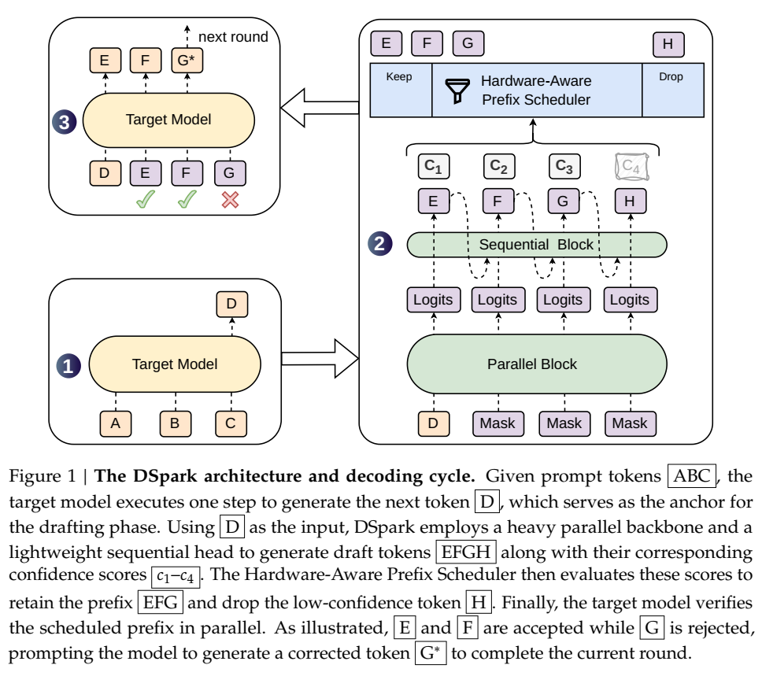
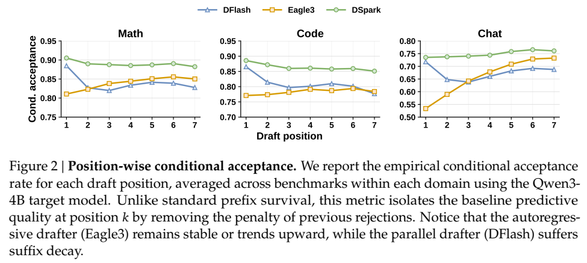
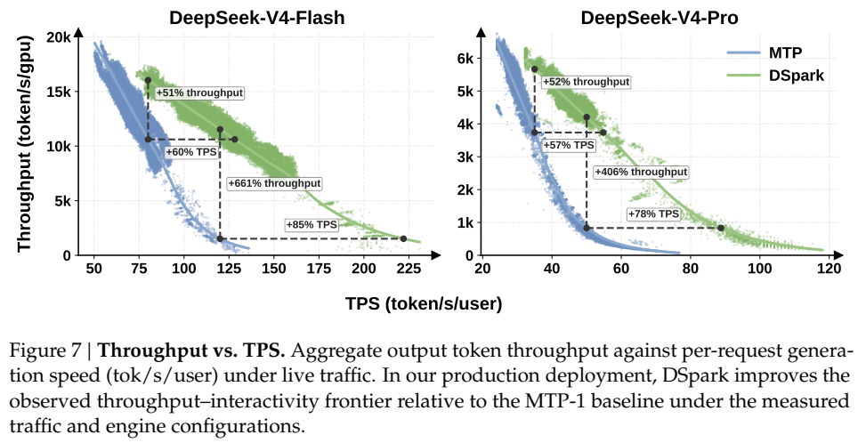
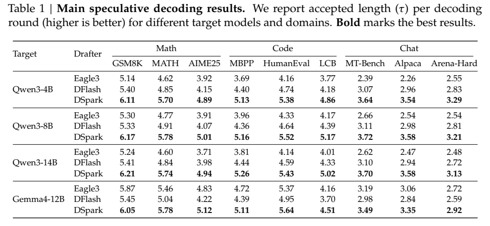

# 论文笔记：DSpark

**DSpark: Confidence-Scheduled Speculative Decoding with Semi-Autoregressive Generation (2026)**
* **ArXiv 论文**: [https://arxiv.org/abs/2607.05147](https://arxiv.org/abs/2607.05147)
* **GitHub 代码**: [DeepSeek-AI / DeepSpec](https://github.com/deepseek-ai/DeepSpec) (官方推测解码训练仓库)

> **核心摘要**：DSpark 是 DeepSeek 团队提出的一种推测解码 (Speculative Decoding) 框架。
> 它将**半自回归生成**与**置信度调度验证**相结合，成功解决了高并发下的推理瓶颈。

---

## 1. 痛点与破局思路

大模型推理时因逐个生成 Token，导致延迟高、GPU 访存受限。
推测解码通过轻量级草稿模型 (Draft Model) 预测“块” (即多个连续 Token)，再由目标模型并行验证，从而加速推理。
其单 Token 延迟公式为 $L=\frac{T_{draft}+T_{verify}}{\tau}$ ($\tau$ 为接受数)。
要实现最大加速，必须同时提升 $\tau$ 并降低 $T_{draft}$，但这在以往架构中存在矛盾：

1. **自回归草稿模型（如 Eagle3）**
   * **特点**：通过前置 Token 逐步预测，连贯性好，接受率 $\tau$ 高。
   * **痛点**：内部串行计算，延迟随块大小线性增长 ($O(\gamma)$)，只能使用极短的草稿块。
2. **并行草稿模型（如 DFlash）**
   * **特点**：单次前向传播 (One Forward Pass) 即可输出所有特征，延迟极低 ($O(1)$)。
   * **痛点**：由于各位置独立预测，极易引发“多模态碰撞”(如拼错词汇)，导致后缀质量断崖式衰减。
   * **浪费**：高并发下，目标模型验证这些低质量草稿会白白浪费 GPU 容量，拖累整体吞吐量。

> **注**：DFlash 为 UC San Diego 2026 年发布的研究成果。DSpark 沿用了其并行主干架构并进行了创新。

---

## 2. 结合架构图：DSpark 工作流全景解析

在深入探讨各项底层技术细节之前，我们先以“总-分”的视角，直观了解这些模块是如何协同工作的。



上图（Figure 1）完整展示了 DSpark 在一个推测解码周期内的全部工作流。宏观来看，可以清晰地分为三个关键阶段：**锚点生成**、**DSpark 草稿生成与调度**，以及**目标模型验证**。

为了更透彻地展示草稿生成内部的计算链路，我们在图 1 的基础上补充了如下的微观流程图：

```text
anchor「D」+ (γ-1) 个 mask 占位                target 选定层隐状态 (如[1,9,17...])
            │                                              │ 拼接后过 fc 降维
            ▼                                              │
   Embedding（冻结，target 的）                            │
            │                                              │
            ▼                                              │
   ┌───────────────────────────────────────────┐          │
   │  并行骨干（5 层，训练）   ◄── KV 注入 ────────┘
   │  一次前向，块内双向交互                      │
   └───────────────────────────────────────────┘
            │ 
            ▼ 输出隐状态 h_1 .. h_γ
            ├─────────────────────────────────────────────┐
            ▼                                             │
   LM head（冻结）：h_k ──► 基础 logits U_k               │ (h_k)
            │                                             ▼
   ┌────────▼──────────────────────────────────┐ ┌────────────────┐
   │ 串行块 (Sequential Block)                 │ │   置信度头     │
   │ 序列头：U_k + 偏置 B_k ◄──(依赖)── x_{k-1} ├─►│预测条件概率 c_k│
   └────────┬──────────────────────────────────┘ └────────────────┘
            ▼
   softmax ──► 逐位采样 ──► E F G H
```

### 阶段一：目标模型提供锚点 (Step 1)
在推测周期的开头，目标模型基于当前的 Prompt（图中的 `A B C`）执行一次常规的前向传播，生成下一个 Token `D`。这个 `D` 将作为后续草稿生成的**锚点 (Anchor)**。

### 阶段二：DSpark 草稿生成与置信度调度 (Step 2)
这是整个 DSpark 框架的核心，对应图中中间蓝绿色背景的部分。它融合了后续章节将详细拆解的“半自回归生成”和“置信度调度”两大技术：

* **输入与特征提取**：将上一步生成的锚点 `D` 作为首个预测位置，加上 $\gamma - 1$ 个 Mask 占位符。同时进行**上下文特征注入**：
  * **抽取与降维**：实际抽取的是目标模型若干指定层（如 `[1,9,17,25,33]`）的**隐藏状态 (Hidden States)**，而非目标模型本身的 KV Cache。这些多层特征被拼接后，通过一个全连接层 (FC) 降维投影到草稿模型的特征空间。
  * **KV 注入 (KV Injection)**：降维后的历史上下文特征被转换为 Key 和 Value，在计算注意力时与草稿块内的 Token 拼接。其**目的**在于：草稿模型本身的输入极短（仅 1 个真正的词 Anchor + 若干空的 Mask），它自身完全不知道更早期的长文本。通过 KV 注入，它直接“白嫖”了目标模型已经计算好的“历史长文本深度理解记忆”，从而能瞬间“知悉”前文内容，站在巨人的肩膀上做出精准预测，避免了闭门造车。
* **并行主干计算 (Parallel Block)**：草稿模型复用冻结的 Embedding 层，通过 5 层的并行骨干网络，一次前向传播输出所有位置的隐状态 $h_1 \dots h_\gamma$。此时经由 LM Head 产生了独立的基础对数概率 $U_k$。
* **序列修正与采样 (Sequential Block)**：串行头将依赖已采样前缀的偏置 $B_k$ 叠加在 $U_k$ 上，从左至右逐位采样出草稿 Token `E F G H`，巧妙化解了并行生成极易出现的多模态碰撞。
* **置信度计算与硬件感知前缀调度 (Hardware-Aware Prefix Scheduler)**：这是 Figure 1 右上角那个漏斗图标代表的核心组件。
  * **关键细节**：首先，底层的置信度头不仅接收隐状态 $h_k$，还强依赖串行采样的前一个词特征 $W_1[x_{k-1}]$，从而精准预测出每个草稿 Token 的条件存活概率 $c_1 \dots c_4$。
  * **动态截断机制**：得到概率后，就轮到 **硬件感知前缀调度器 (Hardware-Aware Prefix Scheduler)** 出场了。它就像一个精算师，会结合当前 GPU 引擎的真实负载情况（算力成本表），评估“多验证一个词是否划算”。在图中，它经过计算发现：保留前缀 `E F G` 能最大化系统整体吞吐量；而继续验证低置信度的 `H` 必定亏本（被目标模型拒绝的概率太高，白白占用了昂贵的验证算力槽位）。因此，调度器果断将 `H` 拦截并丢弃（执行 Drop 行动），最终只向目标模型提交精简后的高优草稿 `E F G`。

### 阶段三：目标模型并行验证 (Step 3)
在收到精简后的高优草稿 `E F G` 后，目标模型执行一次并行前向传播进行验证：
* 图中显示，`E` 和 `F` 被成功接受（打勾）。
* `G` 由于不符合目标模型的分布被拒绝（打叉）。
* 无论拒绝与否，目标模型都会在这个周期末尾免费生成一个正确的补偿 Token `G*`，从而完成当前轮次的解码，并将 `G*` 作为下一轮的 Anchor 开始新的循环。

通过这张图可以直观地看出，**DSpark 一方面用轻量串行头保住了极速生成的草稿质量，另一方面用调度器像“剪枝”一样砍掉了无用草稿**，最终达成了推测解码系统效率的最优解。

---

## 3. 核心技术一：半自回归生成 (深度拆解)

为了兼顾并行模型的“快”与自回归模型的“准”，DSpark 采用了**半自回归**设计。
它将草稿生成解耦为两个阶段，巧妙化解了 DFlash 的多模态碰撞与尾部退化问题：

* **阶段一：并行主干 (Parallel Stage)**
  采用深层并行网络进行一次完整前向传播。这确保了绝大部分计算保持 $O(1)$ 的极低延迟。主干网络分别在“特征空间”和“词表空间”产生输出：
  * **隐藏状态 (Hidden States) $h_{k} \in \mathbb{R}^{d}$**：包含块内第 $k$ 个位置的高维语义特征。主干计算时进行了双向注意力交互并注入了目标模型历史上下文 (KV Injection)，因此 $h_k$ 融合了历史及全局信息，代表该位置的“语义潜力”，是后续计算偏置或置信度的核心依据。
  * **基础对数概率 (Base Logits) $U_{k} \in \mathbb{R}^{V}$**：由 $h_{k}$ 经 LM Head 线性投影得到的未归一化得分。它代表主干网络对该位置**独立给出的候选词概率预测**。其核心缺陷在于仅包含边缘概率信息，因不知晓前置位置究竟生成了什么词，混合了多种可能的分支，从而引发了多模态碰撞。
* **阶段二：串行补充 (Sequential Stage)**
  在主干产生基础概率 $U_k$ 后，DSpark 拼接了一个极轻量级的串行输出头。它的任务是为每一个位置注入**局部转移偏置 (Transition Bias) $B_{k}$**。
  这允许当前的预测概率能够严格条件依赖于前一个**刚刚被实际采样出**的 Token，从而建立因果连贯性：
  $$p_{k}(v\vert{}x_{0},x_{<k})=\frac{exp(U_{k}(v)+B_{k}(x_{0},x_{<k},v))}{\sum_{u\in V}exp(U_{k}(u)+B_{k}(x_{0},x_{<k},u))}$$

**局部转移偏置是怎么来的？（以默认的 Markov Head 为例）**
首先明确一个概念，公式中的 **$V$ 代表词表大小 (Vocabulary Size)**（在现代大模型中通常是十万级别），而不是草稿块的长度（草稿块的长度通常用 $\gamma$ 表示，一般只有 5~16）。
为了兼顾速度与效果，DSpark 假设当前词仅依赖前一个词（马尔可夫假设）。原则上，记录词汇表中任意两个词之间的因果转移关系需要一个庞大的 $V \times V$ 矩阵。但 DSpark 将其设定为**草稿模型内部专属的可训练参数**，并通过**低秩矩阵分解 (Low-Rank Factorization)** 极大地压缩了参数规模与计算量：
$$B_{k}(x_{k-1}, \cdot) = W_{1}[x_{k-1}]W_{2} \in \mathbb{R}^{V}$$
* **$x_{k-1}$ 的维度**：它是前一步真正采样出的离散 Token。在编程实现中，它是一个标量（该词在词汇表中的 Integer 索引）；在严格的数学推导中，它等效为一个维度为 $1 \times V$ 的 **One-Hot 向量**。
* **$W_{1} \in \mathbb{R}^{V \times r}$**：这是 DSpark 串行头在训练中学习出的微型 Embedding 查找表参数。注意，公式里的中括号 $[x_{k-1}]$ 表示的是 **索引查找 (Lookup)** 操作（等效于 $1 \times V$ 的 One-Hot 向量直接乘以 $W_1$ 矩阵）。这个操作会瞬间抽出 $W_1$ 中对应词汇的那一行，得到一个 $1 \times r$ 的低维记忆特征。
* **$W_{2} \in \mathbb{R}^{r \times V}$**：这是 DSpark 学习出来的配套 Logit 投影层参数（默认秩 $r=256$）。前面提取出的 $1 \times r$ 的特征向量再与 $W_2$ 相乘，就会重新投射回 $1 \times V$ 的维度，形成对整个十万级词表的偏置打分。
总而言之，偏置 $B_k$ 的底层知识就是储存在这两个通过学习得来的矩阵 $W_1$ 和 $W_2$ 中的。通过低秩分解，它巧妙地避开了巨大的 $V \times V$ 矩阵计算，使这部分额外串行开销几乎可以忽略不计。

**引入局部转移偏置的核心目的：**
其根本目的是为了**消除多模态碰撞 (Multi-modal Collision)，挽救后缀质量断崖式衰减**。
因为阶段一的并行主干是各位置独立预测的（只输出边缘概率），如果上下文既可以接 “of course” 又可以接 “no problem”，并行主干可能会杂糅出 “of problem” 这种错误组合。
当引入偏置 $B_{k}$ 后，如果在 $k-1$ 位置实际采样出了 “of”，转移偏置 $B_{k}$ 就会利用低秩矩阵的记忆，强行在第 $k$ 个位置为 “course” 加分（Boost），并为 “problem” 减分（Suppress），从而用极小的计算代价恢复了序列的因果连贯性，大幅提升了长草稿块的最终接受率。

**进阶探讨：为什么不用更强的 RNN Head？**
原论文中其实还提出了能够记忆长程前缀的 **RNN Head**（通过门控机制更新隐藏状态 $s_k$）。虽然在极大块长（如 $\gamma=15$）下，RNN Head 能比 Markov 带来微弱的额外收益，但考虑到其实现复杂度高、部署性价比低，DSpark 最终在生产中默认采用了“一点点自回归就足够惊艳”的 Markov Head。

---

## 4. 核心技术二：置信度调度的验证 (深度拆解)

针对长草稿引发的“验证浪费”，DSpark 提出**动态前缀调度机制**。
系统只将目标模型的计算资源，投入到具有正期望收益的 Token 上。

* **置信度头与存活概率预测 (Confidence Head)**
  存活概率 $c_{k}\in(0,1)$ 的核心作用是告诉调度器：“假设前面所有的 Token 都被接受了，当前第 $k$ 个 Token 还能存活的概率有多大？” 
  为了实现这一目标，DSpark 在网络架构和损失函数上做了极其巧妙的设计：
  * **预测机制**：使用一个极轻量的线性投影配合 Sigmoid 激活实现：
    $$c_{k}=\sigma(w^{\top}[h_{k};W_{1}[x_{k-1}]])$$
    输入特征拼接了 $h_{k}$（来自并行主干的语义潜力）和 $W_{1}[x_{k-1}]$（来自串行头的前一个草稿词马尔可夫嵌入）。这两者的结合赋予了 $c_k$ 严格的上下文条件感知能力。
  * **软标签构造 (Soft Label)**：模型并没有用 0 或 1 作为硬标签，而是使用**分析每步接受率** $c_{k}^{*}$ 作为去拟合的标准答案。它由草稿与目标分布的“总变差距离”决定：
    $$c_{k}^{*}=1-\frac{1}{2}\vert{}\vert{}p_{k}^{d}-p_{k}^{t}\vert{}\vert{}_{1}$$
  * **监督训练与权重**：使用二元交叉熵损失 $\mathcal{L}_{conf}$ 对其进行训练：
    $$\mathcal{L}_{conf}=-\sum_{k=1}^{\gamma}w_{k}[c_{k}^{*}\log c_{k}+(1-c_{k}^{*})\log(1-c_{k})]$$
    值得注意的是，公式中加入了一个按位置衰减的权重 $w_{k}=\exp(-(k-1)/\gamma)$。因为在严格的前缀匹配规则下，排在前面的 Token 极为关键（一旦出错后续全废），该权重强制模型重点关注块前端的预测精度。
* **顺序温度缩放 (STS) 事后校准**
  虽然置信度头能分清 Token 优劣，但神经网络普遍存在**过度自信 (Overconfidence)** 的毛病，预测绝对值往往偏高。
  为此，DSpark 引入了 STS 事后校准：由于前缀被接受的概率是条件概率的累积乘积 $\prod_{i\le k}c_{i}$，DSpark 的校准并不是简单的全局缩放。它在一个独立的验证集上，**从左至右逐位执行 1D 网格搜索 (1D grid search)**。
  该操作不仅能最小化期望校准误差 (ECE)，而且是严格“保序”的：它在不破坏原有模型预估排序的前提下，将联合概率精确压回经验接受率的真实水平（将 ECE 从 3~8% 骤降至 ~1%），从而为调度器提供绝对可靠的数学期望依据。
* **硬件感知前缀调度 (Hardware-Aware Scheduler)**
  调度的全局优化目标是最大化吞吐量 $\Theta=\tau\cdot SPS(B)$。
  $SPS(B)$ 是目标模型在 Batch Size $B$ 下的执行步数（硬件容量曲线）。
  调度器将草稿 Token 按累积存活概率降序加入验证 Batch。
  一旦边际收益导致 $\Theta$ 下降，即触发**早停 (Early-Stopping)**，精准截断无用 Token。
  * **“早停”不仅仅是为了省算力，更是为了保“无损 (Lossless)”的底线**：论文附录 A 用严格的数学反例证明：如果调度器为了追求更高吞吐量而在决定当前长度时，“偷看”了后续可能生成的具体 Token 甚至其置信度，就会引入**选择偏差 (Selection Bias)**，导致最终生成的文本偏离目标模型的原生分布。因此，遇到吞吐量下降立刻早停，实际上是建立了一道因果屏障，彻底隔离未来信息，死死守住了推测解码“输出质量 100% 无损”的承诺。
* **零开销调度 (ZOS) 异步落地**
  由于底层 ZOS 要求提前确定 Batch Size，DSpark 使用前两步的置信度历史预测来估算容量。
  在执行层将变长 Token 拍平，仅通过稀疏注意力标记依赖，实现零开销的变长验证路由。

---

## 5. 模型来源与训练机制

DSpark 并非与目标模型（如 DeepSeek-V4）进行传统的协同训练。在整个训练过程中，**目标模型完全冻结 (Frozen)**，仅作为“导师”提供监督信号。但要真正跑通这套“寄生式”训练，不仅涉及极其精细的数据工程，还面临着严峻的底层分布式通信挑战。

### 5.1 数据工程与知识蒸馏
训练 DSpark 绝非“随便拿个开源数据集跑一下”那么简单。系统必须经过以下核心数据工程环节：
* **数据集选择 (混合通用训练)**：为了让草稿模型能应对各种场景，论文选用了开源的高质量通用指令集 **Open-PerfectBlend** (130 万样本)。其领域配比经过精心调配：包含数学(39.4%)、代码(38.9%)、日常对话(17.6%)等，以保证模型在结构化和非结构化任务上都有足够的泛化能力。
* **目标模型重生成 (核心知识蒸馏)**：**绝对不能直接使用开源数据集自带的回答 (Responses)**！在构建训练集时，只能提取 Prompt，然后**必须使用你的目标模型（例如 Qwen3.6 等）重新生成一遍完整的回答**。因为投机解码的核心是“模仿目标模型的输出概率分布”，如果直接用 Ground Truth 训练，DSpark 学到的只是数据集的原本分布，这会导致实际推理时出现严重的分布不匹配，遭到目标模型的大量拒绝。

### 5.2 物理排布与系统级优化
在得到目标模型重生成的纯净数据后，送入 GPU 训练前还需要进行特殊的系统层排布：
* **锚点采样与序列打包**：系统会从目标模型生成的长序列中随机抽取多个“锚点位置”，截取长度为 $\gamma$ 的连续 Token 形成训练块。为了避免这些孤立短块引发大量无效的 Padding（填充），极大浪费算力，工程团队采用了 **锚点绑定序列打包 (Anchor-bounded sequence packing)** 技术，将它们紧密打包进密集的 Batch 中。
* **注意力掩码工程**：为了确保同一个 Batch 里被强制打包的各个草稿块互不干扰，系统直接抛弃了标准的 2D 掩码，转而使用 Token 级别的注意力索引 (Attention Indices) 来管理打包结构，在维持精确因果掩码的同时极大节省了显存。

### 5.3 核心参数冻结与更新策略
DSpark 采用了极高资源利用率的“寄生式”训练策略，下表详细梳理了哪些参数被完全冻结，哪些是被更新训练的专属层：

| 组件归属 | 具体模块 / 网络层 | 状态 | 设计考量 / 目的 |
| :--- | :--- | :---: | :--- |
| **目标模型 (Target)** | 整个 Transformer 骨干网络 (所有 Transformer 块) | ❄️ **冻结** | 仅作为“导师”提供隐状态 (KV Injection) 和全词表分布的监督信号。 |
| **共享层 (Shared)** | 词嵌入层 (Embedding Layer) | ❄️ **冻结** | 直接复用目标模型 Embedding，确保草稿模型的特征输入空间完美对齐。 |
| **共享层 (Shared)** | 语言模型头 (LM Head) | ❄️ **冻结** | 确保草稿输出的基础 Logits ($U_k$) 与目标模型的词表空间严格一致。 |
| **DSpark 专属层** | 并行主干网络 (Parallel Backbone) | 🔥 **更新** | 学习如何基于输入的 Anchor 及目标模型的历史隐状态，并行预测连续的草稿块。 |
| **DSpark 专属层** | 串行采样头 (Sequential Head, 如 $W_1, W_2$) | 🔥 **更新** | 学习序列相邻词之间的因果转移偏置，消除并行预测造成的多模态碰撞。 |
| **DSpark 专属层** | 置信度头 (Confidence Head) | 🔥 **更新** | 专门学习拟合真实的存活概率 $c_k$，为后续的硬件感知调度器提供截断依据。 |

### 5.4 监督目标与隐状态通信壁垒
* **三大核心损失函数 (Loss)**
  因推测解码的接受率取决于草稿与目标的相似度，DSpark 高度依赖目标分布进行监督，计算时均施加按位置衰减的权重 $w_k$，优先保障靠前 Token 的质量：
  1. **交叉熵损失 ($\mathcal{L}_{ce}$)**：指导模型预测正确的 Ground-Truth Token。
  2. **分布匹配损失 ($\mathcal{L}_{tv}$)**：最小化两者分布的总变差距离，直接等效于最大化期望接受率。
  3. **置信度损失 ($\mathcal{L}_{conf}$)**：二元交叉熵损失，专门训练 Confidence Head 精准预测存活概率。
* **工程挑战：通信瓶颈突破**
  对于十万级大词表，跨节点传输全词表 Logits 会导致灾难性的带宽瓶颈。DeepSeek 采用了**仅通信隐藏状态 (Hidden State Communication)** 的策略：不传庞大的 Logits，仅传输紧挨着 LM Head 之前的隐藏状态，在草稿模型节点局部计算投影。将通信复杂度从词表维度 $O(V)$ 大幅降至隐藏层维度 $O(d)$。这也是普通开源框架在复现大模型 DSpark 训练时极难逾越的底层系统壁垒之一。

### 5.5 开源生态与复现可行性
论文中提到的核心资产均已开源：
* **训练代码与框架**：开源了名为 **DeepSpec** 的算法驱动投机解码训练仓库（内含 DSpark、Eagle3、DFlash 的完整实现）。
* **模型权重**：发布了为 DeepSeek-V4-Flash / Pro 训练好的 DSpark 预训练权重。
* **训练数据**：明确基于开源的 **Open-PerfectBlend** 数据集。
**复现建议**：如果在中小规模模型（如 Qwen-7B / 14B）上，利用上述开源库复现算法效果完全可行。但若要在千亿级大模型上完美复现，由于受限于底层通信带宽和显存碎片，极易遇到 OOM 或效率低下的瓶颈。这需要复现者耗费大量精力，在现有分布式框架中手动将 DeepSeek 在其内部 HAI-LLM 框架中所做的那些极限系统优化（如隐状态拦截通信、Token 级打包注意力算子）给硬“啃”出来。

---

## 6. 总结与实验意义

### 附：核心实验图表解析

#### 1. 为什么半自回归更强？—— 各位置条件接受率对比 (原论文 Figure 2)

*(注：上图展示了 Qwen3-4B 目标模型在不同任务领域的各位置“条件接受率”。条件接受率排除了前面错误 Token 的连带惩罚，纯粹考察单个位置的绝对预测质量)*
* **DFlash (蓝色，纯并行)**：在第 1 个 Token 时凭借并行主干的深度优势起点极高，但在后续位置迅速遭遇“多模态碰撞”，接受率呈明显的断崖式下降（尤其在发散性的 Chat 场景）。
* **Eagle3 (黄色，纯自回归)**：由于是一步步串行预测，建立了坚实的上下文依赖，其接受率不仅没有衰减，反而随着前缀锁定的信息增多而稳步上升。但痛点在于串行开销大，导致模型只能做得很浅，首个 Token 的准确率“起点”被严重拉低。
* **DSpark (绿色，半自回归)**：完美融合了两者的优势！在首个 Token 处继承了深层并行主干的“超高起点”；在后续位置，凭借轻量级串行头（Markov Head）注入的转移偏置，维持了如同自回归模型一般的“不衰减”强悍后缀质量。

#### 2. 打破算力物理极限 —— 推移系统的帕累托前沿 (原论文 Figure 7)

*(注：上图展示了在真实生产环境 DeepSeek-V4-Flash / Pro 中，系统总吞吐量与单用户生成速度的帕累托前沿曲线)*
* 图中横轴代表用户感知的生成速度（TPS, token/s/user），纵轴代表系统的总吞吐量容量（token/s/gpu）。
* **蓝色散点 (传统 MTP-1 基线)**：呈现出典型的性能悬崖。如果要维持极高的用户体验（要求横轴速度快，位于右下角），系统能够承载的并发吞吐量就会暴跌。
* **绿色散点 (DSpark 部署)**：DSpark 在相同的严苛延迟 SLA 约束下，吞吐量实现了惊人的跃升（如图中标注的极端压力下吞吐量猛增 +661%）。而在同等吞吐量水平进行横向比对时，DSpark 能将用户的生成速度提速 60%~85%。它彻底打破了旧有的系统瓶颈，将整条最优权衡曲线（帕累托前沿）实质性地向“既快且多”的外侧拓宽了。
DSpark 是一套完备的端到端软硬协同优化方案。
1. **模型侧**：用极少串行开销 (Markov Head) 挽救了并行生成的后缀质量退化。
2. **系统侧**：将“验证多长”转化为带硬件约束的优化问题，大幅提升高并发算力利用率。
3. **生产价值**：在 DeepSeek-V4 (Flash / Pro) 的真实流量部署中，同等吞吐量下生成速度提升 60%–85%，实质性地向外推移了系统的**帕累托前沿 (Pareto Frontier)**。
   * **什么是系统的帕累托前沿？** 在大模型推理服务中，存在一个根本的物理矛盾：**“系统总吞吐量 (并发数高)”** 与 **“单用户生成速度 (响应快)”** 往往不可兼得。如果想增加吞吐量，系统需要增大 Batch Size，这会导致单步计算耗时增加，用户感知的生成速度随之变慢；反之亦然。这种在极限状态下的权衡曲线就是帕累托前沿。
   * **推移前沿的意义**：传统的算法调优往往只是在这条既定的极限曲线上做“拆东墙补西墙”的滑动。而 DSpark 凭借“半自回归的高接受率”与“不盲目验证的动态截断”，**打破了原有的算力极限**。它不仅在日常并发下让单用户速度大幅跃升，更在极端并发下维持住了系统不崩溃，将整条性能天花板曲线强行“向外侧拓宽”了。#### 3. 结构化任务的压倒性优势：各领域接受长度对比 (原论文 Table 1)

*(注：上表展示了在禁用动态调度的前提下，不同草稿模型在 Qwen3 及 Gemma4 系列目标模型上的单步平均接受长度 $\tau$)*
* **全面领先**：无论是在不同尺寸的基座模型上，还是在数学、代码、对话三大领域，DSpark 的平均接受长度均一致地超越了纯自回归（Eagle3）和纯并行（DFlash）基线。
* **显著的领域差异**：表格揭示了一个极其核心的现象：**结构化任务（如 Code、Math）的生成效率天然远高于开放式对话任务（Chat）**。例如在 Qwen3-4B 上，代码域（HumanEval）的接受长度高达 **5.38**，数学域高达 **6.11**，而对话域仅有 **3.64**。这证明了在强逻辑、低熵值的上下文中，DSpark 的半自回归架构能发挥出极其恐怖的预测潜力。

#### 4. 前瞻思考：垂域增训（如 Coding Agent）的巨大战略价值
基于上述 Table 1 中代码任务展现出的极高上限，如果我们不局限于论文中使用的 Open-PerfectBlend 通用混合数据集，而是**针对特定的垂直领域任务（如 Coding Agent）构造专属数据集，来专门训练 DSpark 草稿模型**，对于 Agent 架构设计以及底层的推理 Serving 系统而言，不仅完全可行，而且具有极其重要的**战略级系统价值**。

我们可以从以下四个维度进行深度的技术拆解：

**① 算法与统计视角的收益：逼近代码生成的接受率极限**
代码或数学等结构化垂域任务，与日常对话在统计学上有着本质的区别：
* **Token 熵值更低，语法高度可预测**：代码具有严格的上下文语法结构（如关键字配对、缩进、类型声明）。这意味着在前缀确定的情况下，后续位置的边缘概率分布会急剧坍缩。
* **大幅缓解“多模态碰撞”**：并行草稿模型在通用场景下容易把多种可能的语义分支混在一起。但在 Coding 垂域中，由于 DSpark 注入了高强度的局部转移偏置（Markov Head），模型能极其精准地“锁死”在特定的语法树路径上。
* **推高理论接受率 ($\tau$) 上限**：如果直接使用目标模型在代码垂域的分布进行纯净的知识蒸馏，草稿模型的输出分布将极度贴合代码生成的概率曲线。剔除了闲聊数据的干扰，DSpark 极有可能将代码生成的每轮接受长度推向物理极限（例如极其逼近设定的最大草稿块长度 $\gamma$）。

**② Agent 工作流视角的意义：打破“思考-行动”循环的延迟壁垒**
在构建高级 Coding Agent（如自主软件工程师）时，系统的核心痛点往往不是绝对吞吐量，而是**单用户感知延迟 (Per-user Latency)**。
* **长序列生成的常态化**：Coding Agent 往往需要一次性输出数百行的完整代码，推理延迟随长度线性增长，严重拖累实时响应。
* **多轮交互的延迟累加**：典型的 Agent 闭环包含“规划 $\to$ 编码 $\to$ 测试 $\to$ 反思 $\to$ 重构”，基座的生成延迟被成倍放大。
* **加速的杠杆效应**：专属 DSpark 如果能将 Per-user 交互生成速度提升 80% 甚至一倍以上，整个 Agent 的单次闭环时间可能从 1 分钟骤降至 30 秒以内，直接引发交互式智能体体验的质变。

**③ 与测试时计算 (Test-Time Computing) 的协同效应**
当前大模型的演进正向“测试时扩展 (Test-Time Scaling)”靠拢（如借助 MCTS、Beam Search 或基于沙箱运行代码进行多路采样投票）。
* **大幅降低单路径采样成本**：测试时计算的核心瓶颈在于需要采样大量的候选轨迹。垂域 DSpark 作为底座加速器，能以极低的代价提供极高接受率的验证，从物理层大幅砍掉了每一条搜索路径的时间成本。
* **为搜索空间腾出算力红利**：这允许 Agent 系统在相同的时钟时间内，将搜索树的深度或采样路径数量扩展数倍，从而显著提升 Agent 最终解决复杂编程难题的成功率。

**④ 系统工程与流量治理：极致的动态截断与资源保护**
在线 Serving 系统承载 Coding Agent 流量时面临巨大的 KV Cache 压力和 Batch 算力挤兑。
* **提供更精确的置信度信号 ($c_k$)**：纯净的垂域训练能让置信度头对代码生成的每一个 Token 给出极度精确的存活概率评估。
* **完美的硬件感知截断**：当高并发导致系统负载逼近饱和时，DSpark 的调度器能够凭借高精度的 $c_k$ 信号，在发现尾部代码存在一丝语法不确定性时立即触发早停 (Early-Stopping)。
* **避免性能断崖**：这确保了宝贵的 GPU Tensor Core 算力和 KV Cache 绝不会浪费在大概率被拒的低价值尾部 Token 上，使系统在极端压力下依然稳稳守住帕累托前沿。

**总结**：为特定的 Coding Agent 或垂直推理系统训练一个专属的 DSpark 模型，不仅能将推测解码的加速效能压榨到极限，更是**实现大模型测试时算力扩展 (Test-Time Scaling) 以及提升智能体交互实时性的核心基础设施**。这一方向对于追求极致性能的软硬件一体化系统而言，极具技术壁垒和落地价值。