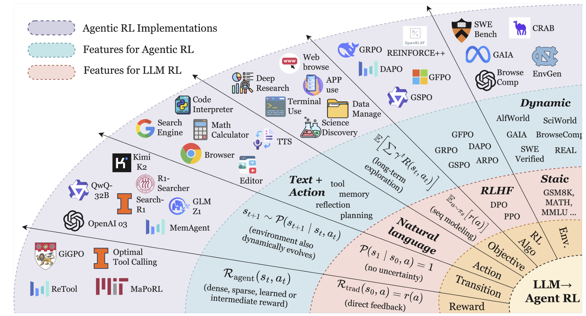
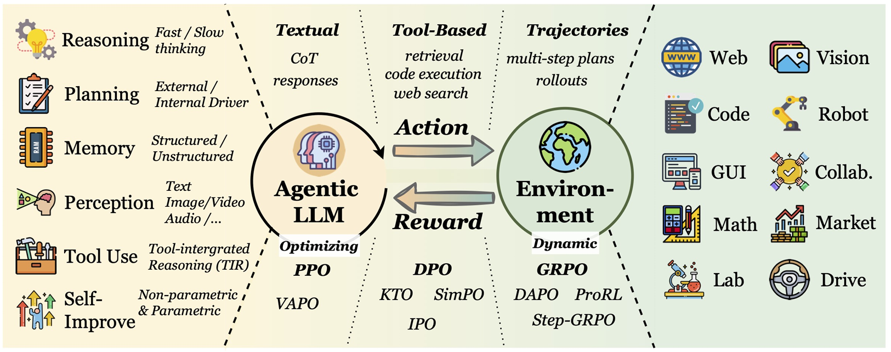
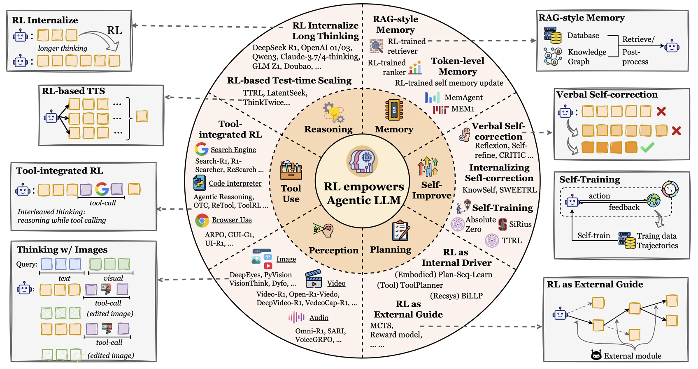
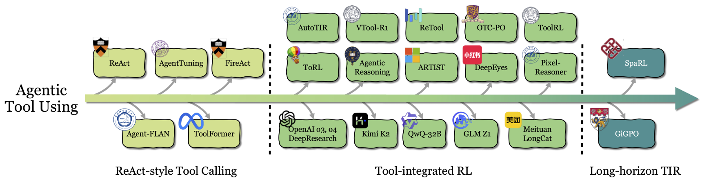
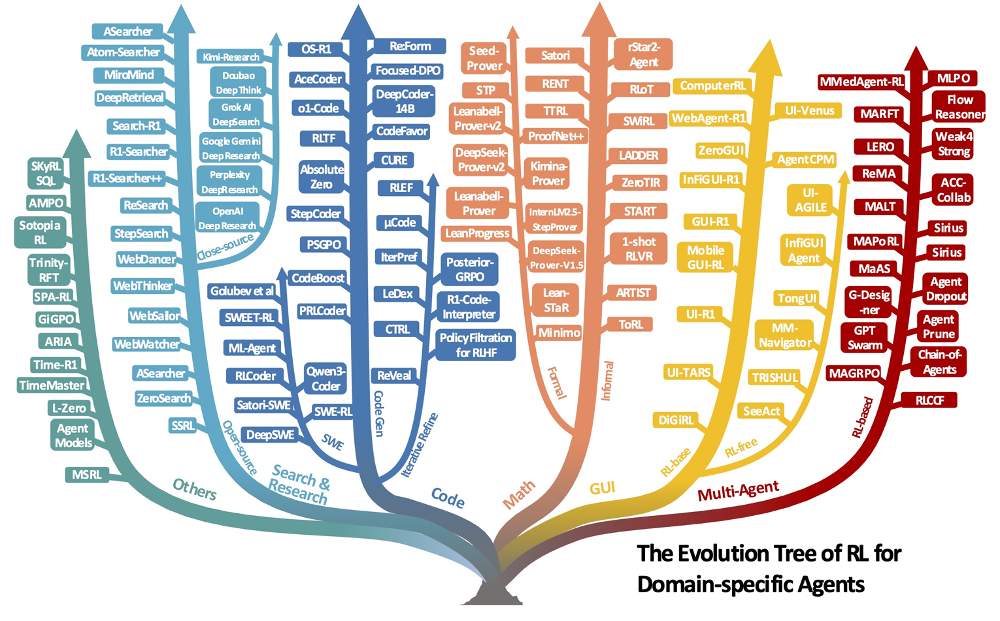
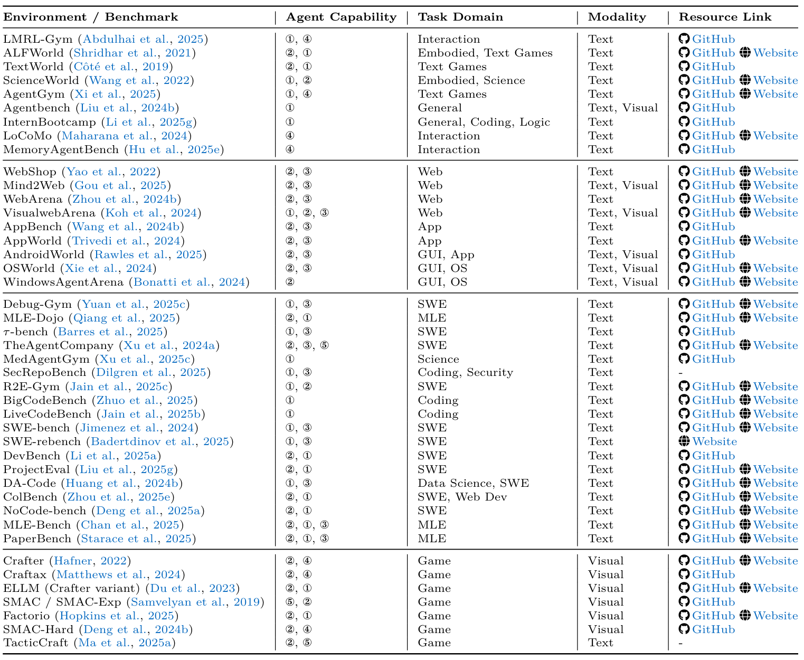
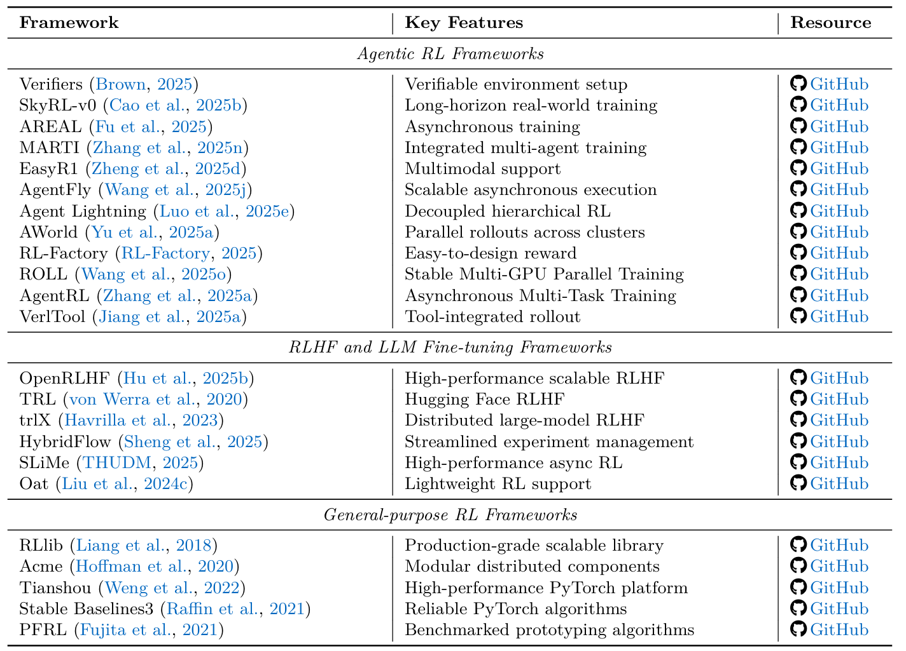

# 论文阅读笔记：The Landscape of Agentic Reinforcement Learning for LLMs: A Survey

## 1. 核心思想与概念
*   **传统 LLM RL (如 PBRFT)**: 将 LLM 视为**静态的条件生成器**，为了单轮输出与人类偏好对齐进行优化。其本质是退化的单步马尔可夫决策过程 (MDP)。
*   **Agentic RL (代理强化学习)**: 范式发生了根本性转变。将 LLM 视为嵌入在**连续决策循环中的可学习策略**。通过 RL 赋予其自主代理能力（规划、推理、工具使用、记忆维护、自我反思），使其能在**部分可观察的动态环境 (POMDP)** 中产生长视野的交互行为。
    *   ***如何理解“部分可观察的动态环境”？***
        *   **部分可观察 (Partially Observable)**：指模型（代理）在任何时刻都无法一次性获取全局的、完整的环境信息。比如在浏览网页、操作软件或查阅大型代码库时，模型只能看到当前屏幕或片段的内容，必须依赖“记忆”和“推理”来推断出所处的整体状态。
        *   **动态 (Dynamic)**：指环境不是静止的，而是会随着代理的动作（如执行代码、点击链接）或外部事物的运行而不断改变。这意味着先前的状态可能失效，模型必须具备根据每一步的新反馈，实时调整和更新策略的能力。

## 2. 范式转变：从 LLM RL 到 Agentic RL

| 维度 | 传统 LLM RL (PBRFT) | Agentic RL |
| :--- | :--- | :--- |
| **状态空间** | 单一的提示词 (Prompt)，单步立即结束 | 代理在部分可观察环境中的状态，多步序列 (T > 1) |
| **动作空间** | 纯文本序列生成 | **文本生成空间 + 动作空间** (调用工具、环境交互等) |
| **奖励函数** | 最终输出的标量奖励 (如基于偏好模型的评分) | **任务导向的稀疏奖励 + 密集的步骤级子奖励** |
| **优化目标** | 最大化单步输出的期望奖励 | 最大化长序列交互的折扣累积奖励 |

## 3. Agentic RL 的六大能力维度

论文从大模型代理的核心能力出发，探讨了 RL 如何内化和提升这些能力：

1.  **规划 (Planning)**
    *   *外部引导*: RL 用于训练价值或启发式函数，引导外部搜索树（如 MCTS）。
    *   *内部驱动*: RL 作为内部驱动力，直接使用环境反馈优化 LLM 的内部规划策略，实现终身学习或动态推理资源分配。
2.  **工具使用 (Tool Using)**
    *   从早期的 ReAct（依赖少样本提示或 SFT 模仿）演变为**工具集成推理 (TIR)**。
    *   RL 将其从模仿模式转变为目标导向优化，使模型自主发现何时、如何以及组合调用哪些工具。难点在于长序列工具调用的信用分配 (Credit Assignment)。

3.  **记忆 (Memory)**
    *   *RAG式记忆*: RL 用于管理何时进行信息检索。
    *   *Token级记忆*: RL 训练代理主动决定保留、覆写或遗忘哪些上下文 token（显式或隐式的 latent token）。
    *   *结构化记忆*: 未来方向是使用 RL 动态管理复杂的结构化记忆（如图谱、分层记忆）。
4.  **自我提升 (Self-Improvement)**
    RL 被越来越多地用作持续反思的机制，使代理能够从规划、推理、工具使用等过程的错误中学习。论文将其发展分为三个主要阶段与一个未来展望：
    *   **基于语言的自我修正 (Verbal Self-correction)**：早期方法依赖提示词（如 Reflexion, Self-refine），让代理生成答案后用自然语言反思并修正。为了增强鲁棒性，发展出了三种策略：(I) **多次采样 (Multiple sampling)** 获取多样化反馈；(II) **结构化反思工作流 (Structured workflows)**，将反思分解为检索、重思考和修正等阶段；(III) **外部引导 (External guidance)**，利用代码解释器、计算器等外部工具提供客观验证。
    *   **内化自我纠错机制 (Internalizing Self-correction)**：语言修正通常仅限单次会话。后续研究通过梯度更新（如 DPO），将反思和纠错的反馈循环直接**内化到模型参数中**。这使得模型能够更持久地具备识别和修正自身错误的固有能力。
    *   **迭代自我训练 (Iterative Self-training)**：迈向完全自主的最高阶段。它将反思、推理和任务生成结合成一个自我维持的循环，实现无监督的无限自我提升。具体架构包括：(I) **自我对弈与搜索引导的改进**（类似 AlphaZero，利用 MCTS 探索推理树并从零训练策略和价值模型）；(II) **执行引导的课程生成**（模型自己生成问题，并根据可验证的执行结果作为奖励来优化策略）；(III) **集体引导 (Collective bootstrapping)**（多智能体聚合共享的成功经验来加速学习）。
    *   *未来展望 - 反思能力的元进化 (Meta Evolution of Reflection Ability)*：目前的反思过程多是静态和手工设计的。未来的前沿是让代理**学习如何更有效地进行自我反思**，例如动态决定针对当前任务是只需简单的语言检查，还是需要昂贵的工具执行验证，从而实现反思机制本身的持续自我进化。
    *   ***延伸讨论：模型发布后的持续演进与测试时微调***
        “自我提升”并不仅仅发生在模型开发阶段的后训练中。针对模型部署后的在线演进，目前已有三类代表性的成熟/前沿系统方案：
        1. **非权重级的持续演进（外部技能库）**：这是目前工程界最成熟的方案（如 **Voyager** 架构）。智能体在开放环境试错成功后，将操作路径抽象为代码（Skill）存入外部向量数据库。下次遇到同类问题先检索技能库，从而巧妙规避了在线更新权重的灾难性遗忘，实现了无缝的终身学习 (Lifelong Learning)。
        2. **权重级的测试时微调 (Test-Time RL, TTRL)**：应对极难任务的前沿方案。模型遇到新任务时不直接作答，而是利用环境的执行反馈作为奖励，在后台快速利用 RL **针对当前任务临时微调一个模型策略副本**，生成最终答案后即可选择丢弃，是以庞大算力换取准确率的极端测试时自适应。
        3. **数据闭环驱动的持续微调系统 (Autonomous Pipeline)**：致力于全自动的长效演进。例如 **ALAS** 框架构建了一个自主流水线，自动在网上爬取数据、提炼训练信号并持续在后台对自身进行微调。工业界也广泛采用这一理念，将真实的在线交互反馈持续送入后端的 DPO/RL 管道，形成定期迭代模型新版本的“数据飞轮”。
5.  **推理 (Reasoning)**
    *   RL 是培养“慢思考”（System 2）能力的核心，如 OpenAI o1, DeepSeek-R1 系列。通过 RL 鼓励模型生成验证、回溯等思维链 (CoT) 行为。
6.  **感知 (Perception)**
    *   针对视觉语言模型，RL 将其从被动感知转向**主动视觉认知**。比如允许模型反复观察图像（Grounding）、生成草图辅助推理、或使用视觉工具进行推理。

## 4. Agentic RL 的应用场景

*   **搜索与研究 (Search & Research)**: 突破传统 RAG 局限，迈向复杂的端到端深层次研究代理（如 OpenAI Deep Research）。利用 RL 优化多步查询构建、网页导航和信息综合。
*   **代码智能 (Code Agent)**: 代码环境拥有明确的执行反馈（编译、单元测试），是 Agentic RL 的理想试验田。包含从代码生成、迭代代码调试到自动化软件工程 (SWE)。
    *   *自我演进案例*：**CURE** 提出了“编码器-测试器”协同进化的模式，两者在对抗与合作中双双提升（**属于开发阶段的模型微调**）；而 **ReVeal** 则扩展了过程级别的调试，能自主生成测试用例并根据奖励在交互中持续学习（**属于部署后的动态自适应**）。
        *   *【ReVeal 核心洞察】*：传统代码 RL 往往受限于人类预先编写的静态测试集（导致奖励稀疏），而 ReVeal 赋予了智能体“自建测试用例”并运行的能力。这意味着它构建了一个无需人类干预的自我验证飞轮，让智能体真正学会了如何从错误堆栈中提取教训并自我恢复。*(学术支持：发表于 arXiv 2025，论文《ReVeal: Self-evolving code agents via iterative generation-verification》)*
*   **数学推理 (Math Agent)**: 
    *   *非正式推理*: 结合外部计算工具解决复杂问题，探索基于过程的奖励 (PRM)。
    *   *形式化推理*: 借助定理证明器 (如 Lean, Isabelle) 获取绝对可靠的二元反馈，但面临探索空间爆炸的挑战。
*   **GUI 代理**: 在网页、操作系统等图形界面中进行长视野导航与交互操作。
    *   *自我演进案例*：**UI-Venus** 采用自我进化的轨迹框架 (self-evolving trajectory framework) 收集高质量数据并进行 RFT 微调，在多模态界面的基础定位和复杂导航任务中提升能力（**主要发生于开发与微调阶段**）。
*   **具身代理 (Embodied Agents)**: 用于机器人导航和物体操作，难点在于 Sim-to-Real（仿真到现实）的鸿沟。
    *   *自我演进案例*：**Voyager** 作为经典范例，在《我的世界》中通过“制定计划->环境互动->提取技能->存入不断增长的外部技能库”的迭代循环，实现了无需更新模型权重的**部署后持续演进**。
*   **多智能体系统 (MAS)**: 用 RL 优化多智能体的通信拓扑、角色分配或直接进行端到端的多智能体强化学习 (MARL)。
    *   *自我演进案例*：**免 RL 的多智能体演进 (RL-Free MAS Evolution)**，在冻结底层模型参数的情况下，通过符号学习、动态图优化或工作流重写等外部协调机制，让多智能体系统在协作中实现架构级的自我进化（**属于典型的部署后系统级持续演进**）。

## 5. 环境与框架
*   **评测与环境**: 包含 Web 交互 (WebArena)、GUI 操作 (OSWorld)、软件工程 (SWE-bench)、领域专业环境 (科学、机器学习) 及纯模拟/游戏环境 (Crafter, SMAC)。

*   **RL 框架**: 支撑 Agentic RL 的底层基础软件生态可主要划分为三大类：

    1.  **通用强化学习框架 (General-purpose RL Frameworks)**
        *   *代表软件*: `RLlib`, `Tianshou` (天授), `Stable Baselines3`, `Acme`
        *   *特点*: 最底层的纯强化学习算法库，提供极其稳定、工业级的 PPO、DQN 等传统算法实现，是构建任何上层大模型 RL 系统的数学与工程基石。
    2.  **RLHF 与大模型微调框架 (RLHF and LLM Fine-tuning Frameworks)**
        *   *代表软件*: `OpenRLHF`, `TRL`, `trlX`, `SLiMe`, `HybridFlow`
        *   *特点*: 专注于大规模语言模型的后训练对齐，强调极致的训练吞吐量和大规模分布式计算能力，通常需要与 vLLM、Megatron 等推理和训练后端深度融合，以支撑千亿参数级别的 PPO/DPO 训练。
    3.  **Agentic RL 专属框架 (Agentic RL Frameworks)**
        *   *代表软件*: `AgentFly`, `AWorld`, `AgentRL`, `EasyR1`, `Agent Lightning`, `Verifiers`, `VerlTool`, `SkyRL-v0`, `AREAL`, `MARTI`, `ROLL`
        *   *拓展分析*: 这是专门为“大模型智能体”量身定制的新一代基础设施。由于智能体在动态环境中进行多步工具调用和长逻辑推理时，会产生极大的算力开销和复杂的环境状态机，传统的大模型训练框架很难直接适配。原论文详细列举了该领域的前沿突破，主要着眼于解决以下核心痛点：
            *   **可验证环境与长视野训练**：`Verifiers` 引入了端到端策略优化的可验证环境设置；`SkyRL-v0` 及其模块化后续版本则展示了如何通过强化学习进行长视野的真实世界智能体训练。
            *   **高并发的异步经验收集与分布式架构**：经验生成 (Rollout) 是智能体训练的主要瓶颈。`AWorld` 作为一个分布式 Agentic RL 框架，通过跨计算集群编排大规模并行的 rollout，实现了比单节点运行快 14.6 倍的加速，打通了可扩展的端到端训练流水线；`AgentRL` 提供了一个可扩展的异步框架，统一了环境编排，并引入了跨策略采样和任务优势归一化机制以实现稳定的大规模训练；`AREAL` 针对语言推理任务量身定制了异步分布式架构；`ROLL` 则提供了一个包含统一控制器、并行 Worker 和自动资源映射的大规模 RL 优化库，用于高效的多 GPU 训练。
            *   **高吞吐的工具调用与环境解耦**：`AgentFly` 框架通过基于装饰器 (decorator-based) 的工具和奖励定义、异步执行以及集中式资源管理，实现了高吞吐量的 token 级别多轮交互训练；`Agent Lightning` 将智能体执行过程建模为标准 MDP，利用分层 RL 算法（LightningRL），实现了几乎“零代码修改”即可训练任何 AI 智能体；`VerlTool` 在 Verl 基础上引入了支持工具使用的 ARLT 框架，使智能体能够在交互环境中联合优化规划与执行。
            *   **多模态与多智能体融合**：
                *   `EasyR1` 为 Agentic RL 引入了原生多模态支持，使智能体能在统一的 RL 框架中同时利用视觉和语言信号。
                    *   *【EasyR1 核心洞察】*：随着纯文本推理大模型（如 DeepSeek-R1）的突破，多模态推理（Vision-R1）成为了行业的下一个必争之地。EasyR1 的出现填补了多模态强化学习底层工程的空白，使得模型在“慢思考”时不仅能生成文本思维链，还能主动地“观察”和“定位”图像元素，为视觉感知与复杂逻辑推理的结合扫清了基建障碍。*(开源支持：开源多模态强化学习训练框架 [hiyouga/EasyR1])*
                *   `MARTI` 更是专门针对需要并发控制和复杂通信的多智能体 (MAS) 场景，提供了整合推理与训练的底层引擎。
                    *   *【MARTI 核心洞察】*：当系统从单体进化到多智能体协作时，传统的 RL 框架由于难以处理错综复杂的通信图谱和长期延迟的信用分配（即哪个智能体的决定导致了最终成功/失败）而失效。MARTI 将分布式并发控制与强化学习循环融为一体，意味着学术界与工业界已经开始着手解决大规模多 Agent 网络的联合演进难题。*(学术与开源支持：清华大学开源项目 [TsinghuaC3I/MARTI]，论文《MARTI: A framework for multi-agent LLM systems reinforced training and inference》)*
            *   **可验证的沙盒奖励**：Agentic RL 最缺乏的是密集的奖励信号，`Verifiers` 等框架致力于提供安全隔离且结果确定（如代码编译是否通过）的执行沙盒，为策略优化提供高质量的真实环境反馈。

## 6. 面临的挑战与未来方向
1.  **可信度 (Trustworthiness)**
    *   *安全挑战*: Agentic RL 可能会通过“奖励黑客 (Reward Hacking)”手段学习到不安全或恶意调用 API 的捷径。
    *   *幻觉*: 结果导向的 RL 可能鼓励模型编造看似合理但毫无根据的中间推理步骤，产生“幻觉税”。
    *   *阿谀奉承 (Sycophancy)*: RLHF 容易让代理为了迎合用户的错误观点而妥协任务的客观真理性。
2.  **扩展 Agentic 训练 (Scaling Up Training)**
    *   增加用于 RL 训练的计算资源（延长搜索和反思时间）能显著增强模型的涌现推理能力。同时，高质量多领域数据的混合和算法效率的提升至关重要。
3.  **扩展评估环境 (Scaling Environments)**
    *   当前静态环境易过拟合。未来需引入“环境生成器”，自动根据模型的弱点生成课程和任务，形成动态对抗和协同进化。
4.  **机制争议 (The Mechanistic Debate)**
    *   学术界对于 RL 到底带来了什么仍有争论：RL 到底只是**放大和凸显**了模型预训练时就具有的能力（概率重分配），还是真正能让模型产生**定性的新知识/新算法**？证据表明，在高质量环境和长推理任务中，RL 确实能促成抽象决策规则的内化。

---
*注：本文档是对《The Landscape of Agentic Reinforcement Learning for LLMs: A Survey》核心内容的梳理，旨在帮助快速理解从 LLM 的静态指令微调向动态自主代理强化学习的范式演进。*
