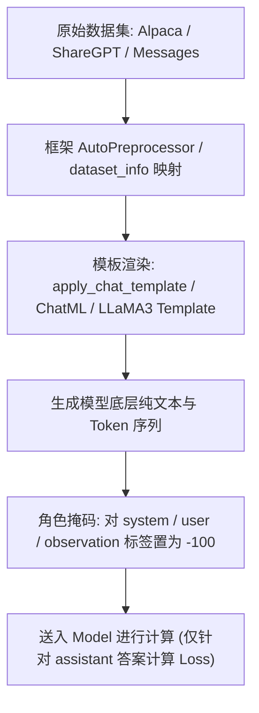

## 1\. **Supervised fine-tuning（**SFT）

微调是一种有监督的技术手段，是在已具备广泛知识基础的大型预训练语言模型上，利用针对性的数据集实施额外的训练过程，旨在使模型更精准地契合特定任务需求或深入某一专业领域。**微调的核心目标在于实现知识的精细化灌输与指令系统的精确匹配，所以SFT的重点是学习样式和指令，而非知识注入。**当前实践中，微调主要分为**全参数微调**和**部分参数微调，下面详细说一下这两个方式的特点和技巧。**

## **2\. 全参数微调**

主要是利用小学习率的方式，对大模型的全参数进行调整，以使其完全适应特定领域或任务。这种方法适用于拥有大量与任务高度相关的高质量训练数据的情况，通过更新所有参数来最大程度地优化模型对新任务的理解和表现。

### 2.1 全参数SFT需要的数据量

这个没有一个明确的答案，但是根据大家的经验和一些开源的技术报告来看，SFT的数据一般在2k-10k之间，epoch可以根据SFT数据设定为2-10个epoch，epoch和数据量成反比，SFT的数据在准确，不在量大，所以在数据比较精确的情况下，一般5k的数据5个epoch，就能得到一个不错的效果。

另外，对于一般的人类阅读和生成能力，仅在1000个样本上就可以有不错的效果，但是对于数学推理、代码生成等复杂任务，需要较大的数据量。

### 2.2 如何避免SFT灾难性遗忘

SFT数据比较多或者epoch比较大时，可能会导致SFT后大模型的通用能力下降，导致灾难性遗忘，这要根据实际场景判断，如果你只关注特殊领域的性能，通用能力下降你也不需要过度关注，如果想要不失去通用的生成能力，可以考虑以下几点：

-   多任务微调：如果希望模型保持多任务泛化能力，可以一次性对多个任务执行微调。良好的多任务微调可能需要包含许多任务的50-100,000个示例。
-   考虑PEFT的方法：也就是保留了原始LLM的权重，不采用全参数微调的方法。通过训练少量特定于任务的适配器层和参数。PEFT对灾难性遗忘表现出更大的鲁棒性，因为大多数预训练的权重保持不变。
-   数据配比：在SFT数据中，增加一些通用生成的数据，避免SFT过度学习单一训练集内容。

### 2.3 SFT指令微调数据如何构建

SFT的重点是学习样式，而非知识注入，所以SFT的样本在于其质量而非数量，少量但精良的样本往往胜过大批中低品质的样本，实现同样甚至更优的微调效果。通常情况下，2-10k数据就会有一个不错的效果。这一理念在Meta发布的《LIMA: Less Is More for Alignment》论文中得到了有力阐述，该文献强调了在指令微调过程中，高品质微调数据的决定性作用。据此，我们应当将重心放在提升样本质量的打磨上，而非单纯追求数量的增长。

如何评估样本的效果，在评估微调样本质量的过程中，通常需要关注以下几个核心维度：

1.  **样本多样性（Sample Diversity）**：

1.  **指令多样性**：考察样本中指令的覆盖范围是否广泛，是否包含了各类任务类型、不同难度级别以及多样化的指令结构和表达方式，确保模型在微调后能应对多种复杂情境。
2.  **内容多样性**：检查样本中提供的文本内容是否涵盖了不同主题、文体、长度以及语境，以避免模型在特定领域或文本类型上过拟合，确保其具备良好的泛化能力。

3.  **答案质量（Answer Quality）**：

1.  **准确性（Accuracy）**：评估答案是否准确无误地响应了给定指令和内容，是否忠实反映了任务要求，且不包含事实性错误、逻辑矛盾或语义模糊。
2.  **完备性（Completeness）**：考察答案是否全面覆盖了指令所要求的所有任务点，尤其对于多步骤或复合任务，答案应完整体现所有必要的操作结果。
3.  **简洁性与清晰度（Conciseness & Clarity）**：衡量答案是否言简意赅、表达清晰，避免冗余信息或含糊表述，确保模型在微调后生成的输出易于理解和使用。

5.  **一致性（Consistency）**：

1.  **内部一致性**：检查同一指令对不同内容的处理结果是否保持一致，即模型在相似情境下应给出相似的答案。
2.  **外部一致性**：对比样本答案与已知的知识库、专家判断或公认的基准结果，确保答案符合领域共识和常识。

7.  **难度适配（Difficulty Calibration）**：

1.  **难易程度分布**：分析样本集中简单、中等、复杂任务的比例，确保微调数据集包含不同难度级别的样本，有助于模型逐步提升处理复杂指令的能力。

9.  **噪声控制（Noise Reduction）**：

1.  **标签错误检查**：识别并剔除标注错误或不一致的样本，确保答案与指令、内容间的映射关系正确无误。
2.  **数据清洗**：去除重复样本、无关内容或低质量文本，提升数据集的整体纯净度。

可以看出评估微调样本质量属于一项涉及多方面考量的综合性工作，旨在确保用于指令微调的数据既能有效驱动模型学习指令理解与执行的核心技能，又能促进模型在实际应用中展现卓越的性能和广泛的适应性。通过严谨的质量评估与持续优化，可以最大限度地利用有限的高质量样本资源，实现大模型指令微调的高效与精准。

### 2.4 进行SFT时，基座模型选用Chat还是Base模型？

选Base还是Chat模型，首先先熟悉Base和Chat是两种不同的大模型，它们在训练数据、应用场景和模型特性上有所区别。

1.  在训练数据方面，Base模型是基于海量语料库进行的无监督学习。它从大量文本中学习语言模式和知识，而不需要人工标注或监督。相比之下，Chat模型则是在指令微调的有监督学习下进行训练的。这意味着它使用人工标注的数据集进行训练，以便更好地理解和响应特定指令。
2.  在应用场景上，Base模型主要用于无监督学习任务，如文本分类、情感分析、摘要生成等。这些任务主要关注文本内容的理解和处理，而不需要对特定指令做出响应。相反，Chat模型则主要用于指令学习任务，如问答系统、对话生成、[智能客服](https://link.zhihu.com/?target=https%3A//cloud.baidu.com/product/ai-ics-voice.html)等。在这些任务中，模型需要理解和响应人类的指令，以提供准确和有用的信息。
3.  在模型特性上，Base模型预训练之后没有做任何调整。它提供了基本的语言理解和生成能力，但可能需要针对特定任务进行微调或优化。而Chat模型则是在Base模型上进行微调的版本，它通过指令微调和人工反馈强化学习等方法，使模型更加符合人类的价值观和指令要求。
4.  总之，Base和Chat是两种不同的大模型，它们在训练数据、应用场景和模型特性上有所区别。Base主要用于无监督学习任务，而Chat则专注于指令学习任务。在模型特性上，Chat通常在Base上进行微调，以更好地适应特定任务的需求。

根据以上区别，在选择基座模型时也要考虑数据量和任务差别难度，对于训练数据量少的，任务和基座大模型比较优秀能力接近的选chat模型。对于训练数据量比较大，或任务与chat版本的相似的能力比较差，选择base版本。

另一种说法是base模型可以更方便做**知识注入，**而chat版本是做过对齐的，不好做知识注入。所以基于base的SFT可以做的上限更高，更方便做知识的注入，而基于chat模型的SFT是做的样式学习或者指令学习。但是base也存在没有对齐的风险，输出可能和希望有差距，需要更多的调优和对齐。

### 2.5 SFT多优化项问题

SFT对于需要优化多个能力项时（比如数学、聊天、推理等），需要多个SFT数据集，这比优化单一能力的难度要大很多，需要考虑数据配比、优化的策略等，参考论文：**How Abilities in Large Language Models are Affected by Supervised Fine-tuning Data Composition。**


**策略解释：**

-   多任务学习：直接混合不同的SFT能力项数据进行SFT。若将每个数据源视为不同任务，则可视为多任务学习；
-   顺序训练：按顺序依次在各能力项数据集上微调。由于通用能力是人类对齐的核心能力，我们将通用能力数据放在最后阶段微调；
-   混合顺序训练：首先在特定能力数据集（代码、数学）上进行多任务学习，然后在通用能力数据集上进行SFT；
-   两阶段混合微调（DMT）：我们综合RQ1-3的结论与上述训练策略的优缺点，提出DMT策略。在第一阶段我们首先在特定能力数据集（代码、数学）上进行多任务学习。在第二阶段我们使用混合数据源进行SFT，其中包括通用数据和一定比例k的特定能力数据（k = 1, 1/2, 1/4, 1/8, 1/16, 1/32），这有助于缓解模型对特定能力的灾难性遗忘。

**主要结论：**

-   **随着数据量的增加，数学推理、代码生成和通用能力的性能变化趋势如何?**

-   不同能力项有不同的Data Scaling曲线：数学推理能力，通用能力与数据量呈正相关模型的性能缩放曲线。值得注意的是通用能力只需要大约 1k数据样本便会产生性能激增（数据量从1/256 到 1/64），并在达到一定阈值提高缓慢（1/64），这契合于 LIMA 论文中所提到的“Less is more”。然而代码能力在7B，13B则呈现不规则的性能曲线，33B呈现log-linear的趋势；
-   数据充足的情况下，更大参数量的模型往往有更强大的性能；

-   **在SFT阶段中，将三种能力项数据直接混合是否会产生性能冲突？**

-   与单数据源相比，混合数据源设置呈现低资源性能增益，而高资源性能冲突: 三种能力的性能放缩曲线一致呈现高资源下（1/1）混合数据源设置弱于单数据源，然而随着数据量下降二者产生性能转折，最终低资源（1/256）下混合数据源产生明显性能增益；
-   随着模型参数量的提高，数学推理与通用能力在低资源下的性能增益更加显著；

-   **什么是产生性能冲突的关键因素？**

-   当不同的SFT能力之间存在显著的任务格式和数据**分布差异时（数学和通用数据之间），数据比例的影响较小。然而，当存在一定程度的相似性时（代码和通用数据之间），数据比例可能会导致明显的性能波动；**
-   即便在通用数据资源非常有限的情况下，特定能力的数据比例的放缩也没有对通用能力造成明显影响；

-   **不同的SFT训练策略对数据组成的影响是什么？**

-   **多任务学习在尽可能保留了特有能力，但是通用能力性能下降显著；**
-   **两种顺序训练保留了通用能力，但是由于多阶段的微调产生灾难性遗忘，使得它失去了太多的特定能力（尤其是数学）；**
-   **在不同的模型参数量下（7B，13B，33B），DMT (k = 1/256)策略在特定能力方面（数学，代码）均有显著改善，甚至对于通用能力也有一定程度的优化；**

**总结**

大模型混合多种能力项数据进行微调时，会呈现高资源冲突，低资源增益的现象。我们提出的DMT策略通过在第一阶段微调特定能力数据，在第二阶段微调通用数据+少量的特定能力数据，可以在保留通用能力的同时，极大程度地挽救大模型对特定能力的灾难性遗忘，这为SFT的数据组成问题提供了一个简单易行的训练策略。值得注意的是，第二阶段微调时混合的特定能力数据量需要根据需求而定。

### 2.6 全参数微调技巧

**a. SFT模式选择**

模式一：基于base模型+领域任务的SFT；  
模式二：基于base模型+领域数据 continue pre-train +领域任务SFT；  
模式三：基于base模型+领域数据 continue pre-train +通用任务SFT+领域任务SFT；  
模式四：基于base模型+领域数据 continue pre-train +通用任务与领域任务混合SFT；  
模式五：基于base模型+领域数据 continue pre-train（混入SFT数据） +通用任务与领域任务混合SFT；  
模式六：基于chat模型+领域任务SFT；  
模式七：基于chat模型+领域数据 continue pre-train +领域任务SFT；

-   在资源充足的情况下，如只考虑领域任务效果，建议选择模式二；
-   在资源充足的情况下，如考虑模型综合能力，建议选择模式五；
-   在资源不允许的情况下，我会考虑模式六；

  

## 3\. 部分参数微调（Sparse Fine Tuning / Selective Fine Tuning/**Parameter-Efficient Fine-Tuning/PEFT**）

部分参数微调策略仅选择性地更新模型中的某些权重，尤其是在需要保留大部分预训练知识的情况下。这包括：

1.  **prefix/prompt-tuning:** 在模型的输入或隐层添加$k$个额外可训练的前缀 tokens（这些前缀是连续的伪 tokens，不对应真实的 tokens），只训练这些前缀参数；
2.  **P-tuning:** P-Tuning 利用少量连续的 embedding 参数作为 prompt使 GPT 更好的应用于 NLU 任务，而 Prefix-Tuning 是针对 NLG 任务设计，同时，P-Tuning 只在 embedding 层增加参数，而 Prefix-Tuning 在每一层都添加可训练参数
3.  **P-tuning v2**：V2更接近于prefix- tuning，微调了每一层transformer的输入embedding，v2在大小模型都有效；
4.  **Adapter-Tuning**：将较小的神经网络层或模块插入预训练模型的每一层，这些新插入的神经模块称为 adapter（适配器），下游任务微调时也只训练这些适配器参数；
5.  **LoRA（Low-Rank Adaptation）**：通过向模型权重矩阵添加低秩矩阵来进行微调，既允许模型学习新的任务特定模式，又能够保留大部分预训练知识，从而降低过拟合风险并提高训练效率。
6.  **AdaLoRA：**是对LoRA的一种改进，它根据重要性评分动态分配参数预算给权重矩阵；
7.  **QLoRA**：使用一种新颖的高精度技术将预训练模型量化为 4 bit，然后添加一小组可学习的低秩适配器权重，这些权重通过量化权重的反向传播梯度进行微调。

[链接](https://zhuanlan.zhihu.com/p/635152813)


## **4\. 冻结（Freeze）监督微调**

在这种微调方式中，部分或全部预训练模型的权重被冻结（即保持不变不再训练），仅对模型的部分层（如最后一层或某些中间层）或新增的附加组件（如任务特定的输出层或注意力机制）进行训练。这样可以防止预训练知识被过度覆盖，同时允许模型学习针对新任务的特定决策边界。

## 5\. SFT 数据格式

在进行 SFT 时，数据格式决定了模型如何理解指令和对话结构。目前业界最常用的数据格式有以下三种：

### 5.1 Alpaca 格式
源自斯坦福 Alpaca 项目，是最经典的单轮指令微调格式。
- **结构特点**：包含 `instruction`（指令）、`input`（可选的补充输入/上下文）和 `output`（期望输出）三个核心字段。
- **适用场景**：简单的指令跟随任务（“给指令 -> 给答案”）。
- **数据示例**：
```json
[
  {
    "instruction": "请解释什么是光合作用。",
    "input": "",
    "output": "光合作用是绿色植物利用太阳能将其转化为化学能，并合成有机物释放氧气的过程。"
  },
  {
    "instruction": "总结以下文章的核心观点。",
    "input": "苹果公司今天发布了最新的 iPhone，采用了全新的钛金属边框和更强大的芯片，售价与上一代保持一致。",
    "output": "核心观点：苹果发布了外观和性能升级的新款 iPhone，且未涨价。"
  }
]
```

### 5.2 ShareGPT 格式
目前开源模型微调中最流行的对话数据格式之一，各大微调框架（如 LLaMA-Factory）都有良好支持。
- **结构特点**：包含一个 `conversations` 列表，交替记录 `human`（用户）和 `gpt`（模型，有时也叫 `assistant`）的对话内容。
- **适用场景**：多轮对话、聊天机器人和复杂的角色扮演任务。
- **数据示例**：
```json
[
  {
    "conversations": [
      {
        "from": "human",
        "value": "你好，能帮我写一个 Python 的 hello world 吗？"
      },
      {
        "from": "gpt",
        "value": "当然可以，这是代码：\n```python\nprint('Hello, World!')\n```"
      },
      {
        "from": "human",
        "value": "太棒了，那怎么运行它呢？"
      },
      {
        "from": "gpt",
        "value": "你需要把它保存为 `.py` 文件（例如 `hello.py`），然后在终端中输入 `python hello.py` 来运行。"
      }
    ]
  }
]
```

### 5.3 ChatML 格式
OpenAI 提出的一种标准化对话格式。
- **结构特点**：使用特殊的标记符（如 `<|im_start|>` 和 `<|im_end|>`）明确区分不同的角色边界，如系统提示（system）、用户输入（user）和助手回复（assistant）。
- **适用场景**：需要严格边界控制的场景，能有效防止提示注入（Prompt Injection）攻击，安全性极高。在模型底层，这种格式最终会被拼装成特殊的纯文本流。
- **数据示例**（此为转换后供模型直接学习的底层文本流形态）：
```text
<|im_start|>system
你是一个乐于助人、知识渊博的 AI 助手。<|im_end|>
<|im_start|>user
你好！请问你能做什么？<|im_end|>
<|im_start|>assistant
你好！我可以帮你解答问题、编写代码、翻译文本等。<|im_end|>
```

### 5.4 主流 SFT 工具软件支持的数据格式与配置范式

在实际工程落地中，开源微调框架（如 **LLaMA-Factory**、**ModelScope SWIFT** 等）对上述基础格式进行了标准化扩充，引入了灵活的字段映射、工具调用（Agent / Tool Calling）及多模态数据支持。

#### 5.4.1 LLaMA-Factory 数据格式规范与映射 (`dataset_info.json`)
[LLaMA-Factory](https://github.com/hiyouga/LLaMA-Factory) 是目前开源界最流行的大模型微调框架之一。它原生支持 **Alpaca** 和 **ShareGPT** 两大格式，并通过 `data/dataset_info.json` 配置文件实现自定义字段映射与格式注册。

> **💡 架构演进与常见误解辨析 (v0 vs v1)**：
> LLaMA-Factory 近期在底层源码架构中推行了 **v0 (Legacy 架构)** 向 **v1 (Experimental Plugin Architecture)** 的升级重构（通过环境变量 `USE_V1=1` 进行启用）。关于 v0 与 v1 的核心辨析如下：
> 1. **关于多轮对话支持的误解澄清**：
>    - **误解**：部分开发者误认为 v0 架构仅支持单轮对话 SFT 训练。
>    - **事实**：**v0 架构从早期版本起就已经完整支持多轮对话 SFT 训练**。它不仅可以通过 **ShareGPT 格式**（`formatting: "sharegpt"`）原生支持任意轮数的对话，还可以在 **Alpaca 格式**中利用 `history` 字段传入历史对话对，且训练时会自动对多轮对话中所有的助手回答同时计算 Loss。
> 2. **v0 到 v1 的升级本质**：
>    - **v0 架构数据流**：依赖 `Template / DataProcessor / DataCollator` 硬编码流，数据格式解析与模型 Prompt 渲染紧耦合在一起。
>    - **v1 架构数据流**：全面重构为模块化与插件化的 **`DataEngine`** 与 **`DataConverterPlugin`** 系统。实现了数据集解析与模型 Template 渲染的深层解耦，将各种源数据统一下沉转换为中间表示（Canonical Messages IR），但对上层 `dataset_info.json` 的配置范式与 JSON 数据字段定义保持完全向下兼容。

1. **Alpaca 格式扩展（单轮/历史多轮）**
   - **结构**：除 `instruction`、`input`、`output` 外，还支持可选的 `system` 提示词以及 `history`（历史对话列表）。
   - **JSON 示例**：
     ```json
     [
       {
         "instruction": "根据上下文回答问题。",
         "input": "项目预计在下周一上线。",
         "output": "上线时间是下周一。",
         "system": "你是一个严谨的助手。",
         "history": [
           ["你好，请问项目进度如何？", "项目进度正常，正在测试中。"]
         ]
       }
     ]
     ```
   - **`dataset_info.json` 注册配置**：
     ```json
     "my_alpaca_dataset": {
       "file_name": "my_alpaca_data.json",
       "formatting": "alpaca",
       "columns": {
         "prompt": "instruction",
         "query": "input",
         "response": "output",
         "system": "system",
         "history": "history"
       }
     }
     ```

2. **ShareGPT 与 Agent / Function Calling 格式**
   - **结构**：以 `conversations` 列表记录对话。在 Agent 场景中扩展了 `function_call`（模型发起的函数调用）与 `observation`（工具执行返回的结果）角色，并额外支持 `tools` 字段注册工具描述。
   - **JSON 示例**：
     ```json
     [
       {
         "conversations": [
           { "from": "human", "value": "帮我查一下北京今天的天气" },
           { "from": "function_call", "value": "{\"name\": \"get_weather\", \"arguments\": {\"city\": \"Beijing\"}}" },
           { "from": "observation", "value": "{\"temperature\": \"25°C\", \"weather\": \"Sunny\"}" },
           { "from": "gpt", "value": "北京今天天气晴朗，气温为 25°C。" }
         ],
         "tools": "[{\"name\": \"get_weather\", \"description\": \"获取指定城市天气\", \"parameters\": {...}}]"
       }
     ]
     ```
   - **`dataset_info.json` 注册配置**：
     ```json
     "my_agent_dataset": {
       "file_name": "my_agent_data.json",
       "formatting": "sharegpt",
       "columns": {
         "messages": "conversations",
         "tools": "tools"
       }
     }
     ```

3. **多模态（Multimodal）格式扩展**
   - 在文本字段中插入 `<image>` 占位符，并在 JSON 数据中附带图片相对/绝对路径或列表，框架训练时会自动处理图像特征抽取与对齐。

---

#### 5.4.2 ModelScope SWIFT (ms-swift) 数据格式规范
[ms-swift](https://github.com/modelscope/ms-swift) 是 ModelScope 开源的轻量高效大模型微调框架，主推与 OpenAI API 对齐的 **Messages 统一格式**，同时具备强大的 `AutoPreprocessor` 自动列映射推断能力。

1. **OpenAI Messages 标准格式（首选）**
   - **结构特点**：采用 `messages` 列表，直接兼容 OpenAI Chat Completions API 的 `role`（`system` / `user` / `assistant` / `tool`）与 `content` 范式。
   - **JSON / JSONL 示例**：
     ```json
     {
       "messages": [
         { "role": "system", "content": "你是一个专业的 Python 程序员。" },
         { "role": "user", "content": "如何反转一个列表？" },
         { "role": "assistant", "content": "可以使用 `list.reverse()` 或切片 `lst[::-1]`。" }
       ]
     }
     ```

2. **命令行自动映射与解耦 (`--columns`)**
   - SWIFT 原生兼容 Alpaca、ShareGPT 和 Messages 格式。若用户数据集的字段名不标准（例如为 `question` 与 `answer`），**无需修改原始文件**，只需在命令行指定映射：
     ```bash
     swift sft \
         --model Qwen/Qwen2.5-7B-Instruct \
         --dataset /path/to/my_data.jsonl \
         --columns question:user answer:assistant
     ```
   - 复杂场景下，同样支持通过 `custom_dataset_info.json` 或 Python 脚本注册定制解析逻辑 (`register_dataset`)。

3. **多模态 (Vision / Audio / Video) 统一表达**
   - 统一在 `messages` 的 `content` 中使用 `<image>`、`<video>` 或 `<audio>` 占位符，并在 JSON 根节点添加对应的资源路径数组：
     ```json
     {
       "messages": [
         { "role": "user", "content": "<image>描述一下这张图片中的内容。" },
         { "role": "assistant", "content": "图片展示了一只在草地上奔跑的小狗。" }
       ],
       "images": ["/path/to/dog.jpg"]
     }
     ```

---

#### 5.4.3 SFT 框架的统一数据 pipeline 转换机制
无论输入是 Alpaca、ShareGPT 还是 Messages 格式，主流 SFT 工具在进行模型训练前都会通过统一的 Data Pipeline 完成以下两个核心步骤：



1. **模板渲染（Chat Template）**：利用 Tokenizer 的 `apply_chat_template` 将解析出来的对话节点拼装为特定模型所需的底层 Prompt（如 Qwen 的 ChatML `<|im_start|>`，LLaMA-3 的 `<|start_header_id|>` 等）。
2. **角色掩码对齐（Role-based Loss Masking）**：识别对话中的角色，自动将 `user` / `system` / `observation` 部分 Token 的 Target Label 替换为 `-100`，强制模型只针对 `assistant` / `gpt` 的回答部分进行梯度更新与损失计算（即后文介绍的 Prompt Masking 机制）。


## 6\. SFT Loss 计算 (Prompt Masking)

在 SFT 训练中，计算 Loss（损失）的底层机制与预训练（Pre-training）完全相同，都是基于**“预测下一个词”（Next-Token Prediction / Causal Language Modeling）**并计算**交叉熵损失（Cross-Entropy Loss）**。

唯一的、也是最关键的区别，就在于**哪些 Token 参与最终 Loss 的计算**。目前开源界的最佳实践是**对 Prompt 进行 Mask（掩码）操作（Train on completions only）**。

### 6.1 为什么要 Mask Prompt
在 SFT 阶段，模型的主要目标是学习如何根据指令生成高质量的回答，而不是去预测用户的输入。如果对整个序列（Prompt + 答案）都计算 loss，模型可能会把学习容量浪费在拟合输入上，甚至出现过拟合（死记硬背指令结构）。

### 6.2 Loss 计算的具体过程 (Ignore Index)
为了直观理解，我们以一条简单的 SFT 训练数据为例：
- **Prompt (指令)**: `你好`
- **Output (回答)**: `很高兴认识你`

分词器处理后，这串文本将被转换为连续的 Token，如：`[ "你", "好", "很", "高", "兴", "认", "识", "你" ]`

在构建训练数据时，系统会将真实的“下一个词”作为目标标签（Label）。在 **SFT 掩码处理**中，框架会将属于 Prompt 部分的 Label 替换为一个特定的忽略值（例如在 PyTorch 的 CrossEntropyLoss 中默认是 `-100`）：

| 当前看到的内容 (Input) | 真实的下一个词 (Target) | 掩码后的 Label | 这一步的 Loss 是否用于更新权重？ |
| :--- | :--- | :--- | :--- |
| `[你]` | `好` | **-100 (Ignore)** | ❌ **丢弃**（属于 Prompt，不参与计算） |
| `[你, 好]` | `很` | `很` | ✅ **保留**（Output 的第一个词开始计算） |
| `[你, 好, 很]` | `高` | `高` | ✅ **保留** |
| `[你, 好, 很, 高]` | `兴` | `兴` | ✅ **保留** |

在计算梯度进行反向传播时，Label 为 `-100` 的词元（tokens）会被直接跳过。最终，这次前向传播（Forward Pass）的总 Loss，**仅仅是 Output 部分（打 ✅ 处）交叉熵 Loss 的平均值**。

通过巧妙地在计算梯度的终点处**“把指令部分的误差权重清零”**，强行引导模型将注意力集中在“如何根据给定的前文，生成符合人类期望的后文”上。

## 7\. SFT 及大模型全链路超参数经验

在大模型的整个生命周期（预训练 -> SFT -> 强化学习/偏好对齐）中，超参数的设置不仅决定了模型的收敛速度，更决定了模型能力的上限。以下是各阶段的核心超参数经验：

### 7.1 全链路学习率 (Learning Rate) 设定对比
大模型不同训练阶段的学习率通常遵循 **“预训练 > SFT > 对齐(RLHF/DPO)”** 的衰减规律。下表展示了针对 7B 级别模型（全参数更新）的典型学习率参考范围：

| 训练阶段 | 典型算法 / 方法 | 学习率量级 (参考值) | 设置逻辑与特点 |
| :--- | :--- | :--- | :--- |
| **Pre-training (预训练)** | Causal LM | `1e-4` ~ `3e-4` | 需要较大的学习率，通过海量数据从头学习语言规律与世界知识。 |
| **SFT (监督微调)** | Causal LM | `1e-5` ~ `3e-5` | **需比预训练低一个量级**，防止“灾难性遗忘”（丧失原有知识），专注学习指令和样式。若极不稳定可降至 `5e-6`。 |
| **RLHF (偏好对齐)** | **DPO** (直接偏好优化) | `5e-7` ~ `5e-6` | 本质上是 SFT 的变体，属于成熟模型上的“微调中的微调”，对参数变动极敏感，**学习率通常比 SFT 再低一个量级**。 |
| | **PPO** (近端策略优化) | `1e-6` ~ `5e-6` | Actor 策略网络对学习率极其敏感，过大会导致 KL 散度爆炸和策略坍塌。 |
| | **GRPO** (组相对策略优化) | `1e-6` ~ `5e-6` | DeepSeek 提出，去除了 Critic 网络，靠 Group Size (组大小) 稳流。学习率通常与 PPO 类似，但可根据组大小微调（Group 越大，梯度越稳，LR 可略大）。 |

*注：如果采用 **LoRA** 等 PEFT 降维方法，由于只更新极少量参数，学习率通常可以比上述全参值**大 10 到 50 倍**（例如 LoRA 的 SFT 常取 `1e-4` ~ `5e-4`）。*

### 7.2 其他核心超参数设置经验 (以 SFT 为主)
- **Warmup（预热）**：
  - 强烈建议开启。通常设置 warmup steps 为总步数的 1% ~ 10%，让学习率从 0 缓慢爬升。这能极大程度防止训练初期梯度震荡导致模型崩溃。
- **批次大小 (Batch Size)**：
  - 核心原则是“显存允许情况下的最大值”。在单卡显存受限时，务必通过**梯度累积 (Gradient Accumulation)** 来模拟更大的 Global Batch Size，确保梯度更新的稳定性。
  - *缩放法则*：如果在调参时放大了 Batch Size（如扩大 $N$ 倍），为了保持同等收敛效果，学习率通常需要按比例（例如 $\sqrt{N}$ 倍）适当调大。
- **训练轮数 (Epochs)**：
  - SFT 阶段一般 **1 ~ 3 个 Epoch** 足矣。对于高质量的小规模垂类数据，可以适当增加到 3 ~ 5 轮，但要密切监控验证集的 Loss，防止模型陷入风格僵化或过拟合。在 SFT 阶段，**数据质量永远比数量更重要**。

## 8\. 总结

### 8.1 选用全参数SFT还是部分参数的SFT

这个说法不一，所以要根据自己场景选用不同的方法，如果资源充足的话，建议SFT和PEFT都尝试一下，选用效果最优的方式，如果资源不足，建议选PEFT。

从理论分析上来看，SFT会修改大模型全量参数，可以在数据量充足的情况下学习更多的内容，效果上限应该更高，但也存在灾难性遗忘等不稳定情况。PEFT不管是prompt training还是LORA都是只修改少量参数，所以他的优点就是需要资源少，稳定性高，但是存在效果上限问题，有些场景下效果不好，特别是基座大模型在该领域任务上的效果本身就不好，很难通过PEFT来提升。

[链接](https://zhuanlan.zhihu.com/p/692892489)