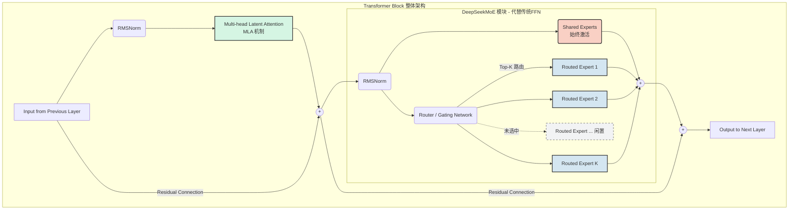

### 1\. GPT-4结构的“小道消息”

前一段时间，有小道消息透露GPT-4使用的是MOE的结构：


来源：https://www.reddit.com/r/mlscaling/comments/14wcy7m/gpt4s\_details\_are\_leaked/

-   **[MoE架构](https://zhida.zhihu.com/search?content_id=237020869&content_type=Article&match_order=1&q=MoE%E6%9E%B6%E6%9E%84&zhida_source=entity)：**他们在模型中使用了 16 个专家模型，每个专家模型的MLP层大约有 111B 个参数。每个前向计算中，这些专家模型中的 2 个被路由到进行计算。
-   **[路由算法](https://zhida.zhihu.com/search?content_id=237020869&content_type=Article&match_order=1&q=%E8%B7%AF%E7%94%B1%E7%AE%97%E6%B3%95&zhida_source=entity)：**就是使用很简单的路由算法来选择前向的专家。
-   **总参数量**：Attention层的参数是共享的，大约有 550 亿个[共享参数](https://zhida.zhihu.com/search?content_id=237020869&content_type=Article&match_order=1&q=%E5%85%B1%E4%BA%AB%E5%8F%82%E6%95%B0&zhida_source=entity)。所以总体的参数量为： $111B*16 + 55B \approx 1800B$ , 也就是是1.8万亿参数。
-   **推理成本**：每生成一个token需要用到 $111B*2 + 55B \approx 280B$ 的参数，浮点数运算量约为560 TFLOPs，相比于非MoE结构的[稠密模型](https://zhida.zhihu.com/search?content_id=237020869&content_type=Article&match_order=1&q=%E7%A8%A0%E5%AF%86%E6%A8%A1%E5%9E%8B&zhida_source=entity)降低了非常大的成本（生成每个token需要用到1.8万亿参数，运算量3700 TFLOPs）。

### 2\. MOE结构相关论文粗读

**2.1 *GShard: Scaling Giant Models with Conditional Computation and Automatic Sharding***

  
GShard是第一个把MoE结构引入[Transformer](https://zhida.zhihu.com/search?content_id=237020869&content_type=Article&match_order=1&q=Transformer&zhida_source=entity)结构的工作，但其主要卖点是提出了GShard这个框架，可以方便的做对MOE结构做[数据并行](https://zhida.zhihu.com/search?content_id=237020869&content_type=Article&match_order=1&q=%E6%95%B0%E6%8D%AE%E5%B9%B6%E8%A1%8C&zhida_source=entity)或者模型并行。但是我们今天仅介绍其中提出的MOE结构。

具体的做法是，把Transformer的encoder和[decoder](https://zhida.zhihu.com/search?content_id=237020869&content_type=Article&match_order=1&q=decoder&zhida_source=entity)中每隔一个的[FFN](https://zhida.zhihu.com/search?content_id=237020869&content_type=Article&match_order=1&q=FFN&zhida_source=entity)层，替换成MoE层：


左边部分展示了普通的Transformer模型，右边展示了引入MoE结构的Transformer模型：其实就是把原来的FFN替换成了一群FFN（即多个“专家”），又加了一个分发器（Gating）。分发器的任务是把不同的***token*** 分发给不同的专家，使用的是 Top-2 gating network，即每次会发给至多两个专家。

**负载均衡策略：**如果我们每次都是简单的对gating之后的结果取softmax后的最大两个专家，那么会导致有些专家一直空闲，有些专家一直忙，这会拖慢训练速度，而且导致那些一直空闲的专家没有得到充分的训练。因此分发器有一个很重要的任务，就是尽可能把token均分给各个专家。为此，文章设计了一个auxillary loss，专门用来衡量我分发器分发的怎么样：如果把token都分给一个专家，loss就很高；分的越均匀，loss越小。此外，文章还提出了Expert capacity balancing，即一个专家最多只能处理一定数量的token。gating会维护一个计数器，计数每个专家处理的token总数，当一个token被分发给的两个专家都超过了这个capacity，那么这个token就不会过FFN层，而是直接通过[residual connection](https://zhida.zhihu.com/search?content_id=237020869&content_type=Article&match_order=1&q=residual+connection&zhida_source=entity)输入到下一层去。


图源：https://zhuanlan.zhihu.com/p/399496787

**Random routing：**在Top-2 gating的设计下，如果第二个专家的权重非常小，那么就直接忽略它，这也是为了节省专家2的expert capacity计数。

得到两个专家的输出结果之后，根据gating的分数对二者进行加权平均，就得到综合的输出了。

  

***2.2 [Switch Transformers](https://zhida.zhihu.com/search?content_id=237020869&content_type=Article&match_order=1&q=Switch+Transformers&zhida_source=entity): Scaling to Trillion Parameter Models with Simple and Efficient Sparsity***

Switch Transformer 卖点在于它简化了MoE的[routing算法](https://zhida.zhihu.com/search?content_id=237020869&content_type=Article&match_order=1&q=routing%E7%AE%97%E6%B3%95&zhida_source=entity)，每个FFN层激活的专家个数从多个变成了一个，提高了计算效率，可以将语言模型的参数量扩展至 1.6 万亿。


Switch Transformer在T5模型的基础上加入了MoE设计，并在[C4数据集](https://zhida.zhihu.com/search?content_id=237020869&content_type=Article&match_order=1&q=C4%E6%95%B0%E6%8D%AE%E9%9B%86&zhida_source=entity)上预训练，使用相同的compute budget，从PPL和[test loss](https://zhida.zhihu.com/search?content_id=237020869&content_type=Article&match_order=1&q=test+loss&zhida_source=entity)都能看出优于T5：


***2.3 GLaM: Efficient Scaling of Language Models with Mixture-of-Experts***

Google在2021年推出的一个超大模型，总参数量有1.2T，但是在计算式实际激活的参数量只有96B，所以在inference的时候，比GPT-3等dense model要快得多，训练成本也只有[GPT-3](https://zhida.zhihu.com/search?content_id=237020869&content_type=Article&match_order=2&q=GPT-3&zhida_source=entity)的1/3，而且在29个NLP任务上超越了GPT-3。

GLaM的结构其实没什么特殊，和上面两个工作的相似：


### 3\. SOTA模型中的MoE：以DeepSeek系列 (V3/V4) 为例

随着DeepSeek-V3/R1和后续V4的发布，业界对MoE结构的认知从“简单的参数缩放插件”演变为了“底层架构与系统工程深度协同的范式”。以具有671B总参数、每次仅激活37B参数的 DeepSeek-V3 为例，其核心并不止于把 FFN 变成 MoE，而是通过一整套极具工程美学的创新，极大地压低了训练与推理成本。

#### 3.1 核心网络结构：DeepSeekMoE 原理图解

DeepSeek 对传统 MoE 的专家层进行了“切碎”与“分工”：
1. **混合架构设计 (底层 Dense，上层 MoE)**：DeepSeek-V3 并非所有的 Transformer 层都使用 MoE。在总计 61 层的网络中，**最底部的 3 层依然保留了传统的稠密前馈网络 (Dense FFN)**。这是因为底层通常负责处理最基础的词法和语义解析，这类全局通用特征无需分门别类交给不同专家处理。而从第 4 层开始，才将 FFN 替换为 MoE 架构，进行知识的“精细分化”。
2. **细粒度路由专家 (Fine-grained Routed Experts)**：在 MoE 层中，原先的一个大 FFN 被拆分为大量小专家（如V3采用256个小专家，每个Token从中路由激活8个）。这使得专家的组合更加灵活，每个专家捕捉的知识特征也更加专一。（注：这里的每个“专家”本质上依然是一个小型的 FFN）。
3. **共享专家 (Shared Experts)**：除了按条件激活的路由专家外，模型还专门设立了始终激活的共享专家（如V3中有32个）。每个Token在进行前向计算时，必定会经过这些共享专家。

**核心思想**：底层 Dense 层负责打好全局通用的地基；进入高层 MoE 后，再由共享专家兜底所有token的“通用常识”（如语法逻辑），让细粒度路由专家彻底卸下包袱，专注于“特定领域的专业知识”。这套组合拳不仅极大地提高了参数利用效率，还起到了稳定训练的作用。

以下是 DeepSeekMoE 每一层的前向计算架构原理图：



#### 3.2 训练阶段技术细节：无辅助损失与FP8量化

除了模型结构上的改进，DeepSeek 在训练效率（Training Details）上做出了大量极客级别的工程创新：

- **无辅助损失负载均衡 (Auxiliary-Loss-Free Load Balancing)**
  - **传统痛点**：以往为了防止“路由塌缩”（少数专家被疯狂调用，其他专家闲置），通常强制加入辅助损失函数（Auxiliary Loss）。但这个惩罚项的梯度会参与反向传播，干扰交叉熵主任务梯度的优化，导致模型性能受损。
  - **DeepSeek 动态偏置机制**：DeepSeek 把“负载均衡”和“模型主线学习”解耦，在路由选择的门槛上引入动态偏置 $b_i$。对于每一个 Token，它与专家 $i$ 的最终选通打分为： $\text{Routing Score}_i = \text{Affinity Score}_i + b_i$ 。
  - **无梯度更新公式**：偏置 $b_i$ **不参与反向传播**，而是根据每个专家的实际负载按纯规则动态更新： $b_i \leftarrow b_i + \gamma \times (\text{Target Load} - \text{Actual Load}_i)$ 。
    - **$\text{Target Load}$ (目标负载)**：即理想情况下的平均负载。若每次从 $N$ 个专家中激活 $K$ 个，则目标负载通常设定为 $K/N$，代表期望每个专家平摊下来的计算任务量。
    - **$\text{Actual Load}_i$ (实际负载)**：在当前训练批次 (Batch) 的统计中，专家 $i$ 实际被分配到的 Token 比例。
      > [!NOTE]
      > **机制辨析**：Actual Load 并非一个记录“当前正在被处理的 Token 数量”的实时计数器，而是一个基于“批次（Batch）”的纯统计比例。在每次前向传播时，系统会集中统计这一个 Batch 里每个专家分到的 Token 比例来更新偏置；进入下一个 Batch 时会**清零重新统计**。因此不存在“一个 Token 处理完后实际负载要减一”的说法。
    - **直觉理解**：如果专家太忙 ($\text{Actual Load} > \text{Target Load}$)，括号内为负数，偏置 $b_i$ 随之减小，下一次该专家就更难被选中；如果太闲 ($\text{Actual Load} < \text{Target Load}$)，括号内为正数，偏置增大，变相“走后门”提高该专家的被选中概率。
  - **前向计算的纯净性**：虽然 Router 依靠“加了偏置的分数”来决定选哪几个专家，但在实际将这几个专家的输出进行加权求和时，使用的依然是**原始的无偏置 $\text{Affinity Score}$**。这就确保了反向传播的梯度百分之百纯净，彻底消除了辅助损失对主干任务的干扰。*(注：为了兜底，DeepSeek-V3 仅保留了一个权重极小 $\alpha=0.0001$ 的序列级平衡损失，其污染可忽略不计)*。
- **FP8 混合精度训练 (FP8 Mixed Precision Training)**
  - DeepSeek-V3 首次在如此巨大规模的模型上证明了原生 FP8 训练的可行性。为了解决低精度带来的梯度下溢或上溢问题，V3 引入了**细粒度块级量化（Block-wise Quantization）**。
  - 通过将巨大的矩阵乘法（GEMM）在 FP8 格式下进行，大幅削减了显存占用和节点间的通信带宽消耗，这是其训练成本能压缩到极低水平（如官方披露的不到600万美金）的关键。
- **MTP (Multi-Token Prediction)**
  - V3在训练时摒弃了传统的“仅仅预测下一个Token”的目标，而是在模型末端挂载了额外的浅层预测头（Prediction Heads），让模型在每一步**同时预测未来多个Token**。
  - 这不仅为模型的主干网络提供了更密集的梯度信号，提升了长距离语义规划能力，更为推理加速埋下了伏笔。

#### 3.3 推理阶段技术细节：MLA压缩与投机解码

由于模型拥有高达671B的总参数，如何低成本部署推理是 DeepSeek 的另一大绝招：

- **MLA (Multi-head Latent Attention, 多头潜伏注意力) 与核心公式推导**
  - **① 为什么 MLA 可以大幅减少 KV Cache 消耗？**
    - 在传统的 MHA 中，每个 Token $t$ 需要缓存庞大的 Key 矩阵 $K_t$ 和 Value 矩阵 $V_t$。
    - MLA 采用了**低秩联合压缩**策略。给定输入的隐藏状态 $h_t$，它先用一个降维矩阵 $W_{DKV}$ 将其压缩成一个极小的**低维潜伏向量 (Latent Vector)** $c_t$：
      $$ c_t = W_{DKV} \cdot h_t $$
    - **推理时，系统只缓存这个极小的 $c_t$**（外加一个被解耦出来的极小向量 $k_t^{\text{rope}}$ 用于专门存放非线性的旋转位置编码），而**彻底抛弃缓存高维的 K 和 V**。这使得整体 KV Cache 的体积骤减到了传统模式的 1/4 甚至更低。
  - **② 既然只有潜伏向量，为什么解压它没有显著增加计算量？（数学魔法：权重吸收）**
    - 按理说，在计算注意力时，我们需要用升维矩阵 ($W_{UK}$ 和 $W_{UV}$) 把缓存的 $c_t$ 重新解压回多头所需的 $K_t$ 和 $V_t$：
      $$ K_t = W_{UK} \cdot c_t $$
      $$ V_t = W_{UV} \cdot c_t $$
    - 如果每次生成新 Token 时，都要把过去所有成千上万个缓存的 $c_t$ 重新解压一遍，计算量将不堪重负。但 DeepSeek 利用了**矩阵乘法的结合律**，在推理侧实现了**“权重吸收 (Weight Absorption)”**：
    - **关于 Key 的吸收**：注意力打分是当前 Token 的 Query ($Q$) 乘以过去的 Key ($K_t$)。代入上方的解压公式：
      $$ \text{Score} = Q \cdot K_t^T = Q \cdot (W_{UK} \cdot c_t)^T = Q \cdot c_t^T \cdot W_{UK}^T = (Q \cdot W_{UK}^T) \cdot c_t^T $$
      由于 $W_{UK}$ 是固定的模型权重，我们完全可以在计算当前 Token 的 Query 时，**提前把 $W_{UK}^T$ 乘到 $Q$ 身上**，得到一个融合了降维信息的新 $Q'$。这样一来，在与历史 Token 交互时，只需用 $Q'$ 直接与缓存的低维 $c_t$ 做点积即可！直接绕过了把 $c_t$ 还原成 $K_t$ 的步骤。
    - **关于 Value 的吸收**：同理，注意力的输出是分数乘以 Value 矩阵，再乘以最终的输出投影矩阵 $W_O$：
      $$ \text{Output} = \text{Score} \cdot V_t \cdot W_O = \text{Score} \cdot (W_{UV} \cdot c_t) \cdot W_O = \text{Score} \cdot c_t \cdot (W_{UV} \cdot W_O) $$
      同样地，模型在部署时会提前把 $W_{UV}$ 和 $W_O$ 这两个固定的权重矩阵乘在一起融合成一个新矩阵。
    - **总结**：通过巧妙的“权重吸收”，繁重的解压矩阵乘法被转移到了“当前单个 Token ”的投影计算上；而对于历史中成千上万个上下文 Token 而言，**完全不需要进行任何解压计算**。这就完美解释了 MLA 为什么在大幅缩减显存占用的同时，不仅没有增加计算负担，反而因为极大地缓解了“内存读取带宽 (Memory-bound)”瓶颈，显著提升了推理速度。
- **基于MTP的无外力投机解码 (Speculative Decoding)**
  - **① MTP 在网络结构中的位置**：MTP 模块（预测头）挂载在整个 DeepSeek **主干网络（主 Transformer）的最顶端**。它并不是一个简单的线性投影层，而是一个串联的“浅层 Transformer Block”。它巧妙地复用了主模型的 Embedding 层和最终输出层，内部只包含最基础的注意力和全连接层，因此体积极小、计算极快。
  - **② 训练收益**：在训练阶段，主干网络预测第 $t+1$ 个词，而 MTP 模块则负责顺藤摸瓜去预测 $t+2, t+3...$ 等未来词元。这迫使模型提前做好长远语义规划，为系统提供了极其密集的学习梯度信号。
  - **③ 推理加速：草稿生成与并行校验的具体步骤**：
    在部署阶段，MTP 被直接用来充当内置的**“草稿模型 (Draft Model)”**，实现了无需外部模型的“自我投机解码”。它的执行脉络如下：
    1. **极速打草稿 (Drafting)**：主模型计算出第 $t+1$ 个 Token 的隐藏状态。此时，顶部的轻量级 MTP 模块立刻接管该状态，极速“猜”出接下来的几个候选词（例如生成草稿序列：$t+2, t+3$）。
    2. **并行批改作业 (Parallel Verification)**：将这串草稿序列拼接起来，当做普通的提示词（Prompt），送入庞大的 MoE 主干网络。得益于 Transformer 天然的并行特性，主网络在**只需一次前向传播的耗时内**，就能将这几个草稿词全部校验一遍。
    3. **接受与回退 (Acceptance & Fallback)**：对比主网络和草稿的结论。如果主网络发现 MTP 猜对了，就会全部“接受”，模型相当于在原先生成 1 个词的时间里瞬间输出了 3 个词！如果发现某一步猜错了，就从错误处丢弃草稿，回退到主网络自己的预测结果继续往下走。这实现了计算资源的完美利用和原生速度的指数级飙升。

    **MTP 投机解码执行原理图**：
    
    ```mermaid
    graph TD
        subgraph Step1 [步骤1: MTP极速打草稿]
            H_t[主模型当前隐藏状态 h_t] --> MTP1(MTP 模块 1)
            MTP1 --> T2[猜出草稿: Token t+2]
            
            MTP1 --> MTP2(MTP 模块 2)
            MTP2 --> T3[猜出草稿: Token t+3]
        end

        subgraph Step2 [步骤2: 主干并行批改]
            Prompt[将草稿拼接为测试序列<br/>Prompt + t+2 + t+3] --> MainModel[庞大的 MoE 主干网络]
            MainModel -->|单次并行前向传播| V_T2[计算出真实的 t+2]
            MainModel -->|单次并行前向传播| V_T3[计算出真实的 t+3]
        end

        subgraph Step3 [步骤3: 接受与回退验证]
            V_T2 -->|对比草稿| A1{草稿 t+2 <br/>猜对了吗?}
            A1 -->|Yes: 接受!| V_T3
            A1 -->|No: 拒绝!| Reject[丢弃错误草稿<br/>使用主干真实输出]
            
            V_T3 -->|对比草稿| A2{草稿 t+3 <br/>猜对了吗?}
            A2 -->|Yes: 接受!| AcceptAll[瞬移: 极速输出3个词!]
            A2 -->|No: 拒绝!| Reject
        end
        
        T2 -.-> Prompt
        T3 -.-> Prompt
        
        classDef highlight fill:#d5f5e3,stroke:#333,stroke-width:2px;
        classDef draft fill:#fcf3cf,stroke:#333,stroke-width:2px;
        classDef verify fill:#ebdef0,stroke:#333,stroke-width:2px;
        
        class H_t,MainModel highlight;
        class MTP1,MTP2,T2,T3 draft;
        class V_T2,V_T3,A1,A2 verify;
    ```

  - **④ 为什么主模型批改草稿能做到“零成本附加”？**
    > [!TIP]
    > 1. **显存带宽瓶颈（Memory-bound）**：大模型正常生成词的速度慢，不是因为 GPU 算力不够，而是因为每次只生成 1 个词时，系统都必须把大模型几百 GB 的权重从显存搬运到计算核心，90% 的时间在等数据传输（犹如开 10 吨的卡车只运 1 瓶水）。既然如此，在卡车上同时放 3 瓶水（3个草稿词）一起算，总时间开销几乎完全相同！
    > 2. **Transformer 的天生并行性**：不同于 RNN 必须排队串行计算，Transformer 的注意力机制通过矩阵掩码（Causal Mask），能够在一瞬间**同时**算出“看到 A 时下一个是谁”、“看到 A+草稿B 时下一个是谁”。所以草稿序列被打包送入网络时，底层是进行了一次高度并行的矩阵乘法（Matrix-Matrix Multiplication）。

    **底层算力并行原理对比如下：**

    ```mermaid
    graph TD
        subgraph Traditional [传统自回归生成: 串行低效 - 卡车只运一瓶水]
            A1[当前序列: 词1] -->|搬运数百GB模型权重| B1(生成真实的 词2)
            B1 -.->|下一轮重新搬运权重| C1(生成真实的 词3)
        end
    
        subgraph Parallel [投机解码并行校验: 高效并发 - 卡车装满一箱水]
            Seq[拼接短序列: <br/>词1 + 草稿2 + 草稿3] -->|仅搬运一次模型权重| Attention[Transformer 核心机制<br/>利用矩阵并行同时计算全序列]
            
            Attention -->|并发输出| Out1(算出真实的 词2)
            Attention -->|并发输出| Out2(算出真实的 词3)
            Attention -->|并发输出| Out3(算出真实的 词4)
            
            Out1 -.->|无缝对比| Check1{等于 草稿2 吗?}
            Out2 -.->|无缝对比| Check2{等于 草稿3 吗?}
        end
        
        classDef traditional fill:#fdedec,stroke:#333,stroke-width:2px;
        classDef parallel fill:#d4efdf,stroke:#333,stroke-width:2px;
        classDef attention fill:#d6eaf8,stroke:#333,stroke-width:2px;
        
        class A1,B1,C1 traditional;
        class Seq,Out1,Out2,Out3,Check1,Check2 parallel;
        class Attention attention;
    ```

### 4\. 后记

其实笔者在开发大模型的时候并没有实际尝试MOE结构，而是一直使用dense结构，之前也一直听到“MOE结构已死”的论调。直到小道消息传出GPT-4使用的是MOE结构之后，大家似乎重新点燃了对MOE的热情。然而，要开发MOE结构的大模型有很多问题需要解决：

-   如何提升MOE并行的效率，专家之间的网络通信会成为计算的瓶颈。而且GPU擅长做[矩阵运算](https://zhida.zhihu.com/search?content_id=237020869&content_type=Article&match_order=1&q=%E7%9F%A9%E9%98%B5%E8%BF%90%E7%AE%97&zhida_source=entity)，不擅长做分支；
-   每个专家小模型分配的样本数较少，无法得到充分的训练；（是否可以先训练出若干个完整的大模型，例如[数学大模型](https://zhida.zhihu.com/search?content_id=237020869&content_type=Article&match_order=1&q=%E6%95%B0%E5%AD%A6%E5%A4%A7%E6%A8%A1%E5%9E%8B&zhida_source=entity)、代码大模型、[问答大模型](https://zhida.zhihu.com/search?content_id=237020869&content_type=Article&match_order=1&q=%E9%97%AE%E7%AD%94%E5%A4%A7%E6%A8%A1%E5%9E%8B&zhida_source=entity)等，然后作为专家的初始化？）
-   需要确保专家模型上的[负载均衡](https://zhida.zhihu.com/search?content_id=237020869&content_type=Article&match_order=2&q=%E8%B4%9F%E8%BD%BD%E5%9D%87%E8%A1%A1&zhida_source=entity)

---

本文参考：  

[链接](https://www.zhihu.com/question/611498370/answer/3113583323)[链接](https://www.zhihu.com/tardis/zm/art/344344373?source_id=1003)[链接](https://zhuanlan.zhihu.com/p/542465517)