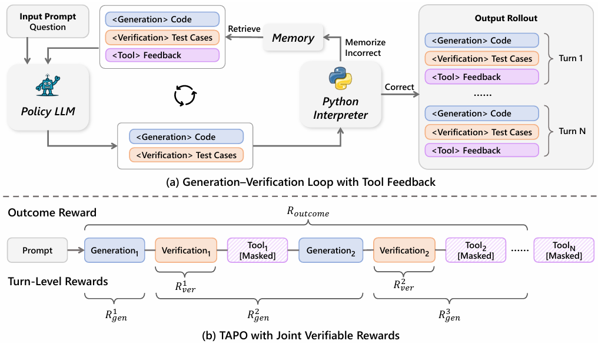
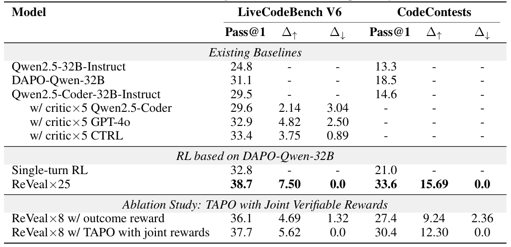
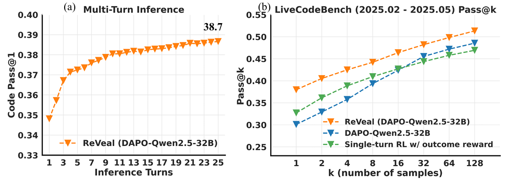
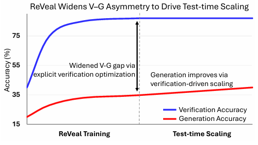
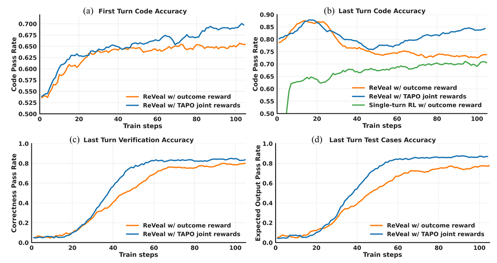

# ReVeal: Self-Evolving Code Agents via Reliable Self-Verification

**论文基本信息：**
- **作者：** Yiyang Jin, Kunzhao Xu, Hang Li 等 (微软亚洲研究院, 同济大学, 中科大)
- **领域：** Agentic RL, Code Generation, Large Language Models
- **论文链接：** [2506.11442v2.pdf](file:///C:/Users/Shaw/OneDrive/Obsidian%20Vault/Agentic%20RL/2506.11442v2.pdf)

## 1. 核心动机 (Motivation)

> [!NOTE] 什么是 Test-time Scaling (测试时/推理期计算扩展)？
> 传统的 Scaling Law 侧重于通过增加模型参数或训练数据量来提升性能（Training-time Scaling）。而 **Test-time Scaling** 指的是在模型训练完成后，在**推理（测试）阶段**赋予模型更多的计算资源和时间（例如：通过更多轮次的尝试与反思、生成大量候选并自我过滤、延长思维链等），从而换取最终问题解决率的提升。最近的 OpenAI o1 和 DeepSeek-R1 等模型证明，有效的 Test-time Scaling 能够让模型在复杂推理任务上达到前所未有的高度。

当前的 RLVR (Reinforcement Learning with Verifiable Rewards) 显著提升了 LLM 的推理能力（例如 DeepSeek-R1 等）。然而，现有方法主要依赖**最终结果奖励 (Outcome Rewards)**，存在以下局限性：
- **自我验证不可靠：** 模型缺乏对“验证过程”的显式优化，在复杂问题上往往产生冗长无效的 reflection (反思) 或盲目猜测。
- **Test-time Scaling 受限：** 由于验证信号不可靠，模型在测试阶段即便被允许增加计算量（更多的推理和试错轮次），其性能也会很快遇到瓶颈，难以超越训练数据覆盖的视野。
- **现有验证方案的缺陷：** 之前的工作要么需要训练一个额外的 Critic 模型（增加了推理复杂度和成本），要么严重依赖预先存在的公共测试用例（在现实场景中很难获取）。

## 2. 核心贡献 (Core Contributions)
- **提出 ReVeal 框架：** 一个多轮强化学习框架，通过**自我验证 (self-Verification)** 和基于外部工具的评估，实现代码生成能力的自我进化。
- **利用并扩大 V-G 不对称性：** 基于“验证比生成更容易”的规律 (Verification-Generation Asymmetry)，将“验证”作为一等优化目标。随着验证能力的增强，模型在测试阶段能获得更可靠的反馈，从而驱动更难的代码生成任务持续优化。
- **提出 TAPO 算法 (Turn-Aware Policy Optimization)：** 一种全新的信用分配机制，有效防止多轮 RL 中的“奖励作弊 (reward gaming)”，促进了代码生成和测试用例生成的协同进化。

## 3. 方法论 (Methodology)

> **💡 图 3 原理概览：** 上图展示了 ReVeal 的整体训练与推理架构。**图 (a)** 描述了单模型如何在“代码生成”与“测试验证”间交替，并利用外部 Python 解释器提供闭环反馈；**图 (b)** 则详细展示了多轮交互展开（Rollout）后，各个阶段（Generation、Verification）是如何被独立计算并精准分配奖励的。

### 3.1 迭代的 生成-验证 循环 (对应图 3a)
如图 3(a) 所示，ReVeal 摒弃了外部的 Critic 模型，使用单一策略模型（Policy LLM）交替执行代码生成和验证，形成一个不断迭代的反馈闭环（直到代码跑通或达到设定的最大轮次 $N$）：
1. **生成 (Generation)：** 模型基于 Prompt 生成当前轮次的候选代码 `<Generation> Code`。
2. **验证 (Verification)：** 模型紧接着自行构想边缘条件，合成测试用例 `<Verification> Test Cases`，并将其送入外部环境（Python 解释器）执行。
3. **环境反馈 (Tool Feedback)：** 解释器返回客观的执行状态（如运行时错误、实际输出与期望的差异），记录在 `<Tool> Feedback` 中。这段反馈会作为短期记忆（Memory）附加到上下文中，指导模型在下一轮（Turn N）进行精准修正。

### 3.2 联合可验证奖励的设计与计算细节 (对应图 3b 奖励拆解)
参考图 3(b)，为了在长序列的多轮 Rollout 中同时训练生成和验证能力，传统的单一结果奖励过于粗糙。ReVeal 专门将奖励在数学上拆分为三个精准的互补组件：

1. **Outcome reward ($R_{outcome}$，全局结果奖励)：**
   作用于整个推理链的终点，用于把控最终解决方案的整体质量。公式设定为 $r_{outcome} = r_{format} + r_{passrate}$：
   - **格式奖励 ($r_{format}$)**：生成的内容如果严格遵循所需的结构化格式标记，得 1 分，否则扣 1 分。
   - **正确率奖励 ($r_{passrate}$)**：最终代码在隐藏测试集上的通过率乘以 5 ($5 \times passrate$)。因此最终的全局奖励区间被框定在 $[-1, 6]$ 之间。

2. **Turn-Level Generation reward ($R^k_{gen}$，轮次生成奖励)：**
   对于第 $k$ 个**生成轮次**（代码生成），该奖励专门关注代码质量的进步。
   - **首轮 ($k=1$)**：等于该轮首发代码的绝对通过率 ($r_{passrate}^1$)。
   - **后续轮次 ($k \ge 3$)**：主要奖励代码在当前轮次与上一生成轮次（即第 $k-2$ 步）间的**相对提升**，公式化简为：$r_{gen}^k = r_{passrate}^k - r_{passrate}^{k-2}$。这种差值计算极大地鼓励了模型在每一轮都要做出“实质性的正确修正”，从而驱动真正的自我进化。

3. **Turn-Level Verification reward ($R^k_{ver}$，轮次验证奖励)：**
   对于第 $k$ 个**验证轮次**（模型自行生成测试用例），该奖励专门评估模型“验证能力”的可靠性。
   - **计算公式**：$r_{ver}^k = \frac{\text{能在标准答案 (Golden Code) 上成功跑通的用例数}}{\text{模型生成的该轮测试用例总数}}$。
   - **设计用意**：这要求模型生成的测试用例必须是客观正确的（即不产生幻觉，不能误判原本正确的代码）。通过这种方式，论文将“反思能力”给量化了，独立确保了验证信号的高质量。

### 3.3 轮次感知策略优化 (TAPO - 图 3b 的信用分配连线)
多轮交互（长序列）面临的最大挑战是传统 GAE 无法精准分配信用 (Credit)，且模型极易学会“奖励作弊 (Reward Gaming)”——例如乱写无用代码，只为了混取验证环节的“测试用例奖励”。如图 3(b) 底部的大括号和连线所示，TAPO 通过创新的分配机制解决了这一痛点：
- **精准跨轮连结防作弊：** 生成奖励（$R^k_{gen}$）不仅分配给当前的 Generation 轮次，还会**向前传导，附加给紧邻它的前一个 Verification 轮次**（参见图中 $R^2_{gen}$ 括号前伸的细节）。而验证奖励（$R^k_{ver}$）则严格局限在当前的验证轮次内。
- **协同进化：** 这种设计意味着，如果模型前置的验证环节做得好（发现了真 Bug），从而成功指导下一轮写出了更好的代码（获得了高 $R^k_{gen}$），那么前置的验证环节也会获得分红。这就迫使模型必须**既能写出好测试找错，又能真正动手改对代码**，彻底封死了“作弊”路径，实现了生成与验证能力的协同进化。

## 4. 实验与结果 (Experiments & Results)
### 4.1 综合性能超越基线与 Critic 模型 (对应表 1)

> **📊 表 1 深度解析：** 本表展示了 ReVeal 在 LiveCodeBench 和 CodeContests 上的绝对表现。
> - **全面超越：** ReVeal 的 Pass@1 (38.7%) 显著优于单轮 RL (32.8%)，甚至超越了引入额外 Critic 模型（如借助 GPT-4o 辅助的 32.9% 和专属 CTRL 模型的 33.4%）的方法。
> - **高修正与零退化：** 关键指标 $\Delta \uparrow$（错误代码被成功修正的比例）高达 7.50%，而 $\Delta \downarrow$（原本正确的代码被改错的比例）竟然为 **0.0%**。这证明了 ReVeal 的自我验证极其可靠，它清晰地知道什么是对的，绝不会在多轮试错中“越改越错”。
> - **消融实验：** 底部的消融实验证实了 TAPO 联合奖励（Joint Rewards）相比于纯结果奖励（Outcome reward）能带来更高的正向修正率和更低的退化率。

### 4.2 突破能力边界与深度的 Test-time Scaling (对应图 1)

> **📈 图 1 深度解析：** 左图 (a) 和右图 (b) 揭示了 ReVeal 在推理阶段的强大延展性。
> - **(a) 持续扩展 (Test-time Scaling)：** 尽管 RL 训练时最大只进行了 3 轮交互，但推理时允许尝试 25 轮时，Pass@1 从首轮的 34.8% 持续攀升到了 38.7%。即使在 20 轮之后，模型依然在稳步自修正，没有因过长的上下文而崩溃。
> - **(b) 突破能力天花板：** 在 Pass@k 评估中，普通的单轮 RL 方法（绿线）在采样次数 k>32 后就出现了明显的瓶颈，受限于 Base Model（蓝线）的底层能力上限。而 ReVeal（黄线）在所有 k 值上稳步爬升，证明真实环境反馈赋予了模型探索“原先无法触及的解空间”的能力。

### 4.3 核心驱动力：扩大验证与生成的不对称性 (对应图 2)

> **🧠 图 2 深度解析：** 该图直观地展示了 V-G Asymmetry（验证-生成不对称性）的理论机制，也是整篇论文的灵魂所在。
> - **拉大能力差：** 蓝线代表“验证准确率”，红线代表“生成准确率”。ReVeal 并不奢求直接把红线拉高，而是通过 RL **显式且专门地优化验证能力（蓝线）**。
> - **以优带劣：** 当两者之间的差距（Gap）被刻意拉大后，模型就能在测试阶段，依靠高位运行的“蓝线（验证代码的能力）”通过多轮实机试错，一点一点把处于低位的“红线（生成正确代码的能力）”给拽上来。这就是为什么 Test-time Scaling 能够一直生效的内核机制。

### 4.4 训练过程中的“生成-验证”双螺旋进化 (对应图 4)

> **🧬 图 4 深度解析：** 这四张训练曲线图记录了模型内部能力的蜕变过程。
> - 尤其是 **图 (c) 验证准确率** 和 **图 (d) 测试用例生成准确率**，展示了模型作为“裁判”能力的飙升。随着训练步数增加，模型“编写出合法测试用例”的能力从初始的不到 50% 一路飙升至近 88% (图 d)。
> - 而在它自己生成的合法测试用例中，判断代码对错的准确率始终维持在 80%~85% 的极高水平 (图 c)。
> - 这两张图是文章的“定海神针”：它证明了模型完全可以在**没有任何人工和标准答案介入的推理阶段**，当好自己的“严厉测试员”。正是基于这无比可靠的自我测试，才支撑起了图 (a) 和 (b) 中代码最终正确率的双螺旋上升。

## 5. 总结与启发 (Conclusion & Takeaways)
1. **验证是一等公民：** 在 Agentic RL 时代，不仅要让模型学会“写代码”，更要专门训练模型“写测试用例”和“理解执行反馈”的能力。
2. **高质量的数据闭环：** ReVeal 让模型自己生成测试用例并用环境执行来获取 Reward，摆脱了对外部 Ground Truth 测试集的强依赖，这是迈向更强大的 Autonomous AI Agents 的关键一步。
3. **TAPO 信用分配的普适性：** 这种针对多轮交互的细粒度信用分配 (Credit Assignment) 方法，可以推广到除代码以外的任何具有“验证-生成不对称性”且能获得环境明确反馈的任务中。

## 6. 常见问题 (Q&A)

**Q: ReVeal 的奖励计算、修正策略生成等各环节，是否需要其它 SOTA 模型或者人工介入？**
**A: 绝大部分是靠自身闭环完成的，不依赖其他 SOTA 模型，且无人工介入，但在“训练阶段”需要数据集提供标准答案（Golden Code）。**

具体来说：
1. **单一模型架构 (Single Policy Model)**：与之前许多依赖额外强大 Critic 模型（如 GPT-4）来进行代码审查的方法不同，ReVeal 强调**只有一个 Policy LLM**。生成代码、构思边缘情况、编写测试用例、阅读报错信息并修正，全部由这一个模型自身完成，不依赖外部其他更强的模型。
2. **纯环境反馈 (Tool Feedback)**：模型发现错误不是靠人工提示，也不是靠其他 AI，而是靠真实的**外部执行环境（如 Python 解释器）**。这提供了一个绝对客观、无偏差的反馈闭环。
3. **训练期 (Training) vs 推理期 (Inference)**：
   - **在 RL 训练期**：为了奖励模型“写出高质量的测试用例”，系统会将模型生成的测试用例放到数据集提供的**标准答案 (Golden Code)** 上去跑。如果测试用例在标准答案上能通过，才算好用例，才能给予 Verification Reward。因此，**训练阶段依然需要包含参考答案的优质数据集**。
   - **在推理期 (Test-time/Inference)**：完全自治闭环。在面对全新的问题时，没有 Golden Code，模型依靠自己在训练期学到的“直觉”去生成测试用例并用解释器跑，根据跑出的结果自己修正代码。这个阶段真正实现了 Autonomous（全自动）。

**Q: 这种“自我反思与试错”的方式，是否会受到 Policy Model 自身能力上限的限制？**
**A: 必然会受到绝对上限的限制，但 ReVeal 的巧妙之处在于利用“验证-生成不对称性”极大地撑开了这个上限。**

- **绝对上限依然存在：** 试错（Trial and Error）无法让模型凭空发明它认知范围之外的知识。如果基础模型完全不具备某种高级数据结构的底层概念，再多的反思和执行反馈也无法让它写出正确的代码。
- **利用“不对称性”破局：** 在编程和数学任务中存在一个基本规律——**验证一个答案对不对，远比直接想出这个答案更容易（V-G Asymmetry）**。即便是能力有限的模型，一次性写对复杂代码（生成）很难，但针对题目要求写几个输入输出的测试用例（验证）却相对容易。ReVeal 正是通过 RL 专门拔高了模型“验证”的上限，从而利用高水平的测试反馈，引导原本较弱的生成能力向正确的方向逼近。
- **实验证明突破边界：** 论文的 Pass@k 实验表明，传统的单轮 RL 方法在尝试 32 次左右就达到了能力天花板（陷入盲目猜测），而 ReVeal 即便在尝试 128 次后，依然能稳步提升解决率。这证明基于真实环境反馈的验证驱动，确实能指引模型探索到基础模型原先无法触及的解空间。
- **知识蒸馏的远景：** 在深入的 Test-time Scaling 中，一旦模型偶然探索到了极难问题的正确解法，这些高质量的“思考轨迹”就可以被收集起来，作为新的训练数据重新蒸馏（微调或强化）给模型本身。这种“左脚踩右脚”的闭环，正是突破大模型能力上限的关键路径。

## 7. 面向生产环境的前沿技术推演 (Real-Time RL & Agent 自演进)

基于 ReVeal 的核心思想（特别是其多轮交互与验证机制），在当下的视角，我们可以将其直接映射到构建类似 Composer/Cursor 的**“实时强化学习 (Real-time RL / Online RL) 飞轮”**和 Agent 模型自演进的技术方案设计中。

### 7.1 破除生产环境的“无监督”困境 (Autonomous Reward Generation)
在真实的 IDE 生产环境（如 Composer 的使用场景）中，最大的痛点在于**缺乏标准答案 (No Golden Code)**，且用户反馈往往极度稀疏、充满噪音（用户很少主动给代码打分，往往只是默默关闭窗口或自行修改）。
- **ReVeal 的参考价值：** 我们可以借鉴 ReVeal 的“自我验证能力”。当 Agent 为用户生成代码后，可以在后台沙盒（Shadow Environment）中**自主生成几组测试用例并静默运行**。如果测试跑通且未抛出异常，系统即可自动构造出一个高质量的正向 Reward 信号。这种机制使得我们在没有任何人类显式打分的情况下，依然能源源不断地从真实交互中榨取客观、高信噪比的 RL 训练数据，这是维持高频（如数小时级）模型迭代飞轮的基础。

### 7.2 在真实的多轮“拉扯”中精准分锅 (基于 TAPO 的信用分配)
真实的编程交互往往是长程且充斥噪音的（例如：*模型写初始代码 -> 用户贴报错 -> 模型修改 -> 依然不对 -> 用户进一步提示 -> 模型最终改对*）。如果直接拿整段对话去训练，传统算法很难分辨出是哪一轮的什么行为导致了最终的成功。
- **ReVeal 的参考价值：** ReVeal 提出的 TAPO 算法（轮次感知策略优化）提供了一种精妙的防作弊与“分锅”架构。通过计算**差值奖励 (Generation Reward)** 并将其**向前回传绑定给错误发现环节 (Verification/Critique)**，系统可以精准分析海量的用户多轮交互日志。它可以自动甄别出促成 Bug 修复的那个“关键顿悟回合”，从而过滤掉废话，赋予真正有价值的推理步骤极高的权重。这一机制对于处理无规则的真实对话流具有教科书级别的借鉴意义。

### 7.3 将“长程试错成本”蒸馏为“模型直觉” (Distilling Test-time Scaling)
在实际业务中，所谓的 Test-time Scaling 往往表现为用户与 Agent 经历了十几个回合极其痛苦的 Debug，最终终于让程序跑通。虽然问题解决了，但用户体验并不好。
- **ReVeal 的参考价值：** 这种长程且最终成功的探索轨迹，正是推动模型自演进的“终极矿藏”。在构建自演进飞轮时，核心任务就是自动挖掘这些成功案例，提纯出其中**从错误到正确的关键思维链 (Thought Chain)**。随后，利用 RL 或 SFT 将这些来之不易的经验“蒸馏 (Distillation)”回 Base Model 的权重中。如此一来，下一个部署的改进版模型在面对同类 Bug 时，无需再拉扯 10 轮，而是依靠刻入参数的“直觉”在一轮内给出正解。ReVeal 证明了：专门强化模型的“验证判别力”，是支撑这种大规模试错与蒸馏的最有效手段。
