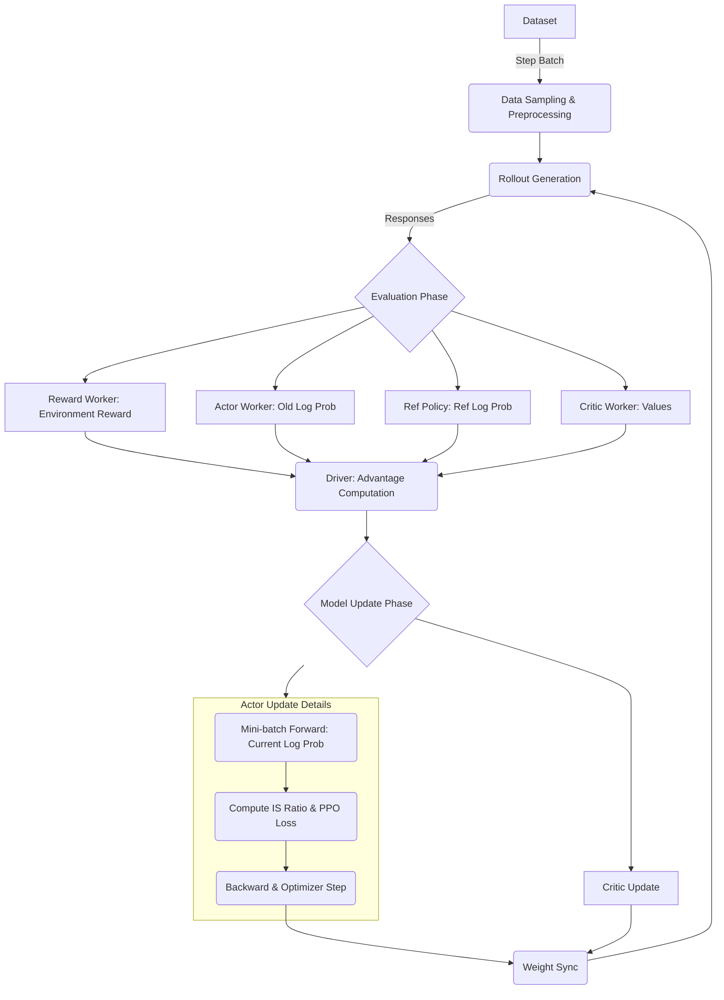

# verl 系统架构与技术特性文档 (v0.8.0)

`verl` 是一个专为大规模语言模型（LLM）后期训练（Post-training）设计的强化学习框架，它是 **HybridFlow** 编程模型的开源实现。其核心目标是提供兼具灵活性、高性能和生产就绪的 RLHF 训练能力。当前版本为 v0.8.0，引入了多项重要更新：全新的同步训练入口 `main_ppo_sync.py`（基于 TransferQueue 的独立 `PPOTrainer` 实现，非简单重命名）、完全异步训练策略（`fully_async_policy`）、一步异步策略（`one_step_off_policy`）、增强的 Agent 工具调用框架（`ToolAgentLoop`），以及更多的检查点引擎（NIXL、KIMI、Mooncake）和模型支持（GLM-4V、Kimi-VL、Apertus）。

## 1. 系统架构

`verl` 的架构基于“解耦”的思想，将算法逻辑、分布式控制与底层计算引擎分离开来。

### 1.1 HybridFlow 编程模型

`verl` 采用了 HybridFlow 模型，结合了两种范式的优点：

* **Single-Controller (单控制器):** 类似于传统的单机编程，开发者可以在驱动脚本（Driver）中用几行代码清晰地表达复杂的 RL 数据流（如 PPO 的 Rollout -> Evaluate -> Update 循环）。
* **Multi-Controller (多控制器):** 底层重型计算任务（如训练和推理）则由分布式的计算图执行，能够跨越成百上千个 GPU。

#### 1.1.1 单控制器控制多控制器的连接机制

在 `verl` 的 HybridFlow 编程模型中，**Single-Controller（单控制器，即 Driver 端）** 和 **Multi-Controller（多控制器，即 Worker 组的分布式计算图）** 之间通过一套基于 Ray RPC、装饰器反射与动态代理的机制进行连接和协作。其底层实现主要位于 [decorator.py](file:///c:/Users/Shaw/git/ascend-rl/verl/verl/single_controller/base/decorator.py)、[worker_group.py](file:///c:/Users/Shaw/git/ascend-rl/verl/verl/single_controller/base/worker_group.py) 和 [base.py](file:///c:/Users/Shaw/git/ascend-rl/verl/verl/single_controller/ray/base.py) 中。

> **批注：装饰器反射与动态代理的技术原理**
>
> **装饰器反射**指通过装饰器在方法上"打标签"，再在运行时通过 Python 反射机制扫描出被标记的方法。具体而言：`@register` 装饰器（[decorator.py L398-L444](file:///c:/Users/Shaw/git/ascend-rl/verl/verl/single_controller/base/decorator.py#L398-L444)）在被修饰方法上注入魔术属性 `MAGIC_ATTR`（字符串 `"attrs_3141562937"`），其值为包含 `dispatch_mode`、`execute_mode`、`blocking` 的字典。使用随机字符串作属性名可避免与用户自定义属性碰撞。随后，[_bind_worker_method()](file:///c:/Users/Shaw/git/ascend-rl/verl/verl/single_controller/base/worker_group.py#L185-L255) 通过 `dir(user_defined_cls)` 遍历类的所有方法，用 `hasattr(method, MAGIC_ATTR)` 检测被 `@register` 标记的方法，再用 `getattr(method, MAGIC_ATTR)` 取出配置字典。
>
> **动态代理**指在运行时动态创建代理对象（Functor）并绑定到 `RayWorkerGroup` 实例上，使 Driver 端像调用本地方法一样调用远端分布式方法。其实现位于 [func_generator](file:///c:/Users/Shaw/git/ascend-rl/verl/verl/single_controller/ray/base.py#L48-L66)：内部定义 `Functor` 类，其 `__call__` 封装完整调用链（dispatch 数据切分 → execute RPC 调度 → ray.get 同步等待 → collect 结果拼接）；通过 `type(method_name, (Functor,), {})()` 动态创建以方法名命名的类实例（便于调试日志可读）；最终由 `setattr(self, method_name, func)` 绑定到 WorkerGroup。
>
> 两者协作关系：**装饰器反射**解决"如何找到需要暴露的方法"，**动态代理**解决"如何让 Driver 像调本地方法一样调远端分布式方法"。流程为：`@register` 打标签 → `_bind_worker_method` 反射扫描 → `func_generator` 创建 Functor 并绑定 → Driver 调用 `wg.method()` 时走入 `Functor.__call__` 执行 dispatch→execute→collect。
>
> **关于“魔术属性”（Magic Attribute）**：这不是 Python 官方术语，而是 verl 代码中的约定叫法（源自注释 `"here we add a magic number to avoid user-defined function already have this attribute"`）。指用一个硬编码的、几乎不可能与用户代码冲突的字符串（`"attrs_3141562937"`，数字取自圆周率 π）作为属性名，将元数据“隐蔽地”挂载到方法上。其“魔术”性体现在：①隐蔽性——从方法签名看不出该属性存在，需 `hasattr` 检测；②防冲突——刻意选择生僻名称；③通信契约——它是装饰器（写入方）与反射扫描（读取方）之间的唯一桥梁。Python 社区中类似模式也称 marker attribute 或 sentinel attribute（如 Flask 的 `_endpoint`、Django 的 `_meta`）。

其核心控制与通信链路包含以下四个步骤：

1. **方法注册与配置标记 (`@register` 装饰器)**
   * Worker 类（运行在分布式执行面）的方法如果需要被外界以分布式方式调用，会使用 `@register` 装饰器进行修饰，如：
     ```python
     @register(dispatch_mode=Dispatch.DP_COMPUTE_PROTO, execute_mode=Execute.ALL, blocking=True)
     def compute_log_prob(self, data):
         ...
     ```
   * 该装饰器会给方法注入魔术属性（`MAGIC_ATTR` 即 `attrs_3141562937`），包含 `dispatch_mode`（数据分发模式，如 DP_COMPUTE_PROTO）、`execute_mode`（执行模式，如 ALL 或 RANK_ZERO）和 `blocking`（是否同步阻塞）。

2. **动态代理绑定 (Dynamic Functor Proxy)**
   * 当 Driver 节点初始化 `RayWorkerGroup` 时，其基类方法 `_bind_worker_method()` 会扫描对应的 Worker 类，筛选出所有带有 `MAGIC_ATTR` 的方法。
   * 接着，它使用 `func_generator` 动态创建一个 `Functor` 代理对象，并将其以同名属性的形式绑定到 `RayWorkerGroup` 实例上（例如，将 `compute_log_prob` 代理绑定为 `self.actor_rollout_wg.compute_log_prob`）。
   * 这使得 Driver 端在编写 PPO 训练循环时，可以像调用本地对象方法一样直接调用 `self.actor_rollout_wg.compute_log_prob(data)`。

3. **数据分发与 RPC 调度 (Dispatch & Execute)**
   * 当 Driver 调用代理方法时，代理方法首先执行 `dispatch_fn`（根据 `dispatch_mode` 选取，如 `dispatch_dp_compute_data_proto`）。该函数负责将 Driver 侧的大块输入数据（如 `DataProto`）切分（Chunk）成多份子批次（Mini-batches），分摊到每个 Worker 上。
   * 接着，代理方法调用 `execute_fn`（根据 `execute_mode` 选取，如 `execute_all`），在底层对各个 Ray Worker 句柄发起异步 RPC 调用：`getattr(worker, method_name).remote(*sliced_args, **sliced_kwargs)`，并拿到一组 Ray `ObjectRef` 句柄。

4. **结果回收与重组 (Block & Collect)**
   * 如果 `blocking=True`，代理方法会在 Driver 侧调用 `ray.get(output)` 进行同步等待，阻塞直到所有 Worker 完成计算并返回数据。
   * 最后，代理调用 `collect_fn`（如 `collect_dp_compute_data_proto`）将各个 Worker 返回的子数据块重新拼接（Concat/Merge）还原为完整的数据结构（如单个 `DataProto`），并将其返回给 Driver，完成一次完整的控制与计算循环。

*(若开启了 TransferQueue 异步流式数据系统，RPC 调度部分将进一步解耦，仅传递 BatchMeta 句柄，真实的高性能张量通过 TQ 走 GPU/NPU-to-GPU/NPU RDMA 通道进行点对点传输，参见 1.10 节)*

### 1.2 核心逻辑组件

* **Trainer (`verl/trainer/`):** 算法中枢。例如 `RayPPOTrainer` 负责编排 PPO 流程，协调 Actor、Critic、Reward Model 等角色的动作。
* **Worker Group (`verl/workers/`):** 执行单元抽象。`verl` 将计算任务分配给不同的 Worker：
  * **Rollout Worker:** 负责生成（Inference），支持 vLLM, SGLang, TensorRT-LLM。
  * **Training Worker:** 负责参数更新（Training），支持 PyTorch FSDP（含 `fully_shard` / FSDP2 策略）、Megatron-LM。
  * **Reward Worker:** 负责计算奖励，可以是基于模型的（Reward Model）或基于规则的（Executable Sandbox）。
* **3D-HybridEngine:** 这是 `verl` 高性能的关键。它能够高效地在训练阶段（切分权重以节省显存）和推理阶段（重组权重以提高吞吐）之间进行 **Resharding**（重切分），极大地减少了模型切换的通信开销。

### 1.3 数据协议 (`DataProto`)

`verl` 使用 `DataProto` 作为组件间通信的标准数据格式。它基于 `TensorDict`，能够同时携带张量数据（如 `log_probs`, `hidden_states`）和非张量元数据（如 `uid`, `data_source`），支持自动 Padding 和重排序。

### 1.4 核心执行流 (Execution Flow)

以 PPO 算法为例，`verl` 的整个核心执行流在 `RayPPOTrainer.fit()` 中被精确编排。



一个完整的强化学习训练迭代（Step）包含以下几个关键阶段：

1. **数据采样与预处理:** 从数据集中抽取一个 Batch 的 Prompt，并根据配置（如 `rollout.n`）对 Prompt 进行重复，以便后续进行多次采样（对 GRPO 尤为重要）。
   * *代码路径:* `verl/trainer/ppo/ray_trainer.py` -> `RayPPOTrainer.fit()` 中的 `self.train_dataloader` 迭代逻辑。
2. **生成阶段 (Rollout):**
   * Driver 将 Prompt 发送给 **Rollout Worker Group**（通常由 vLLM、SGLang 或 TRT-LLM 驱动）。
   * 底层调用 `generate_sequences` 异步生成回复（Responses）。
   * 同时，支持序列长度的负载均衡（Sequence Length Balancing），确保不同数据并行（DP）Rank 上的总 Token 数相近，减少流水线气泡。
   * *代码路径:* `verl/trainer/ppo/ray_trainer.py` -> `self.actor_rollout_wg.generate_sequences()`。
   * *实现细节:* `verl/workers/rollout/vllm_rollout/vllm_rollout.py` (以 vLLM 为例)。
3. **评估阶段 (Evaluation):**
   * **Reward:** 将生成的回复发给 **Reward Worker** 计算环境奖励（或通过本地规则沙盒直接计算）。
     * *代码路径:* `verl/trainer/ppo/ray_trainer.py` -> `self.reward_fn(batch)`。
   * **Old Log Prob:** Actor Worker 在**权重更新前**，先计算一次当前模型对生成轨迹的对数概率，作为后续优化的基准（锚点）。
     * *代码路径:* `verl/trainer/ppo/ray_trainer.py` -> `self._compute_old_log_prob(batch)` -> `self.actor_rollout_wg.compute_log_prob()`。

> **批注：$\theta_{old}$ 的含义与“old”的命名由来**
>
> $\theta_{old}$ 是**数据收集（Rollout）时刻的 Actor 权重的冻结快照**。叫“old”是因为一旦训练开始更新 $\theta$，快照中的权重就变成了“旧的”。时间线为：
>
> ```
> [Rollout 生成] ──> [计算 old_log_prob] ──> [训练更新 θ]
>     用 θ 生成回复       快照: θ_old = θ         θ ← θ + Δθ
>     (此时 θ 是“当前的”)    (冻结，不再变化)         (θ 变成“新的”)
> ```
>
> 这个快照的作用是为 PPO 的 importance sampling ratio 提供分母锚点：$\text{ratio} = \pi_\theta / \pi_{\theta_{old}}$。Ratio 衡量“新策略相对于生成数据时的策略变化了多少”，PPO-Clip 通过限制 ratio 不偏离 1 太远，保证每次更新都在信任域内，避免灾难性偏移。如果没有 $\theta_{old}$ 锚点，就无法度量策略变化幅度，clip 机制也就无从构造。

   * **Ref Log Prob (可选):** Ref Policy 计算参考对数概率，用于后续的 KL 散度惩罚。
     * *代码路径:* `verl/trainer/ppo/ray_trainer.py` -> `self._compute_ref_log_prob(batch)` -> `self.actor_rollout_wg.compute_ref_log_prob()`。
   * **Values (可选):** Critic Worker 计算当前轨迹的状态价值。
     * *代码路径:* `verl/trainer/ppo/ray_trainer.py` -> `self._compute_values(batch)` -> `self.critic_wg.compute_values()`。
4. **优势函数计算 (Advantage):**
   * 在 Driver 端（CPU）进行轻量级的优势函数计算（支持 GAE 或 GRPO 的 Outcome Advantage）。
   * 在此阶段，环境奖励会与 KL 惩罚进行融合。
   * *代码路径:* `verl/trainer/ppo/ray_trainer.py` -> 调用 `core_algos.compute_advantage()` 或 `apply_kl_penalty()`。具体实现在 `verl/trainer/ppo/core_algos.py` 中。
5. **模型更新 (Update):**
   * **Critic Update (可选):** 使用计算出的 Returns 训练更新 Critic 网络。
     * *代码路径:* `verl/trainer/ppo/ray_trainer.py` -> `self._update_critic(batch)`。
   * **Actor Update (核心子流程):**
     * **Current Log Prob 计算:** Actor 模型在训练模式下执行 Forward，利用最新权重再次计算轨迹概率。
     * **IS Ratio & PPO Loss:** 对比 `Current` 与 `Old` Log Prob 计算 Ratio，结合 Advantages 构造 Clip 损失。
     * **梯度更新:** 执行 Backward 并由优化器（Optimizer）步进更新权重。
     * *代码路径:* `verl/trainer/ppo/ray_trainer.py` -> `self._update_actor(batch)` -> 最终调用 `verl/workers/engine_workers.py` 中的 `update_actor()` 方法（进而调用各引擎的 `train_mini_batch`）。

> **批注：Actor Update 的多轮 mini-batch 循环与 Current Log Prob 的每轮重算**
>
> L142-L144 描述的“Current Log Prob 计算 → IS Ratio & PPO Loss → 梯度更新”三步是按序执行的，但这描述的是**单个 mini-batch 内部的流程**。整个 Actor Update 阶段实际将此三步循环执行了 `ppo_epochs × num_mini_batches` 次（见 [train_mini_batch()](file:///c:/Users/Shaw/git/ascend-rl/verl/verl/workers/engine_workers.py#L234-L321) 的 dataloader 迭代）：
>
> ```
> Mini-batch 1: Forward(θ₁) → current_log_prob₁ → ratio₁=exp(current₁-old) → Loss₁ → Backward → θ₂=θ₁+Δθ₁
> Mini-batch 2: Forward(θ₂) → current_log_prob₂ → ratio₂=exp(current₂-old) → Loss₂ → Backward → θ₃=θ₂+Δθ₂
> ... 重复 ppo_epochs × num_mini_batches 次 ...
> ```
>
> 每轮的 `current_log_prob` 都用**最新的** $\theta$ 重算（见 [ppo_loss()](file:///c:/Users/Shaw/git/ascend-rl/verl/verl/workers/utils/losses.py#L57-L120) 中 `model_output["log_probs"]` 来自 engine forward），而 `old_log_prob` 和 `advantages` 则是阶段 3/4 预先算好的冻结值，整个 update 阶段共享不变。这意味着：
> - 随着 mini-batch 推进，$\theta$ 逐步远离 $\theta_{old}$，ratio 偏离 1 的幅度越来越大。
> - PPO-Clip 的截断机制正是在此场景下发挥作用——确保即使多步累积，单步更新幅度仍受限，训练不崩溃。
> - $\theta_{old}$ 作为“信任域锚点”的价值在多轮迭代中尤为突出：不管 $\theta$ 走了多远，ratio 始终相对于同一个基准衡量偏离。

6. **权重同步 (Weight Sync):**
   * 调用 `checkpoint_manager.update_weights()`。
   * Actor 的最新权重被同步（通常通过 NCCL/HCCL 高速通道）给 Rollout Worker，以便下一轮能使用最新的策略进行生成。
   * *代码路径:* `verl/trainer/ppo/ray_trainer.py` -> `self.actor_rollout_wg.update_weights()`。
   * *底层实现:* `verl/checkpoint_engine/` (如 `hccl_checkpoint_engine.py`、`nccl_checkpoint_engine.py`、`nixl_checkpoint_engine.py`、`kimi_checkpoint_engine.py` 或 `mooncake_checkpoint_engine.py`)。

---

**【批注】PPO 核心公式与 Log Prob 的使用方式**

上述六个阶段中，`old_log_prob`、`ref_log_prob`、`current_log_prob`（代码中为 `log_prob`）三个对数概率张量贯穿了奖励塑形、优势函数估计和策略损失计算三大环节。以下梳理其数据流与公式。

**① KL 惩罚与奖励塑形（Reward Shaping）** —— 对应阶段 3-4

环境只给出标量奖励 $r$（通常在序列末尾），但 PPO 需要 token 级别的奖励信号。verl 通过 KL 惩罚将 `ref_log_prob` 和 `old_log_prob` 融入 token 级奖励：

$$r_t^{shaped} = r_t - \beta \cdot (\log\pi_{\theta_{old}}(a_t|s_t) - \log\pi_{ref}(a_t|s_t))$$

对应 [compute_rewards()](file:///c:/Users/Shaw/git/ascend-rl/verl/verl/trainer/ppo/core_algos.py#L1122-L1135)：`kl = old_log_prob - ref_log_prob`，`return token_level_scores - kl * kl_ratio`。其中 $\beta$ 为 KL 惩罚系数（`kl_ratio`），$\pi_{\theta_{old}}$ 为生成时的策略（old policy），$\pi_{ref}$ 为冻结的参考策略（通常是 SFT 模型）。这一项充当"安全绳"：当模型偏离参考策略过远时，KL 增大，奖励被压缩，从而抑制 Reward Hacking。

**② 优势函数估计（Advantage Estimation）** —— 对应阶段 4

**GAE（PPO 默认）：** 当配置了 Critic 模型时，使用 Generalized Advantage Estimation。从序列末尾反向递推：

$$\delta_t = r_t^{shaped} + \gamma V(s_{t+1}) - V(s_t)$$
$$\hat{A}_t = \delta_t + (\gamma\lambda)\delta_{t+1} + (\gamma\lambda)^2\delta_{t+2} + \cdots$$

对应 [compute_gae_advantage_return()](file:///c:/Users/Shaw/git/ascend-rl/verl/verl/trainer/ppo/core_algos.py#L216-L263)。其中 $V(\cdot)$ 来自 Critic Worker，$\gamma$ 为折扣因子，$\lambda$ 为 GAE 平滑参数。最终 advantages 会被 masked_whiten（在有效 token 上做 z-score 标准化）以稳定训练。

**GRPO（无需 Critic）：** 对同一 Prompt 的 $G$ 个采样回复，以组内奖励的均值和标准差做归一化：

$$\hat{A}_i = \frac{r_i - \text{mean}(\{r_j\}_{j=1}^{G})}{\text{std}(\{r_j\}_{j=1}^{G}) + \epsilon}$$

对应 [compute_grpo_outcome_advantage()](file:///c:/Users/Shaw/git/ascend-rl/verl/verl/trainer/ppo/core_algos.py#L268-L331)。由于优势是 Outcome 级别（整条序列共享同一个值），GRPO 不需要 token 级 Value，因此可省略 Critic 模型，降低显存和计算开销。

**③ 策略损失（PPO Clipped Objective）** —— 对应阶段 5 Actor Update

Actor 在训练模式下用**最新权重**重新计算 `current_log_prob`（即 $\log\pi_\theta$），然后与 `old_log_prob`（即 $\log\pi_{\theta_{old}}$，阶段 3 冻结的快照）做差得到 importance sampling ratio：

$$\text{ratio}_t = \frac{\pi_\theta(a_t|s_t)}{\pi_{\theta_{old}}(a_t|s_t)} = \exp(\log\pi_\theta - \log\pi_{\theta_{old}})$$

PPO-Clip 的目标函数为：

$$L^{CLIP}(\theta) = \mathbb{E}_t\left[\max\bigl(-\text{ratio}_t \cdot \hat{A}_t,\; -\text{clip}(\text{ratio}_t,\; 1-\varepsilon,\; 1+\varepsilon) \cdot \hat{A}_t\bigr)\right]$$

对应 [compute_policy_loss_vanilla()](file:///c:/Users/Shaw/git/ascend-rl/verl/verl/trainer/ppo/core_algos.py#L1279-L1360)。取 `max` 的目的是构造一个悲观下界：当 $\hat{A}_t > 0$（好动作）时，ratio 超过 $1+\varepsilon$ 后不再获得额外收益；当 $\hat{A}_t < 0$（坏动作）时，ratio 低于 $1-\varepsilon$ 后不再加大惩罚。这保证了每次策略更新都在信任域内，避免灾难性偏移。verl 还额外支持 dual-clip PPO（`clip_ratio_c`）进一步约束负优势侧的 ratio 下界。

**三者汇总数据流：**

```
ref_log_prob (π_ref, 冻结) ──┐
                             ├──> KL = old_log_prob - ref_log_prob ──> r_shaped = r - β·KL
old_log_prob (π_old, 快照) ──┘                                              │
                                                                             ▼
                                                             Advantage Estimation (GAE / GRPO)
                                                                             │
                                                                             ▼
current_log_prob (π_θ, 最新权重) ──> ratio = exp(current - old) ──> PPO-Clip Loss ──> Backward
```

注意：old、current、ref 三个 log prob 都必须由**同一训练引擎**产出（见 1.5 节数值一致性说明），以确保减法运算不受不同算子精度影响。

---

### 1.5 执行引擎分工与数值一致性

在 `verl` 中，虽然 Rollout Worker (vLLM/SGLang) 拥有模型权重，但其主要任务仅限于**文本生成 (Generation)**。所有的 Log Prob 计算（Old/Current/Ref）默认都交由 **Training Engine** (PyTorch FSDP/Megatron) 执行。

#### 1.5.1 Ref Log Prob 的特殊作用与计算逻辑

`Ref Log Prob` 代表了原始 SFT（参考）模型对轨迹的对数概率。

1. **用途 (KL 惩罚):** 它主要用于计算 KL 散度惩罚 ($KL = \log\pi_{\theta} - \log\pi_{ref}$)。这是 RLHF 的“安全绳”，防止模型为了刷高奖励而产生“奖励作弊（Reward Hacking）”行为，确保微调后的模型依然保留原始模型的语言能力。
2. **计算方式:** 尽管 Ref 模型权重是冻结的，但 `verl` 依然使用 **Training Engine** 的 Forward Pass 来获取结果。

#### 1.5.2 为什么不直接使用 Rollout 引擎的计算结果？

1. **数值一致性 (Numerical Consistency):**
   * 推理引擎（如 vLLM）为了极致速度，通常使用高度优化的 Kernel（如 PagedAttention）和不同的 FP8/INT8 精度策略。而训练引擎使用的是标准的 PyTorch/Megatron 算子。
   * **消除噪声:** PPO 对 $Ratio = \exp(Current - Old)$ 和 $KL = Current - Ref$ 的数值极其敏感。如果分属于不同引擎，即便权重相同，细微偏差也会被指数函数放大为巨大的数值噪声，导致训练崩溃。
   * **verl 策略:** 确保所有参与减法运算的项（Current, Old, Ref）都在**完全相同的算子、精度和硬件上下文**中产出。
2. **数据布局统一 (Sequence Packing):**
   * 训练引擎在训练阶段使用 **Sequence Packing**（无 Padding）来最大化吞吐。如果 `Ref` 或 `Old` 在推理引擎算，必须在 Packed 和 Padded 布局间进行昂贵的实时格式转换。

> **批注：Sequence Packing 技术原理**
>
> Sequence Packing（在 verl 代码中也称 "remove padding" 或 "no padding" 模式）是一种消除 padding 浪费的训练加速技术。核心思想是将 batch 中多条变长序列紧密拼接为一条 1D 长序列，用偏移量 `cu_seqlens` 标记每条序列的起止位置：
>
> ```
> Padded 布局 (bs=3, max_len=8):         Packed 布局:
> [A A A A A pad pad pad]               [A A A A A B B B C C C C C C C]
> [B B B pad pad pad pad pad]           cu_seqlens: [0, 5, 8, 15]
> [C C C C C C C pad]                   计算量: 24 → 15，浪费 37.5% → 0%
> ```
>
> verl 的工作流：
> 1. **进入训练前**：[`left_right_2_no_padding()`](file:///c:/Users/Shaw/git/ascend-rl/verl/verl/workers/utils/padding.py#L23-L71) 将 padded TensorDict 转为 packed 格式（`NestedTensor` + jagged layout）。
> 2. **模型前向时**：packed 序列直接送入 Transformer，利用 Flash Attention 的 `cu_seqlens` 参数隔离各序列的 attention 计算，不跨序列。
> 3. **前向输出后**：`log_probs` 等输出保持 packed 格式，最终由 `no_padding_2_padding()` 转回 padded 格式供 loss 计算。
>
> L240 提到"数据布局统一"的原因正在于此：训练引擎用 packed 布局，推理引擎（vLLM/SGLang）用 padded/PagedAttention 布局。如果 Old/Ref 在推理引擎算，就需要在两种布局间做实时转换，开销大且易引入数值偏差。
>
> **关于 mask 矩阵**：Packing 后不需要构造 2D attention mask 矩阵。`cu_seqlens` 本身替代了 mask 的作用——Flash Attention 原生接受 `cu_seqlens` 参数，内部自动保证每条序列只 attend 到自己范围内的 token，天然实现序列隔离。[`left_right_2_no_padding()`](file:///c:/Users/Shaw/git/ascend-rl/verl/verl/workers/utils/padding.py#L37) 转换后直接丢弃 `attention_mask`，packed 后的所有 token 均有效，序列边界由 nested tensor 的 `offsets()` 传递给 Flash Attention 的 varlen 接口。相比 padded 布局的 `O(batch × max_len)` mask 矩阵，`cu_seqlens` 仅需 `O(batch)` 的几个整数。

3. **计算图支持:**
   * `Current Log Prob` 需要保留计算图以进行反向传播。推理引擎底层完全不支持反向传播，必须由训练引擎处理。

> **批注：`ref_log_prob` 的具体计算路径**
>
> `ref_log_prob` 确实由训练引擎的前向传播计算（而非 Rollout 推理引擎），但根据部署模式分两条路径（见 [ray_trainer.py `_compute_ref_log_prob()`](file:///c:/Users/Shaw/git/ascend-rl/verl/verl/trainer/ppo/ray_trainer.py#L1232-L1252)）：
>
> | 模式 | 触发条件 | 实际执行 |
> |---|---|---|
> | `ref_in_actor=True` | Ref 与 Actor 共享架构（如 LoRA 场景） | 复用 Actor 训练引擎的 `infer_batch()`，通过 `no_lora_adapter=True` 关闭 LoRA adapter 以模拟冻结的 SFT 权重 |
> | `ref_in_actor=False` | Ref 模型独立部署 | 调用独立的 `ref_policy_wg`，其底层 `self.ref` 是一个 [`TrainingWorker`](file:///c:/Users/Shaw/git/ascend-rl/verl/verl/workers/engine_workers.py#L537)，同样执行 `infer_batch()` |
>
> 三个 log prob 在训练引擎中的计算方式区别：
> - **`infer_batch`**（用于 Old 和 Ref）：训练引擎前向传播，`torch.no_grad()` 不保留计算图，只输出 log prob 数值。
> - **`forward` + backward**（仅用于 Current）：训练引擎前向传播并保留计算图，后续 `backward()` 更新权重。
>
> 因此 L212-L213 所述“计算图支持”仅针对 `current_log_prob`；`old_log_prob` 和 `ref_log_prob` 都是无梯度的纯前向推理，但为数值一致性仍必须走训练引擎算子。

### 1.6 显存复用技术：vLLM 的 Sleep Mode (休眠模式)

在 `verl` 的混合并行（Hybrid Mode / Colocated）架构中，**推理引擎（Rollout）和训练引擎（Actor/Critic）经常会被部署在同一张物理 GPU 上**以节省硬件成本。为了防止两者同时运行导致显存溢出 (OOM)，`verl` 深度集成了推理引擎（如 vLLM/SGLang）的 **Sleep Mode（休眠模式）**。

#### 1.6.1 什么是 Sleep Mode？

Sleep Mode 是推理引擎提供的一种**显存动态释放与恢复**机制。当强化学习流程进入评估和模型更新阶段时，推理引擎其实处于“闲置”状态。此时，通过调用 `sleep()`，推理引擎会暂时释放其占据的显存资源，将其出借给训练引擎使用；当需要再次生成文本时，调用 `wake_up()` 重新申请显存。

#### 1.6.2 休眠级别的差异 (Sleep Levels)

`verl` 在调用 `sleep(level=X)` 时，会根据训练策略智能选择休眠深度：

* **Level 1 (浅度休眠):**
  * **行为:** 仅释放 **KV Cache** 占据的显存空间（清空 PagedAttention 的 Block 缓存），Base Model 权重保留在显存。
  * **适用场景:** **LoRA 训练 (默认推荐)**。由于 LoRA 仅更新极小的 Adapter，Base Model 往往可以常驻显存而不导致 OOM。这种模式下 `wake_up` 极快。
* **Level 2 (深度休眠):**
  * **行为:** 除了释放 KV Cache，还会**将模型的所有权重参数（包括 Base Model 和加载的所有 LoRA Adapters）从 GPU 显存全量转移（Offload）到系统内存 (CPU RAM) 中**。
  * **适用场景:**
    1. **全参数微调 (Full Parameter Tuning)**。
    2. **显存极度紧张的 LoRA 训练**。当反向传播激活值（Activations）过大，必须清空整张卡才能运行训练时，作为保底手段（Last Resort）。
  * **设计哲学:** 虽然旧权重在 `wake_up` 后会被 Actor 的新权重覆盖，但 vLLM 仍执行转存而非直接丢弃。这是为了**防止显存碎片化 (Fragmentation)** 导致重新分配失败，并作为**容错兜底**确保引擎始终处于可工作状态。

#### 1.6.3 释放资产的处理方式 (Discard vs. Offload)

* **KV Cache (Level 1 & 2):** **完全丢弃**。由于 RLHF 每一轮采样都是全新的，旧回复的上下文状态没有保留价值。唤醒时，显存池会被重置为空白状态。
* **权重参数 (Level 2):** **全量转存至 Host RAM**。
  * **LoRA 场景:** 在 Level 2 下，**Base Model 和 LoRA Adapter 会一起被卸载到 CPU**。虽然 LoRA 训练理论上可以只更新 Adapter，但 Level 2 的目的是释放整张卡的显存以应对极端情况（如超长文本产生的激活值），因此采取全量卸载策略。
  * **全参数场景:** 全量卸载。
  * **逻辑考量:** 尽管 `verl` 后续会用 Actor 的新权重覆盖它，但通过 `cudaMemcpy` 转移到 CPU 内存比直接 `free` 掉更稳健，能保持显存分配拓扑的连续性，并作为同步失败时的容错回滚方案。

#### 1.6.4 交互执行流 (调用逻辑)

结合 1.4 节的执行流，`verl` 对 Sleep Mode 的调度逻辑如下：

1. **生成阶段:** Rollout Worker 处于 `wake_up` 状态，占用显存分配 KV Cache 生成回复。
2. **转场 (Rollout -> Update):** Driver 调用 `async_rollout_manager.generate_sequences()` 结束后，立刻调用 `checkpoint_manager.sleep_replicas()` -> 触发 `server.sleep.remote()`。
3. **释放:** Rollout 引擎执行释放动作（KV Cache/Weights 消失），GPU 显存出现大量可用空间。
4. **训练阶段:** Actor Worker 独占整张 GPU 的显存，舒心地进行 Forward、Backward 和梯度更新。
5. **唤醒 (Update -> Rollout):** 在下一轮迭代开始前（或 `update_weights` 阶段），调用 `engine.wake_up()`。此时系统会重新分配 KV Cache（如果是 Level 2，还会把更新后的权重从 CPU 重新搬回 GPU）。

### 1.7 训练与推理后端的组件抽象与集成

`verl` 的一大架构亮点是其对异构计算后端的**高度抽象与热插拔能力**。为了支持生态中百花齐放的训练与推理框架，`verl` 在 `verl/workers/` 目录下设计了一套标准化的基类接口，将底层繁杂的框架细节对高层的 `RayPPOTrainer` 完全屏蔽。

#### 1.7.1 训练后端抽象 (Training Backend)

所有训练后端的集成均围绕 `BaseEngine` 基类（位于 `verl/workers/engine/base.py`）展开：

* **职责定位:** 封装前向计算、反向传播、梯度累加、优化器步进以及显存卸载逻辑。
* **核心接口:** 统一提供 `train_batch()`, `infer_batch()`, `optimizer_step()` 以及 `train_mode()`/`eval_mode()` 切换上下文。
* **支持矩阵:** 通过工厂模式与 `EngineRegistry`，`verl` 目前支持（详见 `verl/workers/engine/__init__.py`）：
  * **`FSDPEngine`**: 基于 PyTorch 原生 FSDP 的轻量级高兼容性引擎。基础引擎，始终可用。支持 `fsdp` 和 `fsdp2`（即 PyTorch 2.4+ 的 `fully_shard` API）两种策略。
  * **`TorchTitanEngine`**: 基于 PyTorch 原生 DCP (Distributed Checkpoint) 的实验性引擎，支持 FSDP2 + TP + PP 并行，提供更灵活的分布式训练。
  * **`VeOmniEngine`**: 面向全栈优化的推理训练一体化引擎。
  * **`AutomodelEngine`**: 基于 HuggingFace `AutoModel` 的通用引擎，适合快速实验。
  * **`MegatronEngine`**: 面向超大规模集群的 3D 并行（TP+PP+DP）引擎。
  * **`MindspeedEngineWithLMHead`**: 面向华为昇腾 NPU 深度优化的引擎（在 Megatron 基础上集成 MindSpeed 加速库）。
  * **`MindspeedEngineWithValueHead`**: 面向昇腾 NPU 优化的 Value 网络引擎（基于 MindSpeed + Megatron）。
  * **`MindSpeedMegatronEngineWithLMHead`**: 结合 MindSpeed 与 Megatron-Core 的混合引擎，提供更强的 NPU 训练性能。

#### 1.7.2 推理后端抽象 (Inference Backend)

由于现代推理引擎通常是高度优化的 C++/CUDA 异步服务端，`verl` 提供了 `BaseRollout` 抽象类（位于 `verl/workers/rollout/base.py`）来进行适配：

* **职责定位:** 负责接收 Prompt、生成文本轨迹，并处理模型权重的热更新与显存出借（Sleep Mode）。
* **核心接口:** 抽象出 `generate_sequences()` (生成文本), `update_weights()` (同步新策略权重), 以及 `sleep()`/`wake_up()` (显存管理) 方法。
* **支持矩阵:** 采用注册表模式 (`_ROLLOUT_REGISTRY`) 和 `ServerAdapter` 包装器，目前内置支持：
  * **`vLLM`**: 最常用的吞吐量优化引擎。
  * **`SGLang`**: 对多轮对话、结构化生成以及复杂状态机支持更友好的引擎。
  * **`TensorRT-LLM`** (`trtllm`): 面向 NVIDIA 硬件极限优化的推理引擎。

#### 1.7.3 解耦带来的工程收益 (Plugin 机制)

通过 `BaseEngine`、`BaseRollout` 结合通用的 `DataProto` 数据协议，`verl` 实现了**算法层与硬件/引擎层的彻底解耦**。
用户只需修改 YAML 配置文件的寥寥数行，即可完成底层的“偷梁换柱”（例如，从 FSDP+vLLM 一键切换为 Megatron+SGLang，或者无缝迁移至昇腾环境运行 Mindspeed+vLLM），而 PPO 核心算法代码（`ray_trainer.py`）无需做出任何更改。这种设计使得算法研究员与系统工程师能够独立开展工作，互不阻塞。

### 1.8 算法逻辑抽象与系统对接接口

正如 `verl` 的核心理念所述，框架”将算法逻辑、分布式控制与底层计算引擎分离开来”。在 `verl` 中，**控制流**与**数学核心**被严格分离：

* **`ray_trainer.py`（控制流）：** `RayPPOTrainer.fit()` 负责”何时调用什么”——编排 Rollout → Reward → Old Log Prob → Ref Log Prob → Values → Advantage → Update Critic → Update Actor → Weight Sync 的执行顺序，管理数据在不同 Worker 组之间的流转。
* **`core_algos.py`（数学核心）：** 实现”具体怎么算”——纯粹的 PyTorch 张量运算，与分布式框架完全无关。

这种分离意味着 `fit()` 的代码不会涉及任何 RL 数学细节，而 `core_algos.py` 的代码也不需要知道它运行在哪个分布式引擎上。

#### 1.8.1 `core_algos.py` 包含的内容

所有 RL 数学逻辑主要集中在 `verl/trainer/ppo/core_algos.py` 中，包含三大类函数：

##### 1. 优势函数估计器（Advantage Estimators）

通过 `@register_adv_est` 装饰器注册到 `ADV_ESTIMATOR_REGISTRY`，支持多种 RL 算法：

| 函数名 | 对应算法 | 说明 |
| :--- | :--- | :--- |
| `compute_gae_advantage_return` | PPO | GAE（广义优势估计），最常用的优势估计方式 |
| `compute_grpo_outcome_advantage` | GRPO | DeepSeek R1 使用的组内相对优势（Outcome Reward） |
| `compute_grpo_vectorized_advantage` | GRPO-Vectorized | GRPO 的向量化实现，提升计算效率 |
| `compute_grpo_passk_outcome_advantage` | GRPO-Pass@k | 仅最佳回复获得非零优势 |
| `compute_reinforce_plus_plus_outcome_advantage` | REINFORCE++ | 基于收益的策略梯度 |
| `compute_reinforce_plus_plus_baseline_advantage` | REINFORCE++-Baseline | 带基线的 REINFORCE++ 变体 |
| `compute_rloo_outcome_advantage` | RLOO | Leave-One-Out 优势估计 |
| `compute_rloo_vectorized_outcome_advantage` | RLOO-Vectorized | RLOO 的向量化实现 |
| `compute_remax_outcome_advantage` | ReMax | 使用基线的 ReMax 变体 |
| `compute_gdpo_outcome_advantage` | GDPO | 多奖励维度独立归一化后再聚合 |
| `compute_opo_outcome_advantage` | OPO | 最优 token 基线 |
| `compute_optimal_token_baseline_advantage` | OTB | 基于累积路径方差的最优 token 基线 |
| `compute_tir_optimal_token_baseline_advantage`（代码中函数名为 `compute_multi_turn_optimal_token_baseline_advantage`） | TIR-OTB | 基于 Token Importance Ratio 的多轮最优 token 基线 |
| `compute_gpg_outcome_advantage` | GPG | Group Policy Gradient |

---

**【批注】GRPO Advantage 计算原理**

GRPO 的核心思想是**不需要 Critic 模型**，通过对同一 Prompt 采样一组回复（Group），用组内奖励的均值和标准差做基线来估计优势。对于 Prompt $p$ 的 $G$ 个回复 $\{o_1, \dots, o_G\}$，每个回复的 outcome reward 为 $r_i$，优势为：

$$\hat{A}_i = \frac{r_i - \text{mean}(\{r_1, \dots, r_G\})}{\text{std}(\{r_1, \dots, r_G\}) + \epsilon}$$

这是 **Outcome 级别**的优势——整条回复的所有 token 共享同一个 $\hat{A}_i$，然后直接乘到 PPO Loss 的 token 级梯度上。

代码执行流程（见 [compute_grpo_outcome_advantage()](file:///c:/Users/Shaw/git/ascend-rl/verl/verl/trainer/ppo/core_algos.py#L268-L331)）：

```python
# 1. token 级奖励求和 → 每条序列的标量 reward
scores = token_level_rewards.sum(dim=-1)  # (bs,)
# 2. 按 prompt index 分组，计算组内均值 / 标准差
for idx in id2score:
    id2mean[idx] = torch.mean(scores_tensor)
    id2std[idx]  = torch.std(scores_tensor)
# 3. 组内归一化 → 每条序列的 advantage
scores[i] = (scores[i] - mean) / (std + epsilon)
# 4. 广播到所有 token（Outcome 级优势）
scores = scores.unsqueeze(-1) * response_mask  # (bs, response_length)
```

关键细节：
- Step 4 的 `unsqueeze(-1)` 将标量优势广播到序列每个 token，奖励高的回复所有 token 被鼓励，低的被抑制。
- `response_mask` 确保 prompt 和 padding 部分的优势为 0。
- GRPO 中 advantages 和 returns 相同（无 Value 基线），返回 `(scores, scores)`。
- `norm_adv_by_std_in_grpo=False`（Dr.GRPO 变体）只减均值不除标准差，避免 std 过小时放大噪声。

与 GAE 的核心区别：GAE 是 token 级优势、需要 Critic 提供 $V(s_t)$；GRPO 是 outcome 级优势、用组内均值替代 Value 基线，节省了一个完整 Critic 模型的显存和计算开销。

---

这些函数接收 `token_level_rewards`、`values`、`response_mask` 等普通 PyTorch 张量，返回计算好的 `advantages` 和 `returns` 张量。

##### 2. 策略损失函数（Policy Loss Functions）

通过 `@register_policy_loss` 装饰器注册到 `POLICY_LOSS_REGISTRY`，实现不同 PPO 变体的损失计算：

| 函数名 | 对应算法 | 说明 |
| :--- | :--- | :--- |
| `compute_policy_loss_vanilla` | PPO | 标准 PPO Clip Loss |
| `compute_policy_loss_cispo` | CISPO | 带停梯度的 Clipped IS |
| `compute_policy_loss_sapo` | SAPO | 平滑策略优化 |
| `compute_policy_loss_gspo` | GSPO | 组级策略优化 |
| `compute_policy_loss_gpg` | GPG | Group Policy Gradient Loss |
| `compute_policy_loss_dppo_tv` | DPPO-Binary-TV | 基于 Total Variance 的 DPPO |
| `compute_policy_loss_dppo_kl` | DPPO-Binary-KL | 基于 KL 散度的 DPPO |
| `compute_policy_loss_clip_cov` | Clip-Cov | 协方差裁剪 |
| `compute_policy_loss_kl_cov` | KL-Cov | KL 协方差裁剪 |
| `compute_policy_loss_geo_mean` | GMPO | 几何平均策略优化 |
| `compute_policy_loss_bypass_mode` | Bypass | 支持 IS 修正和拒绝采样的混合模式 |

每种损失函数接收 `old_log_prob`、`log_prob`、`advantages`、`response_mask` 等张量，输出标量 Loss 和 Metrics 字典。

##### 3. 辅助函数

* `compute_value_loss` — Value 网络的 PPO Clipped 损失
* `compute_entropy_loss` — 熵正则化损失
* `kl_penalty` / `kl_penalty_forward` — KL 散度惩罚的多种计算方式（kl/k1, abs, mse/k2, low_var_kl/k3, full）
* `agg_loss` — 损失聚合（支持 `token-mean`、`seq-mean-token-sum`、`seq-mean-token-sum-norm`、`seq-mean-token-mean` 等模式）
* `compute_rewards` — 将 token 级奖励与 KL 惩罚融合
* `AdaptiveKLController` / `FixedKLController` — KL 系数自适应或固定控制器

#### 1.8.2 控制流与数学逻辑的协作示例

以 PPO 的 Actor 更新为例，控制流与数学逻辑的协作如下：

```text
RayPPOTrainer.fit() [控制流]
│
├── 1. 生成阶段结束后，从 Worker 拿回以下张量：
│   │   old_log_prob  ← Actor Worker（训练引擎 Forward）
│   │   ref_log_prob  ← Ref Policy Worker（训练引擎 Forward）
│   │   token_level_rewards  ← Reward Worker
│   │   values  ← Critic Worker
│
├── 2. 在 Driver CPU 上调用 core_algos.py [数学核心]
│   │   advantages, returns = compute_gae_advantage_return(...)
│   │   token_level_rewards_with_kl = compute_rewards(...)
│
└── 3. 将计算结果发回 Worker，触发 update_actor()
    │
    └── ActorRolloutRefWorker.update_actor()
        │
        ├── 4. 训练引擎 Forward（计算 current_log_prob）
        │
        └── 5. 调用 loss_function（内部调用 core_algos）
            │   pg_loss, metrics = compute_policy_loss_vanilla(
            │       old_log_prob=old_log_prob,
            │       log_prob=current_log_prob,
            │       advantages=advantages,
            │       ...
            │   )
            │
            └── 6. Backward + Optimizer Step
```

#### 1.8.3 算法逻辑与计算引擎的对接链路

为了将纯数学逻辑应用于成百上千个 GPU 上，`verl` 设计了一条清晰的对接与注入链路：

1. **控制平面（Driver 端）的轻量级调用:**
    在 `RayPPOTrainer.fit()` 的每一轮迭代中，Driver 进程会从聚合好的 `DataProto` 中提取标量/张量信息，调用 `core_algos.py` 中的 Advantage 估算函数。计算结果（如 Advantages）被更新到 `DataProto` 并分发回 Worker。
2. **执行平面（Worker 端）的 Loss 函数闭包:**
    `verl` 在 `verl/workers/utils/losses.py` 中定义了适配各类角色的高层 Loss 包装器（例如 `ppo_actor_loss`）。该函数负责将协议格式的 `TensorDict` 数据解包为底层需要的纯张量格式，并通过 `get_policy_loss_fn` 从注册表中取出用户指定的算法逻辑。
3. **计算引擎的逆向注入:**
    在执行更新时（如 `ActorRolloutRefWorker.update_actor()`），Worker 会将包装好的 `ppo_actor_loss` 作为参数传递给底层的计算引擎（如 `BaseEngine` 接口中的 `loss_function` 参数）。
    无论是 FSDP 引擎还是 Megatron 引擎，它们在进行 Forward Pass 获取模型输出后，都会**调用传入的这个 `loss_function`**。此时，引擎关心的只是”我要一个能给我 Loss 标量用于 Backward 的黑盒”，而该黑盒内部恰恰封装了由算法研究员编写的纯粹的 RL 数学逻辑。

这种设计使得 `verl` 实现了一种罕见的**研究与工程正交（Orthogonality）**：算法工程师可以随心所欲地开发下一代对齐算法，系统工程师可以无缝地将其部署在 Megatron 的 3D 并行之上。

### 1.9 Megatron-Bridge：连接生态与算力的纽带

`verl` 深度集成了 NVIDIA NeMo 团队开发的 **Megatron-Bridge** 工具，这是其实现超大规模模型强化学习训练的关键组件。

#### 1.9.1 主要功能介绍

Megatron-Bridge 的核心定位是消除 HuggingFace 生态（模型定义、权重格式）与 Megatron-Core 高性能引擎（3D 并行、算子优化）之间的巨大鸿沟。

* **自动架构转换 (Auto-Conversion):** 能够将 HuggingFace 格式的配置文件和权重，一键转换为 Megatron-Core 内部精细化的类（如 `MCORE Transformer`）和张量切片布局。
* **原生 PEFT/LoRA 支持:** 在 Megatron-Core 环境下重新实现了 LoRA、DoRA 等微调技术。这与 HuggingFace 的 PEFT 库不同，它是直接插入到分布式分片算子中的，能够完美兼容 TP/PP 等并行策略。

> **批注：DoRA 与 LoRA 的区别**
>
> LoRA 冻结预训练权重 $W_0$，只训练低秩增量 $\Delta W = BA$：$W = W_0 + BA$。可训练参数量从 $d \times k$ 降到 $r(d+k)$。
>
> DoRA（Weight-Decomposed Low-Rank Adaptation，Liu et al. 2024）将预训练权重分解为“幅度”和“方向”两个分量分别适配：$W = m' \cdot \frac{W_0 + BA}{\|W_0 + BA\|_c}$。方向部分和 LoRA 一样用 $BA$ 低秩更新；幅度部分 $m'$（每列一个标量，额外参数量仅 $+k$）可独立训练。这使得 DoRA 在保持参数高效的的同时，表达能力更接近全量微调。
>
> verl 中通过配置项 `lora_type`（见 [hf_model.yaml](file:///c:/Users/Shaw/git/ascend-rl/verl/verl/trainer/config/model/hf_model.yaml#L101)）可选 `"lora"`, `"dora"` 等。Megatron-Bridge 将 DoRA 实现嵌入分布式分片算子中，确保与 TP/PP 兼容。
* **统一 Checkpoint 管理:** 支持直接加载 HF 格式的预训练权重，并在训练结束后将其导出为标准的 HF 格式。
* **Auto-Mapping 机制:** 自动处理跨并行维度的参数映射，确保开发者在不了解底层分片细节的情况下，依然能正确定义和操作模型层。

#### 1.9.2 在 verl 中的核心作用

在 `verl` 的架构中，Megatron-Bridge 发挥着不可替代的作用：

1. **万亿参数 (Trillion-parameter) 训练基石:** 正是通过集成 Megatron-Bridge，`verl` 才能在 3D 并行下高效运行。在 2025 年底的实测中，`verl` 配合 Megatron-Bridge 成功完成了万亿级模型在 64 台 H800 集群上的 GRPO LoRA 训练。
2. **Reward/Value 模型快速构建:** `verl` 利用 Megatron-Bridge 提供的钩子（Hook）机制（如 `make_value_model`），在不重写整个底层架构的情况下，快速将 standard LLM 转换为强化学习所需的价值函数网络。
3. **开发效率的飞跃:** 开发者无需手动为每种新模型（如 Qwen2.5, Llama3）编写繁琐的 Megatron 实现。只要模型在 Megatron-Bridge 的支持列表中，就能在 `verl` 中“开箱即用”。

### 1.10 数据流优化：TransferQueue (异步流式数据系统)

随着模型规模和集群规模的扩大，`verl` 引入了 **TransferQueue**（实验性于 v0.7，在 v0.8.0 中通过 `main_ppo_sync.py` 深度集成）。需要注意的是，TransferQueue 并非只是简单的配置开关，而是贯穿了 `main_ppo_sync.py` 的整个数据流：从 `AgentLoopWorkerTQ` 将生成结果写入 TQ，到 `ReplayBuffer` 从 TQ 轮询元数据，再到 `PPOTrainer` 通过 `tq.kv_batch_get()` 拉取真实张量。原有的 `main_ppo.py` 完全不使用 TransferQueue，仍依赖 Ray Object Store 传输数据。

#### 1.10.1 核心痛点：Single-Controller 的单点瓶颈

在传统的 `RayPPOTrainer` 架构中，所有的 `DataProto` 张量数据（轨迹、对数概率、奖励等）都需要汇聚到 Driver 节点（中心化节点），再由 Driver 分发给后续的 Worker。

* **瓶颈:** 当集群规模达到千卡量级时，Driver 节点的 **CPU 内存** 和 **网络带宽** 会成为整个系统的单点故障或速度上限，导致计算资源闲置等待数据。

#### 1.10.2 TransferQueue 的技术特性

TransferQueue 是一个独立的高性能数据总线组件：

* **控制流与数据流解耦 (Control/Data Decoupling):** Driver 节点现在只负责发送极轻量级的“控制指令”和“元数据”。真正的重型张量数据则通过 `TransferQueue` 在各 Worker 组之间直接“点对点”流转。
* **引用传递 (Reference Passing):** 采用类似 Redis 的语义，数据生产者（如 Rollout Worker）将张量写入缓存并返回一个 Key，消费者（如 Actor Worker）根据 Key 直接从高速缓存中提取。
* **零拷贝与 RDMA 加速:** 专门针对 PyTorch 张量优化，支持跨进程零拷贝。集成 **Mooncake** 后端后，可实现基于 RoCE 的 GPU-to-GPU 直接远程内存访问（RDMA），完全绕过 CPU 拷贝。

> **批注：RoCE 技术简介**
>
> RoCE（RDMA over Converged Ethernet，融合以太网上的远程直接内存访问）是一种网络协议，允许一台机器的 GPU 显存直接读写另一台机器的 GPU 显存，完全绕过双方 CPU 和操作系统内核。与传统网络传输（GPU→CPU 内存→内核协议栈→网卡→…→网卡→内核→CPU→GPU，多次拷贝）相比，RoCE 的传输路径为 GPU→RoCE 网卡→网络→RoCE 网卡→GPU，实现零拷贝、零内核介入、零 CPU 参与。
>
> 相比专用 InfiniBand 网络，RoCE v2 复用普通以太网基础设施（25/100/200/400 GbE），性能接近 IB 但性价比更高。在 verl 的 TransferQueue 场景中，Rollout Worker 的张量通过 Mooncake 后端经 RoCE 直接传给 Actor Worker 的 GPU，对千卡级训练的跨节点数据传输至关重要。
* **分级存储 (Hierarchical Storage):** 支持 HBM (显存)、DRAM (主存) 和 SSD (磁盘) 的多级缓存，能够支撑 TB 级的训练中间数据，极大降低 Host 内存压力。

#### 1.10.3 在 verl 中的功能作用

1. **支撑千卡级训练:** 在 2025 年底的实测中，`verl` 利用 TransferQueue 在 **1024 张卡 (64 节点)** 规模上成功运行了 DAPO 等算法，网络传输开销几乎被完全抵消。
2. **实现流式流水线 (Streaming Pipeline):** 通过 `StreamingDataLoader` 接口，模型更新可以不等全量 Rollout 结束，只要 `TransferQueue` 中就绪了足够一个 Mini-batch 的样本，即可开始更新，显著提升集群利用率。
3. **配合 ReplayBuffer:** 在 `main_ppo_sync.py` 等高级 Trainer 中，`ReplayBuffer` 充当 `TransferQueue` 的上层管理器，负责从全局池中按需采样（Sampling）和补齐（Padding）数据，支持多策略并行训练。

#### 1.10.4 连通性机制：单总线接入与自动化点对点

用户无需为不同的 Worker 组手动建立复杂的 P2P 连接。`TransferQueue` 采用了 **“逻辑总线，物理网状”** 的拓扑结构：

* **统一接入:** 各 Worker 组仅需接入统一的 `TransferQueue` 接口，所有的路由寻找、负载均衡和传输链路建立均由系统自动完成。
* **按需拉取 (Pull-based):** 生产者仅上报元数据，消费者在需要时才通过高速硬件通道（如 RDMA）直接从生产者或分布式缓存中拉取数据，避免了全量数据在 Driver 节点的无效中转。
* **Buffer 式抽象与传输封装:** 对于上层算法编程接口（如 `PPOTrainer`），`TransferQueue` 在接口层面呈现的完全是一个标准的 **Key-Value Buffer / 消息队列**（提供 `kv_batch_get`、`kv_batch_put` 等类似数据库读写和消息轮询的语义，并由 `ReplayBuffer` 在后台轮询维护元数据，提供 `sample()` 接口）。它将极其复杂的分布式显存/主存/SSD 分级存储管理、GPU-to-GPU/NPU-to-NPU 的物理层 RDMA 高速传输、以及数据序列的零拷贝与自动 Padding 逻辑全部封装并隐藏在底层。上层算法开发仅需将其当做一个本地 Buffer 进行读写，便可自动享受到底层的极致传输吞吐。

#### 1.10.5 代码集成与功能接口

在 `verl` 源码中，`TransferQueue` 通过以下几个层次深度嵌入到 PPO 训练流中：

1. **全局初始化 (`tq.init`):**
    在 `TaskRunner.run()` 中根据 YAML 配置启动全局服务，指定后端（如 `Mooncake` 或 `Yuanrong`）和存储分片策略。
2. **透明代理装饰器 (`tqbridge`):**
    这是集成最巧妙的地方。`verl` 的 `register` 装饰器会自动应用 `tqbridge`。
    * **Worker 端:** 开发者编写模型训练代码时，函数参数依然是普通的 `TensorDict`。但实际上，Driver 传递的是 `KVBatchMeta`（数据句柄）。`tqbridge` 会在 Worker 节点上自动调用 `async_get_data` 拉取真实张量，并在函数返回时自动将计算结果（如梯度或 LogProbs）`async_put` 回队列。
3. **异步生产者 (`AgentLoopWorkerTQ`):**
    生成节点在完成每一条轨迹的 Rollout 后，立即调用 `async_kv_batch_put` 将样本推入队列，并标记状态为 `success`。
4. **元数据管理者 (`ReplayBuffer`):**
    Trainer 持有一个 `ReplayBuffer` 对象，它在后台线程不断调用 `tq.kv_list()` 获取队列中已就绪的样本索引。当满足 `ppo_mini_batch_size` 时，返回一个 `KVBatchMeta` 供后续步骤使用。
5. **Driver 端的轻量化操作:**
    `RayPPOTrainer` 在计算 Advantages 时，仅通过 `tq.kv_batch_get` 获取必要的字段（如奖励和旧概率），计算完成后通过 `tq.kv_batch_put` 写回。整个过程中，由于不触碰重型张量（如输入序列），Driver 的 CPU 内存消耗极低。

##### 核心功能接口清单

* `tq.init(config)`: 初始化系统后端。
* `tq.kv_list()`: 列出当前队列中所有分区的元数据（Key 和 Tags）。
* `tq.kv_batch_put(keys, fields, tags, partition_id)`: 批量写入样本数据及标签。
* `tq.kv_batch_get(keys, partition_id, select_fields)`: 批量按 Key 和字段名精准拉取数据。
* `tq.kv_clear(keys, partition_id)`: 清理已消费数据的存储空间。
* `BatchMeta / KVBatchMeta`: 数据在集群中的”提货单”对象。

#### 1.10.6 通信架构：Ray 与 TransferQueue 的协作关系

`ray.get()` 与 `TransferQueue` 是**正交、分层**的两种通信抽象，服务于不同层面的数据传输。理解二者关系的关键在于：**Ray 负责”物流调度”（控制指令），TransferQueue 负责”铁路干线运输”（真实数据）**。

##### 分工对比

| | **Ray `ray.get()` / `ray.put()`** | **TransferQueue (`tqbridge`)** |
| :--- | :--- | :--- |
| **传输内容** | Python 对象（DataProto 等），经序列化 | PyTorch Tensor（零拷贝/RDMA） |
| **传输路径** | gRPC → Object Store（RAM）→ 反序列化 | GPU/NPU 直接内存访问（RDMA/Mooncake） |
| **触发方式** | 显式调用 `ray.get(obj_ref)` | 通过 `@register` 装饰器自动拦截 |
| **适用场景** | 控制指令、元数据、”提货单” | 重型张量（梯度、log_probs、hidden_states） |

##### 协作流程（以 Worker 上的一个 `@register` 方法为例）

```text
Driver 侧                                                      Worker 侧
─────────                                                      ─────────

1. 调用 remote 方法
   worker.compute_log_prob.remote(batch_meta)
   │
   │  ← Ray 序列化 batch_meta（轻量句柄，非真实 TensorDict），
   │    通过 gRPC 发送到 Worker
   │
   ▼
2. tqbridge 拦截（Worker 侧）
   @tqbridge 装饰的函数被调用时：
   - 检测到参数中有 BatchMeta / KVBatchMeta
   - 立刻调 tq_client.async_get_data(batch_meta)
   - 从 TransferQueue 的高速缓存/RDMA 显存中拉取真实张量
   │
   ▼
3. 执行业务逻辑（真正的计算）
   │
   ▼
4. 返回值写入 TransferQueue（而非通过 Ray 回传）
   tq_client.async_put(output, metadata)
   │
   │  ← 此时 Worker 已完成计算，数据在 TransferQueue 中
   │    Ray 只需返回更新后的 BatchMeta（提货单）
   │
   ▼
5. Driver 侧收到 BatchMeta
   ray.get(worker.compute_log_prob.remote(batch_meta))
   │
   │  ← 同步点：等待 Worker 完成计算
   │
   ▼
6. Driver 用 BatchMeta 提货
   tq_client.kv_batch_get(keys, ...)
   - 从 TransferQueue 拉取真实 TensorDict
```

##### 关键澄清：`ray.get()` 本身不传输真实数据

* `ray.get()` 的作用是等待 Worker 执行完函数、写入 TQ、返回 BatchMeta。它是**同步点**（确保 Worker 完成计算），不是数据通路。
* 真实数据传输发生在：
  1. **Worker 端输入**：`tqbridge` → `tq_client.async_get_data()` — 从 TQ 拉取输入数据
  2. **Driver 端输出**：`tq_client.kv_batch_get()` — 从 TQ 拉取输出数据

##### 代码层面的协作胶水

`verl` 通过以下机制将两者粘合在一起：

1. **`@register` 装饰器**（`decorator.py:425`）：

   ```python
   func = tqbridge(dispatch_mode=dispatch_mode)(func)
   ```

   所有被 `@register` 装饰的方法，会先经过 `tqbridge` 处理，再执行真正的 Ray remote 调用。

2. **`tqbridge` 装饰器**（`transferqueue_utils.py:298`）：
   * 检测参数中是否有 `BatchMeta` / `KVBatchMeta`
   * 自动在 Worker 端将 `BatchMeta` → 真实 `TensorDict`（`async_get_data`）
   * 自动将返回值写入 TransferQueue（`async_put`）
   * 对开发者完全透明

3. **分层语义**：
   * **Driver 视角**：调用 `worker.method.remote(batch)`，返回 `BatchMeta`，看起来像是在传数据
   * **实际语义**：Driver 传递的是”提货单”（句柄），真实数据在 TransferQueue 中点对点流转
   * **Worker 视角**：函数参数是普通 `TensorDict`，不知道背后有 TQ 的存在

##### 这种设计的收益

* **控制面极轻**：`ray.get()` 只处理 RPC 指令和元数据，不碰重型张量，Driver 的 CPU 内存压力极低
* **数据面极快**：TransferQueue 支持 RDMA/Mooncake，GPU-to-GPU 直接内存访问，带宽利用率接近物理极限
* **开发者友好**：业务代码无需感知 TransferQueue 的存在，写法与普通单机代码无异

### 1.11 奖励函数与沙盒机制 (Reward Mechanism)

在 RLHF 流程中，奖励（Reward）是驱动模型对齐的核心信号。`verl` 提供了灵活的奖励计算框架，支持从简单的规则匹配到复杂的神经网络推理，以及高度安全的代码/数学执行沙盒。

#### 1.11.1 奖励计算的两种范式

1. **基于模型的奖励 (Model-based RM):**
   * **实现:** 作为一个独立的 **Reward Worker Group** 运行。
   * **对接:** 在 `RayPPOTrainer` 中，Driver 会将 Rollout 生成的回复分发给 RM Worker。RM Worker 执行 Forward Pass 产出标量分数（Scalar Score）。
   * **优化:** 支持利用 `vLLM` 或 `SGLang` 作为 RM 的后端，实现极高吞吐的奖励推理。
2. **基于规则/执行的奖励 (Rule-based / Sandbox):**
   * **应用场景:** 数学对齐（结果比对）、代码对齐（单元测试通过率）。
   * **执行沙盒 (Executable Sandbox):** 为了防止 LLM 生成的恶意代码破坏物理机器，`verl` 支持将任务发送到隔离的 Docker 或虚拟机沙盒中执行。
   * **对接接口:** 用户可以通过在配置文件中指定 `reward_fn` 的 Python 路径，或者继承 `verl.workers.reward.base.BaseRewardWorker` 来实现自定义逻辑。

#### 1.11.2 自定义奖励函数的注入

在基于规则/执行（Rule-based / Sandbox）的打分范式下，`verl` 支持在训练配置中以动态加载外部 Python 文件的方式注入打分函数，或者使用预注册打分函数。其配置样例如下：

```yaml
reward:
  custom_reward_function:
    path: /path/to/my_custom_reward.py  # 外部 Python 文件绝对路径，若为 null 则使用预实现打分函数
    name: my_compute_score               # 文件中的打分函数名（默认 compute_score）
  reward_manager:
    name: naive                          # 使用的打分管理器（可选 naive、prime、dapo、batch 等）
```

### 1.12 3D-HybridEngine 重切分原理 (Weight Resharding)

**重切分（Resharding）**是指在分布式计算中，将分布在多个设备（如 GPU）上的张量（参数或数据），根据另一种并行策略的需求，重新进行切分和聚合的过程。在 `verl` 中，这是连接底层异构引擎的核心纽带。

`verl` 能够在超大规模集群上运行的关键，在于其处理**训练（Training）**与**推理（Rollout）**之间权重分布差异的能力。

#### 1.12.1 权重的“双重身份”

* **训练态 (Actor):** 权重通常以 **FSDP**（完全分片数据并行）或 **Megatron TP/PP** 的形式存在。目的是将庞大的模型和优化器状态分散到所有 GPU 显存中，以支撑训练。
* **推理态 (Rollout):** 为了追求生成速度，权重通常以 **vLLM TP**（张量并行）的形式组织，以最大化注意力机制的计算效率。

#### 1.12.2 跨引擎同步流 (The Sync Flow)

当 PPO 进入参数更新后的同步阶段时，`CheckpointEngineManager` 会启动以下流程：

1. **全量聚合/转换:** 将训练端的切片参数（Shards）通过 NCCL/HCCL 聚合，并按照推理引擎要求的张量切分规则（如按 Heads 切分）进行实时重组。
2. **双平面传输:**
   * **控制平面:** Ray 发送轻量级的同步指令。
   * **数据平面:** 真正重型的张量通过 **NCCL/HCCL** 直接在显存间传输。如果训练和推理在同一节点，则利用 **CUDA IPC** 实现零拷贝（Zero-copy）极速同步。
3. **热更新:** 推理引擎（如 vLLM）在不重启服务的情况下，动态替换显存中的权重指针。

### 1.13 PrefixGrouper：GRPO 的极致优化 (Shared Prefix Optimization)

针对 DeepSeek R1 开启的 **GRPO** 训练范式（即一个 Prompt 采样 $N$ 个回复），`verl` 引入了 `PrefixGrouper` 机制，这在计算效率上带来了量级提升。

#### 1.13.1 核心痛点

在传统的 Forward 计算中，如果一个 Prompt 对应 16 个回复，模型会重复计算 16 次 Prompt 部分的隐藏状态（Hidden States），造成巨大的算力浪费。

#### 1.13.2 优化原理

`PrefixGrouper` 通过以下方式重组计算图：

1. **共享前缀:** 将同一组内的 Prompt 视为一个整体，在一次 Forward Pass 中只计算一次 Prompt 的特征。
2. **计算图分裂:** 在进入回复（Response）部分时，计算图自动“分裂”为 $N$ 个分支，仅对回复部分的 Token 进行独立计算。

> **批注：“计算图分裂”的实现原理**
>
> 这里的“分裂”并非 PyTorch 编译器级的图变换，而是纯 Python 层的三步抽象：
>
> 1. **输入拼接**：`build_pg_from_micro_batch()` 将同一 Prompt 的 N 个 Response 紧凑拼接，Prompt 只保留一份。
> 2. **Monkey Patch 拦截注意力**：[`apply_prefix_grouper_patch()`](file:///c:/Users/Shaw/git/ascend-rl/verl/verl/models/transformers/monkey_patch.py#L57-L72) 动态替换 HuggingFace `ALL_ATTENTION_FUNCTIONS` 中的注意力函数。当检测到 `prefix_grouper` 参数时，将标准 Self-Attention 分解为两阶段：
>    - **Phase 1 (Prefix Self-Attention)**：Prompt 只做一次完整的前向计算，缓存 KV。
>    - **Phase 2 (Suffix Concat-Attention)**：N 个 Response 分支各自 attend 到共享的 Prefix KV + 自身的 Suffix token。分裂就发生在 Phase 1 → Phase 2 的过渡处。
> 3. **输出还原**：`prefix_grouper.split_output(logits)` 将拼接的 logits 按 Prompt/Response 边界拆解，与后续 loss 计算无缝衔接。
>
> 详见文档 Section 10（L1819-L1843）的完整说明。
3. **收益:** 这种“一头多尾”的计算模式显著降低了计算量，尤其在 Prompt 较长而回复较短的数学/代码任务中，吞吐量提升可达数倍。

### 1.14 Rollout 模式与解耦架构 (Rollout Modes & Disaggregation)

`verl` v0.8.0 引入了 `RolloutReplica` 抽象，支持多种 Rollout 部署模式，以适应不同的训练场景和资源拓扑。

#### 1.14.1 Rollout 模式分类

`verl` 通过 `RolloutMode` 枚举定义了三种核心模式：

| 模式 | 说明 | 适用场景 |
| :--- | :--- | :--- |
| **HYBRID** | Rollout 引擎和训练引擎（FSDP/Megatron）融合在同一进程中，共享 GPU。通过权重同步切换上下文。 | 在策略（On-policy）训练 |
| **COLOCATED** | Rollout 引擎与混合引擎在同一 Ray Placement Group 中但位于不同进程，共享 GPU。无需权重同步即可切换上下文。 | GRM（LLM 作为裁判）等场景 |
| **STANDALONE** | 独立的 Rollout 服务器，拥有独立的 GPU 资源，采用解耦架构。 | 异步训练（Off-policy） |

#### 1.14.2 RolloutReplica 架构

`RolloutReplica` 是单个服务器实例的抽象，可能部署在单节点或多节点上。它等价于在每个节点上启动推理服务器：

* **SGLang:** `python -m sglang.launch_server --node-rank 0 --nnode 2 ...`
* **vLLM:** `vllm serve --data-parallel-size 16 --data-parallel-size-local 8 ...`

`RolloutReplica` 提供了统一的接口，包括 `resume()`（恢复权重/KV Cache）、`update_weights()`（热更新权重）、`release()`（释放资源）和 `generate_sequences()`（生成序列）。

### 1.15 Rollout 校正与离策略修正 (Rollout Correction)

在大规模 RL 训练中，**离策略（Off-policy）问题** 是导致训练崩溃的主要原因之一。`verl` v0.8.0 在 `verl/trainer/ppo/rollout_corr_helper.py` 中提供了完整的校正管线。

#### 1.15.1 核心问题

1. **策略失配 (Policy Mismatch):** Rollout 实现（如 vLLM BFloat16）与训练实现（如 FSDP FP32）之间的数值差异。
2. **模型更新滞后 (Staleness):** 在旧 Checkpoint 生成的轨迹上进行训练。
3. **分布偏移 (Distribution Shift):** 数据收集与训练之间的分布差异。

#### 1.15.2 校正能力

`rollout_corr_helper` 模块提供以下核心能力：

* **多粒度聚合:** 支持 Token 级和 Sequence 级的重要性采样（IS）权重计算，以及基于散度的拒绝采样（RS）过滤。
* **内存高效设计:** 采用对数空间计算，避免数值溢出/下溢；使用固定安全边界（`exp(±20)`）确保稳定指数运算。
* **全面指标追踪:** 跟踪 IS/RS 统计信息（均值/最大值/最小值、有效样本量 ESS、拒绝率）、离策略诊断指标（KL 散度、困惑度 PPL、对数 PPL 差异、χ² 散度）。

#### 1.15.3 操作模式与 `old_log_probs` 和 `rollout` 结果的关系

`verl` 支持两种操作模式，通过 `algorithm.rollout_correction.bypass_mode` 配置，这也决定了 **`old_log_probs`**（用于 PPO 更新时计算的比率锚点）和 **`rollout` 结果**（包括生成序列和 `rollout_log_probs`）之间的关系：

* **Bypass 模式:**
  * **直接对应关系:** 直接将 rollout 过程中推理引擎（如 vLLM）伴随生成所计算产出的 `rollout_log_probs` 作为训练阶段的 `old_log_probs`（即在代码中执行 `batch.batch["old_log_probs"] = batch.batch["rollout_log_probs"]`）。
  * **策略拓扑:** 属于 **2-Policy 架构**。整个更新流程仅涉及两个策略对象：生成样本的策略 $\pi_{rollout}$（此时等价于 $\pi_{old}$）和当前正在梯度更新的策略 $\pi_\theta$。
  * **优缺点:** 能够完全省去在训练引擎上计算 `old_log_probs` 的昂贵 Forward 传播开销，大幅提升吞吐量。然而，由于推理引擎（如 vLLM/SGLang 的 BF16/FP8 优化算子）与训练引擎（FSDP/Megatron）存在硬件内核和精度微差，可能会引入微弱的数值不一致噪声。

* **Decoupled 模式（默认）:**
  * **重计算与修正关系:** 训练引擎不直接采用 `rollout_log_probs` 作为 `old_log_probs`。相反，Driver 会将 Rollout 生成的样本轨迹（Prompts + Responses）发送到训练引擎（Training Worker）上进行一次前向传播（Forward Pass），重新计算得到 `old_log_probs` 作为近端锚点。
  * **策略拓扑:** 属于 **3-Policy 架构**。同时涉及三个策略对象：$\pi_{rollout}$（生成策略）、$\pi_{old}$（更新前的旧训练策略）与 $\pi_\theta$（当前更新策略）。
  * **离策略修正:** 通过 `log_ratio = old_log_prob - rollout_log_prob` 计算重要性采样权重（Importance Sampling Weights，即 `rollout_is_weights`）或拒绝采样掩码（Rejection Sampling Mask），对因采样精度差异或多步异步导致的数据分布偏移进行修正。
  * **对 GRPO 等算法的适用性**: 在 GRPO 等算法中（例如使用组策略梯度损失 `compute_policy_loss_gpg` 或标准损失 `compute_policy_loss_vanilla`），由于生成时高度依赖 vLLM 等推理引擎产出大批次样本（如 Group Size $\ge 8$），采样策略 $\pi_{rollout}$ 极易与训练引擎策略 $\pi_{old}$ 产生精度失配或异步延迟。Decoupled 模式下计算得到的 `rollout_is_weights`（重要性采样权重 $w_t = \frac{\pi_{old}}{\pi_{rollout}}$）会直接乘以策略梯度损失（即 `pg_losses = pg_losses * rollout_is_weights`），以在数学上修正由于实际采样分布偏移带来的期望偏差，从而保证 GRPO 算法在大规模及异步更新场景下的收敛性和正确性。
  * **优缺点:** 在相同算子、计算精度和硬件上下文中计算所有 Log Prob 项（`current_log_probs`, `old_log_probs`, `ref_log_prob`），确保了完美的数值一致性，彻底排除了指数放大引起的数值噪声，保障训练稳定性；缺点是增加了额外的 Actor Forward 耗时。

### 1.16 异步训练策略 (Experimental Async Policies)

`verl` v0.8.0 在 `verl/experimental/` 目录下引入了多个实验性异步训练策略，旨在解决大规模训练中 Rollout 与 Training 的效率瓶颈。

#### 1.16.1 One Step Off Policy（一步异步策略）

* **核心思想:** 并行化生成与训练过程，利用上一步生成的样本进行当前训练。通过资源隔离，为 Rollout 分配专用资源，剩余资源自动分配给训练。
* **参数同步:** 基于 NCCL 通信原语实现无缝参数传输。
* **收益:** 在 DAPO 32B 训练中，相比同步训练，训练效率提升 23%-40%。
* **入口代码与启动方式**:
  * **代码路径:** [main_ppo.py](file:///c:/Users/Shaw/git/ascend-rl/verl/verl/experimental/one_step_off_policy/main_ppo.py)
  * **核心组件:** `OneStepTaskRunner` / `OneStepOffRayTrainer`
  * **老版本入口机制的复用**: 一步异步策略（One Step Off Policy）的入口脚本在底层导入并复用了老版本已废弃的 PPO 入口 [main_ppo.py](file:///c:/Users/Shaw/git/ascend-rl/verl/verl/trainer/main_ppo.py) 的 `run_ppo` 启动辅助函数。由于 `main_ppo.py` 里的 `run_ppo` 允许外部通过 `task_runner_class` 参数注入自定义的 TaskRunner，该异步策略通过注入自定义的 `OneStepTaskRunner`，极大地减少了重新编写 Ray 运行时环境配置与集群初始化代码的工作量。
  * **启动命令示例:**
    ```bash
    python -m verl.experimental.one_step_off_policy.main_ppo \
        --config-name=one_step_off_ppo_trainer \
        actor_rollout_ref.model.path=my_model_path \
        data.train_files=my_data.parquet
    ```

#### 1.16.2 Fully Async Policy（完全异步策略）

* **核心思想:** 完全解耦 Trainer 和 Rollouter，支持异步样本生成和训练。相比 One Step Off Policy，支持从 0.x 步到多步的异步设置，更加灵活。
* **核心组件:**
  * **Rollouter:** 逐样本生成序列并放入 MessageQueue。
  * **MessageQueue:** 临时存储生成的样本。
  * **Trainer:** 从 MessageQueue 逐样本获取数据，达到 `require_batches * ppo_mini_batch_size` 后执行训练。
  * **ParameterSynchronizer:** 基于 NCCL 实现高效参数同步。
* **特性:** 支持流式推理与训练、异步训练与新鲜度控制（staleness threshold）、Partial Rollout（部分 rollout 逻辑）。
* **收益:** 在 Qwen2.5-7B 128 GPU 训练中，实现 2.35x-2.67x 性能提升。
* **入口代码与启动方式**:
  * **代码路径:** [fully_async_main.py](file:///c:/Users/Shaw/git/ascend-rl/verl/verl/experimental/fully_async_policy/fully_async_main.py)
  * **核心组件:** `FullyAsyncTaskRunner` / `FullyAsyncTrainer` & `FullyAsyncRollouter`
  * **启动命令示例:**
    ```bash
    python -m verl.experimental.fully_async_policy.fully_async_main \
        --config-name=fully_async_ppo_trainer \
        actor_rollout_ref.model.path=my_model_path \
        data.train_files=my_data.parquet
    ```

#### 1.16.3 Separation（资源分离）

* **核心思想:** 将 Rollout 和 Training 的资源完全分离，支持独立的资源分配和调度。
* **代码路径:** `verl/experimental/separation/`

### 1.17 Agent Loop 与工具调用框架 (Agent Loop & Tool-use)

`verl` v0.8.0 增强了 Agent Loop 框架，支持复杂的多轮对话和工具调用场景。

#### 1.17.1 Agent Loop 架构

Agent 框架位于 `verl/experimental/agent_loop/`，采用协程（coroutine）设计：

* **AgentLoopBase:** 协程基类，定义了从 Prompt 输入到轨迹输出的全过程。
* **SingleTurnAgentLoop:** 单轮 Agent Loop，适用于简单场景。
* **ToolAgentLoop:** ReAct 风格的 Agent Loop，支持工具调用（Tool Calling），用户可自定义工具。
* **AgentLoopWorker:** 并行运行 Agent Loop 协程的 Worker 类。
* **AgentLoopManager:** 并行管理多个 Agent Loop Worker 的管理器类。

#### 1.17.2 工具调用框架

`verl` 在 `verl/tools/` 目录下提供了工具调用的标准化接口：

* **BaseTool:** 工具基类，定义了工具的标准接口。
* **FunctionTool:** 函数工具实现，支持将 Python 函数封装为可调用工具。
* **ToolRegistry:** 工具注册表，支持动态加载和管理工具。

`AgentLoopManager` 设计上允许被其他 Agent 框架完全替换，例如：
* NVIDIA Nemo-Gym
* AWS Bedrock AgentCore
* SWE-agent

### 1.18 Reward Loop 与 Teacher Loop (Reward & Teacher Management)

#### 1.18.1 Reward Loop Manager

`verl` v0.8.0 在 `verl/experimental/reward_loop/` 中引入了 `RewardLoopManager`，用于统一管理奖励计算流程：

* **RewardLoopWorker:** 执行奖励计算的 Worker。
* **RewardModelManager:** 管理奖励模型的生命周期。
* **Reward Manager 注册表:** 支持多种奖励管理策略，包括 `naive`、`dapo`、`gdpo`、`limited`、`remote` 等。

#### 1.18.2 Teacher Loop (Teacher Model Management)

`verl` 在 `verl/experimental/teacher_loop/` 中提供了 Teacher 模型的管理框架：

* **MultiTeacherModelManager:** 支持多个 Teacher 模型的并行管理和调度，适用于知识蒸馏等场景。

### 1.19 Distillation（知识蒸馏）

`verl` v0.8.0 在 `verl/trainer/distillation/` 中引入了知识蒸馏模块，支持在强化学习训练中进行知识蒸馏：

* **FSDP Distillation:** 基于 FSDP 的蒸馏损失实现（`verl/trainer/distillation/fsdp/losses.py`）。
* **Megatron Distillation:** 基于 Megatron 的蒸馏损失实现（`verl/trainer/distillation/megatron/losses.py`）。
* **统一损失接口:** `verl/trainer/distillation/losses.py` 提供统一的蒸馏损失计算接口。

---

## 2. 技术特性

### 2.1 算法丰富度

支持目前主流及前沿的 RLHF 算法：

* **基础算法:** PPO, GRPO (DeepSeek R1 核心算法), GRPO-Vectorized, REINFORCE++, REINFORCE++-Baseline, RLOO, RLOO-Vectorized, ReMax, GPG。
* **进阶算法:** DAPO, DrGRPO, SPPO (Self-play), GDPO (多奖励维度聚合), GSPO, SAPO, CISPO, DPPO 等。
* **对齐技术:** 支持过程监督（PRM）、基于验证的奖励（Coding/Math）、多模态（VLM）强化学习，以及知识蒸馏（Distillation）。
* **离策略校正:** 支持重要性采样（IS）校正和拒绝采样（RS）过滤，解决 Rollout 与 Training 之间的策略失配问题。

### 2.2 计算与显存优化

* **高性能后端:** 深度集成 FSDP（含 `fully_shard` / FSDP2 策略）和 Megatron-LM，支持 Flash Attention 2/3（通过 `flash_attn` 包）、序列打包（Sequence Packing）。
* **参数高效训练:** 原生支持 **LoRA** 强化学习，显著降低大规模模型对显存的需求。
* **并行策略:** 支持张量并行 (TP)、流水线并行 (PP)、数据并行 (DP) 以及 DeepSpeed Ulysses 序列并行。
* **混合精度:** 支持 FP8 和 NVFP4 QAT（量化感知训练）。

### 2.3 异构硬件支持

`verl` 具备出色的硬件适应性：

* **NVIDIA:** 优化良好的 CUDA 算子支持。
* **AMD:** 支持 ROCm 内核及相关推理加速。
* **Ascend (华为昇腾):** 针对 NPU 进行了深度适配（见 `docs/ASCEND_NPU_ADAPTATION.md`），是国产大模型训练的理想选择。

### 2.4 扩展性与生态

* **模块化接口:** 开发者可以轻松更换推理后端（如从 vLLM 切换到 SGLang）而无需修改算法核心。
* **多轮对话支持:** 深度集成 SGLang，支持复杂的多轮 Tool-use 场景。
* **实验追踪:** 支持 WandB, SwanLab, MLflow 等主流监控平台。

### 2.5 数据预处理与生命周期 (Data Pipeline)

`verl` 并不直接读取原始文本，而是采用结构化的数据流。

* **标准格式:** 推荐使用 **Parquet** 或 **JSONL**，两者各有适用场景：
   * **Parquet**：列式存储，压缩率高，适合大规模数据扫描。verl 在 `create_rl_dataset` 中直接支持读取，可通过 `pandas.read_parquet` 或 `polars` 高效加载训练集。
   * **JSONL**（JSON Lines）：每行一个独立 JSON 对象，是 JSON 的行式序列化变体。适合逐行流式处理或人工检查数据，比 JSON 格式更适合大规模训练数据集的流式读取。
     ```jsonl
     {"prompt": "1+1等于几", "ground_truth": "2"}
     {"prompt": "2+3等于几", "ground_truth": "5"}
     ```
     上例是一个 JSONL 文件，每行是合法 JSON，但整个文件不是——它与 `{"data": [...]}` 这种包装成单一 JSON 数组的文件结构不同。JSONL 中每行独立，无需解析整个文件即可流式处理。
   * **共同特点**：均为开放格式，不依赖特定引擎，便于跨工具链（Python、Spark、Hive）共享数据。
   * **verl 选用原因**：
     1. **结构化字段支持**：RLHF 数据集通常包含 `prompt`、`ground_truth`、`reward_model` 等多类型字段，JSONL/Parquet 的嵌套结构恰好匹配。
     2. **流式读取友好**：`create_rl_dataset` 支持逐 batch 读取，不需要全量加载到内存，适合大模型训练时处理数百万条 Prompt 的场景。
     3. **与 DataLoader 解耦**：数据文件只负责存储原始样本，`StatefulDataLoader` 的采样、padding、对话模板注入等逻辑与存储格式正交，便于分别优化。
* **预处理工具:** 在 `examples/data_preprocess/` 目录下，`verl` 提供了大量针对不同数据集（GSM8K, Math, HH-RLHF）的转换脚本。
* **对话模板 (Chat Template):** 支持灵活的对话模板注入，确保模型在训练时看到的格式与推理时完全一致（如 User/Assistant 角色标记）。

### 2.6 Checkpoint 保存与容错恢复 (Fault Tolerance)

在大规模分布式训练中，容错能力直接决定了项目的成败。

* **统一 Checkpoint 引擎:** 支持将训练中的分布式权重保存为分片格式，并提供 `verl.model_merger` 工具将其还原为标准的 HuggingFace 格式，方便后续部署。v0.8.0 新增支持以下 Checkpoint 引擎：
  * **NCCLCheckpointEngine:** 基于 NVIDIA NCCL 的权重同步引擎。
  * **HCCLCheckpointEngine:** 基于华为昇腾 HCCL 的权重同步引擎。
  * **NIXLCheckpointEngine:** 基于 NIXL 的高性能权重同步引擎。
  * **KIMICheckpointEngine:** 由 Moonshot AI 提供的权重同步引擎。
  * **MooncakeCheckpointEngine:** 基于 Mooncake 的权重同步引擎，支持 RDMA 加速。
* **状态机恢复 (Stateful Recovery):**
  * **DataLoader 状态:** 记录数据读取的 Index，即使训练中断，重启后也能精准地从停止处继续，不会重复学习。
  * **节点亲和性调度:** 利用 Ray 的 `NodeAffinitySchedulingStrategy`，确保重启后的 Worker 尝试回到原有的物理节点，以复用本地磁盘上的优化器缓存，极大缩短冷启动时间。

### 2.7 评价与监控体系 (Observability)

为了帮助算法研究员判断训练是否正常，`verl` 建立了一套严密的 Metrics 聚合体系。

* **核心对齐指标:**
  * `kl_divergence`: 监控模型是否产生了奖励作弊（Reward Hacking）。
  * `clip_fraction`: 衡量策略更新是否过大。
  * `advantage_mean/std`: 观察优势函数的数值分布是否稳定。
* **聚合机制:** `verl/trainer/ppo/metric_utils.py` 负责在 Driver 端异步收集来自成百上千个 Worker 的原始日志，并进行全局平均或加权聚合，最终通过单点上报给 WandB 或监控面板。

### 2.8 训练专用模型设计与序列打包 (Model Design & Packing)

与通用的推理框架不同，`verl` 的模型层（位于 `verl/models/`）是专门为**极速训练**设计的。

* **全 packed 输入:** 训练模型剥离了复杂的 KV Cache 逻辑。它期望所有输入都是 **Packed（无 Padding）** 的，利用 `cu_seqlens` 告知算子序列边界。
* **Flash Attention 深度集成:** 通过 `flash_attn` 包原生支持 Flash Attention 2/3（独立 CUDA Kernel，非 Hugging Face 封装），能够极大地减少长序列下的显存占用和计算延迟。
* **动态重切分友好:** 模型定义预留了丰富的钩子（Hooks），支持在 FSDP 数据分片与 Tensor Parallelism 张量分片之间进行极低开销的逻辑切换。

### 2.9 灵活的资源池调度 (Flexible Resource Management)

得益于 Single-Controller 架构，`verl` 赋予了用户对 GPU 算力**精细到进程级**的掌控力。

* **GPU 角色隔离:** 用户可以配置让 Actor、Critic 和 Rollout 组分别运行在不同的物理卡上（例如：16 张卡跑训练，16 张卡专门跑 vLLM 推理）。
* **GPU 资源复用:** 也可以配置让它们共享 GPU（Colocated 模式）。在这种模式下，配合 `Sleep Mode`，Actor 和 Rollout 可以轮流“统治”同一张显卡的显存。
* **弹性缩放:** 基于 Ray 的资源管理，用户可以在不修改核心代码的情况下，动态调整各角色的并行度（如增加更多 Reward Workers 以加速奖励计算）。

---

## 3. 模型抽象与生态支持 (Model Abstraction & Ecosystem Support)

与通用的推理框架不同，`verl` 的模型层专为**极速训练**与**重切分（Resharding）**设计，采用了不同于标准 Hugging Face 的定制化实现。

### 3.1 模型的实现方式与存放路径

`verl` 的模型代码统一存放在 `verl/models/` 目录下，主要分为两个体系，分别对应不同的训练后端：

#### 1. Native PyTorch 体系 (`verl/models/transformers/`)

此目录下的脚本主要为 FSDP（完全分片数据并行）或 FSDP2 等 PyTorch 原生训练后端提供支持。

* **核心设计原则（Packed Inputs）：**
  为了最大化训练吞吐，`verl` 彻底丢弃了 Hugging Face 模型中用于推理的复杂 KV Cache 逻辑和 Padding 机制。模型要求所有输入都是 **Packed（紧凑拼接）** 的。
* 模型的输入被高度精简，通常仅包含：`input_ids`（一维张量）、`cu_seqlens`（序列边界位置张量）、以及 `max_seqlen_in_batch`。
* 这些脚本强依赖于 **Flash Attention 2** 的 causal mask 功能，从而极大减少了长序列下的显存占用并提升了计算速度。
* **局限性：** 这一套代码是专门为原生 PyTorch 分布式接口设计的，**不能直接运行在 Megatron 后端上**。
* **支持的模型架构（v0.8.0）：**
  * **Llama**: 经典的 Transformer 架构，广泛支持的基线模型。
  * **Qwen2 / Qwen2-VL**: 通义千问系列，包括多模态版本。
  * **Qwen3.5 / Qwen3-VL**: 最新一代通义千问模型，支持超长上下文和多模态。
  * **GLM-4V**: 智谱 AI 的多模态模型。
  * **Kimi-VL**: 月之暗面的多模态视觉语言模型。
  * **Apertus**: 新增支持的模型架构。
  * **Tiled MLP**: 针对特定架构的 MLP 优化实现。

#### 2. Megatron-Core 体系 (`verl/models/mcore/`)

对于超大规模模型（如百亿、千亿参数），`verl` 采用 NVIDIA 的 Megatron-Core 作为高性能 3D 并行（TP+PP+DP）训练引擎。

* **历史演进：**
  早期版本中，`verl` 需要在这个目录下为每个新模型手动编写并维护一套繁琐的转换脚本（即“第一种方式”，现已废弃）。
* **现代集成方式：**
  目前，`verl` 推荐通过集成外部的 **Megatron-Bridge** 工具来实现模型支持。Megatron-Bridge 提供了一条标准路径，可以将 Hugging Face 的配置和权重直接在线或离线映射为 Megatron-Core 的 `GPTModel` 结构，并支持分布式 Checkpoint (`dist_checkpointing`) 的无缝转换。
* 这种方式允许 `verl` 直接利用最新的 Megatron 特性（如 Context Parallel、Expert Parallel 等），而无需在代码库内大量硬编码模型结构。

### 3. 接入新模型的开发流程

在 `verl` 中适配并接入一个新的模型，其流程取决于您选择的训练后端：

#### 方案 A：针对 FSDP / Native PyTorch (修改 Transformers 脚本)

1. **拷贝与精简:** 将 Hugging Face `transformers/models/` 下的目标模型文件拷贝至 `verl/models/transformers/`。删除所有与 Inference（推理生成）和 KV Cache 相关的代码。
2. **改造 Packed 接口:** 修改 Forward 函数，移除传统的 `attention_mask`，改为接收 `cu_seqlens`，并将底层 Attention 算子替换为支持 `varlen`（变长）输入的 Flash Attention。
3. **支持张量并行 (TP):** 若需 TP，需利用 PyTorch 原生 TP API 编写重切分（Resharding）Hook。
4. **支持序列并行 (SP) / 流水线并行 (PP):** 接入 PyTorch 2.4+ 的相关 API 进行切分逻辑改造。
5. **对齐测试:** 在 `tests/models/` 中补充单元测试，确保精简版模型的梯度与输出和 Hugging Face 原版严格一致。

#### 方案 B：针对 Megatron-Core (利用 Megatron-Bridge，推荐)

1. **确认推理支持:** 确保该模型已经被您的 Rollout 推理引擎（如 vLLM 或 SGLang）所支持，且版本匹配。
2. **确认 Bridge 支持:**
   * 检查 **Megatron-Bridge** 官方仓库是否已经原生支持了该架构（例如 Llama、Qwen2）。
   * 如果是全新架构，您需要向 `NVIDIA-NeMo/Megatron-Bridge` 提交 PR 以实现架构映射逻辑，而非修改 `verl` 源码。
3. **配置运行:** 一旦 Bridge 支持该模型，在 `verl` 中通常无需编写任何新代码，只需在 YAML 配置文件中指定正确的 Hugging Face 模型路径，框架即可自动完成权重的在线转换与分片。

### 3.3 当前支持与开发中的模型生态

根据官方代码库及最新的开源社区动态（GitHub Issues & PRs），`verl` 的模型生态呈现出极高的活跃度：

**已支持的成熟模型:**

* **Qwen 家族:** 受到最广泛的支持。包括 Qwen2, Qwen2.5 (被用作核心基座), Qwen3.5, 以及多模态模型 Qwen2.5-VL 和 Qwen3-VL。近期 PR (#6352) 更是针对 Qwen3.5 补充了 Megatron-FSDP 的 SFT 示例，并加入了 MFU（算力利用率）预估支持。
* **Llama 家族:** 包含 Llama 2 / Llama 3 系列，这是最成熟的 Baseline，广泛用于各种强化学习算法的验证。
* **DeepSeek 家族:** 全面支持 DeepSeek-V2 / V3 以及 R1 系列。社区专门针对推理模型（Reasoning Models）的 GRPO 训练及特定的 "Think" 标签解析进行了系统级优化（如 PR #6424 的底层解析器分离）。
* **GLM-4V:** 智谱 AI 的多模态视觉语言模型，已在 v0.8.0 中获得原生支持。
* **Kimi-VL:** 月之暗面的多模态视觉语言模型，已在 v0.8.0 中获得原生支持。
* **Apertus:** 新增支持的模型架构，扩展了 verl 的模型生态。

**积极开发与适配中的方向:**

* **超大参数模型稳定性:** 社区正密集解决如 Qwen3-30B-A3B 等中大型模型在混合部署（Colocated）模式下的内存峰值溢出（OOM）及 Host 卸载稳定性问题（#6366, #6367）。
* **多模态对齐优化:** 针对 Qwen2_5_vl 等视觉模型，社区正持续进行代码重构（如 PR #6445）与准确度/熵值计算的调优（#6382）。
* **全新架构与生态:**
  * **Gemma 3/4:** 社区已提出需求，正积极推进对 Google Gemma 最新系列处理器的原生支持（#6341）。
  * **Agentic RL:** 新增的 Harbor Agentic RL 循环（PR #6444）标志着 `verl` 正在拓展支持面向复杂智能体（Agent）任务的模型训练。

---

## 4. 用户接口与开发指南 (User Interfaces & Development Guide)

对于普通的深度学习算法工程师（而非框架开发者），`verl` 提供了一套分层且易于扩展的 API 体系，使用户能够专注于算法逻辑和业务场景，而无需触碰分布式通信和显存管理的细节。

### 4.1 命令行与配置接口 (CLI & Hydra Config)

`verl` 采用 **Hydra** 作为配置管理中心。用户与框架最频繁的交互是通过命令行和 YAML 文件。

* **入口命令:** 从 v0.8.0 开始，推荐使用 `python -m verl.trainer.main_ppo_sync` 作为新的同步训练入口。原有的 `main_ppo.py` 已被标记为废弃（deprecated），将在后续版本移除。需要注意的是，`main_ppo_sync.py` **并非简单的重命名**，而是一个全新的实现，其核心差异包括：
  1. 内置 `TransferQueue` 零填充、零拷贝数据传输（`main_ppo.py` 不使用 TransferQueue）。
  2. 引入 `ReplayBuffer` 从 TransferQueue 中轮询元数据并采样批次。
  3. 支持每个 Prompt 独立的 `n` 采样数量（`__rollout_n__`），而非全局统一的 `rollout.n`。
  4. 支持 Agent Loop 的多输出（`{uid}_{session_id}_{index}` 格式）。
  5. 使用独立的 `PPOTrainer` 类（而非 `RayPPOTrainer`），具有完全重写的 `fit()` 和 `step()` 方法。
  6. Agent Loop 内部直接完成 Score 计算（通过 `AgentLoopWorkerTQ._agent_loop_postprocess()`），而非在 Trainer 中后处理。
* **配置层级:**
    * `data`: 训练/验证文件的路径、Batch Size 等。
    * `actor_rollout_ref`: 指定 Actor 模型路径、Rollout 引擎（vLLM/SGLang）、训练引擎（FSDP/Megatron）及其超参数。
    * `critic`: 指定 Critic 网络配置。
    * `algorithm`: RL 核心参数（$\gamma$, $\lambda$, KL 系数等）。
    * `trainer`: 分布式环境配置（nnodes, gpus_per_node）。

**用户常用操作:**
```bash
# 推荐使用新的同步入口
python -m verl.trainer.main_ppo_sync \
    data.train_files=my_data.parquet \
    actor_rollout_ref.model.path=my_model_path \
    actor_rollout_ref.rollout.name=vllm \
    +trainer.val_before_train=False

# 旧入口（已废弃）
python -m verl.trainer.main_ppo \
    data.train_files=my_data.parquet \
    actor_rollout_ref.model.path=my_model_path
```

### 4.2 自定义奖励函数接口 (Custom Reward API)

这是用户最常进行代码定制的地方。`verl` 将复杂的分布式奖励计算抽象为简单的字符串/文本处理函数。

#### 4.2.1 自定义函数实现与加载

`verl` 支持两种注册和运行自定义奖励打分函数的方式：

1. **非侵入式外部动态加载（推荐）**：
   无需修改源码，通过 YAML 配置文件中 `reward.custom_reward_function` 字段指定外部 Python 打分文件的物理路径和函数名，框架会通过动态解析自动将其载入运行。
2. **内置注册**：
   * **实现位置:** 在 `verl/utils/reward_score/` 下创建新的 Python 脚本并实现 `compute_score(solution_str, ground_truth, ...)` 函数。
   * **注册机制:** 在 `verl/utils/reward_score/__init__.py` 中导出该打分函数，并根据 `data_source` 路由分配。

**示例代码:**
```python
def compute_score(solution_str, ground_truth, method='strict'):
    answer = extract_answer(solution_str) # 用户自定义提取逻辑
    return 1.0 if answer == ground_truth else 0.0
```

#### 4.2.2 打分管理器 (Reward Manager)
除了具体的打分函数，框架通过打分管理器并行化与流水化这些评估工作。用户可在 YAML 配置的 `reward.reward_manager.name` 中选择：
* **内置标准管理器 (verl/workers/reward_manager/)**：
  * `naive`：默认管理器，对生成文本执行直接打分。
  * `prime`：支持并发多进程异步执行的打分器。
  * `dapo`：面向 DAPO 对齐的打分器。
  * `batch`：支持批量文本采样的打分器。
* **实验性管理器 (verl/experimental/reward_loop/reward_manager/)**：
  * `remote`：基于外部 HTTP 服务获取奖励打分。
  * `rate_limited`：内置流量频率限制 of 打分器。
  * `gdpo`：GDPO 算法的特定多维度分发打分器。

### 4.3 算法数学逻辑扩展接口 (Algorithm Extension API)

如果您想尝试新的 RL 算法（如改进 PPO 的裁剪机制），可以在不修改框架核心的情况下进行扩展。

* **位置:** `verl/trainer/ppo/core_algos.py`。
* **扩展方式:** 使用装饰器注册自定义函数。
    * `@register_policy_loss`: 实现自定义的 Actor 损失函数。
    * `@register_adv_est`: 实现自定义的优势函数（Advantage）计算逻辑。
* **调用:** 只需在 YAML 中更改 `algorithm.adv_estimator` 或 `algorithm.ppo_loss` 的名称即可。

### 4.4 数据输入接口 (Data Interface)

用户只需提供结构化的 **Parquet** 或 **JSONL** 文件。

* **必填字段:** `prompt` (字符串)。
* **选填字段:** `ground_truth` (规则奖励所需), `reward_model` (模型奖励所需), `ability` (任务分类标签)。
* **转换建议:** 使用 `examples/data_preprocess/` 提供的预处理脚本，将原生 Hugging Face 数据集快速转换为 `verl` 格式。

### 4.5 可观测性接口 (Observability API)

`verl` 提供了统一的日志上报接口，用户可以通过配置一键集成主流监控。

* **WandB/MLflow:** 在配置中设置 `trainer.logger=['wandb']` 即可。
* **自定义指标:** 用户在 `compute_score` 中返回的额外字典（Extra Dict）会自动被 `metric_utils.py` 捕获并聚合到全局 Dashboard 中。

### 4.6 AgentLoop 框架接口 (AgentLoop Framework)

对于需要处理**多模态**、**多轮对话**或**智能体（Agentic）**任务的用户，`verl` 提供了一个高度抽象的 `AgentLoop` 框架。它允许用户自定义模型与环境的交互逻辑。

*   **实现位置:** 核心抽象位于 `verl/experimental/agent_loop/agent_loop.py`。
*   **核心接口:** 继承 `AgentLoopBase` 并实现 `async def run(...)` 协程。
    *   该函数定义了从 Prompt 输入到最终轨迹输出的全过程。
    *   通过 `self.server_manager.generate()` 异步调用底层模型推理。
    *   通过 `register(name)` 装饰器进行命名注册。
*   **内置实现:**
    *   **SingleTurnAgentLoop:** 单轮对话 Agent，适用于简单场景。
    *   **ToolAgentLoop:** ReAct 风格的多轮 Agent，支持工具调用（Tool Calling），用户可通过 `verl/tools/` 自定义工具。
*   **功能优势:**
    *   **多轮交互:** 自动处理多轮对话的 Context 拼接与 Token 计数。
    *   **工具调用 (Tool-use):** 支持在 `run` 循环中插入外部 API 调用或代码执行逻辑。
    *   **异构框架兼容:** 设计上允许替换为 NVIDIA Nemo-Gym、AWS Bedrock AgentCore 或 SWE-agent 等第三方 Agent 框架。

**示例：定义一个简单的多轮 Agent**
```python
@register("my_multi_turn_agent")
class MyAgent(AgentLoopBase):
    async def run(self, sampling_params, **kwargs):
        # 第一轮回复
        output = await self.server_manager.generate(...)
        # 根据第一轮结果进行逻辑判断或环境操作...
        # 第二轮追加回复...
        return AgentLoopOutput(...)
```

---

## 5. 代码目录导读

| 目录 | 功能描述 |
| :--- | :--- |
| `verl/trainer/` | 包含 PPO、SFT 等 Trainer 的核心实现逻辑。包括 `main_ppo.py`（已废弃）、`main_ppo_sync.py`（推荐入口）、`ray_trainer.py`、`core_algos.py`、`rollout_corr_helper.py` 等。 |
| `verl/trainer/distillation/` | 知识蒸馏模块，支持 FSDP 和 Megatron 的蒸馏损失实现。 |
| `verl/workers/` | 各类 Worker 的实现，包括底层的 `engine_workers.py`。 |
| `verl/workers/rollout/` | Rollout 引擎实现，包括 vLLM、SGLang、TensorRT-LLM，以及 `RolloutReplica` 抽象。 |
| `verl/workers/engine/` | 训练后端引擎实现，包括 FSDP、Megatron、MindSpeed、TorchTitan、VeOmni、Automodel。 |
| `verl/experimental/` | 实验性功能，包括 `agent_loop/`、`reward_loop/`、`teacher_loop/`、`fully_async_policy/`、`one_step_off_policy/`、`separation/`。 |
| `verl/tools/` | 工具调用和智能体框架接口，包括 `BaseTool`、`FunctionTool`、`ToolRegistry`，支持 Agent Loop 的工具注册和调用。 |
| `verl/protocol.py` | 定义 `DataProto` 数据协议和序列化逻辑。 |
| `verl/models/` | 针对不同后端（原生 PyTorch、Megatron 等）的纯训练模型实现和转换工具。 |
| `verl/checkpoint_engine/` | Checkpoint 引擎实现，支持 NCCL、HCCL、NIXL、KIMI、Mooncake 等多种后端。 |
| `examples/` | 包含端到端的训练示例脚本（如 `grpo_trainer`, `ppo_trainer`）。 |
| `recipe/` | 包含特定任务的训练方案（如 GSM8K 数学、Coding）。*注：默认为空，需使用 `git submodule update --init --recursive` 初始化此 Git 子模块。* |
| `docs/` | 包含 NPU 适配、性能调优、架构设计等详尽文档。 |

---

## 6. 开发参与建议

1.  **环境搭建:** 参考 `README.md` 和 `docs/start/install.md` 进行安装。如果使用 NPU，请重点阅读 `docs/ascend_tutorial/`。
2.  **理解流程:** 从 `verl/trainer/ppo/ray_trainer.py` 的 `fit()` 方法入手，观察它是如何通过 Ray 调用各个 Worker 组的。建议同时阅读 `verl/trainer/main_ppo_sync.py` 了解新的同步训练入口。
3.  **调试工具:** 利用 `scripts/diagnose.py` 进行环境诊断，使用 `verl.utils.debug` 中的计时器进行性能分析。
4.  **贡献代码:** 遵循 `CONTRIBUTING.md` 中的规范，使用 `pre-commit` 进行代码格式检查。
5.  **异步训练:** 如需探索异步训练策略，请查阅 `verl/experimental/fully_async_policy/` 和 `verl/experimental/one_step_off_policy/` 目录下的 README 文档。

---

## 7. 附录 A：由浅入深理解 verl 中的 Ray 分布式技术

为了帮助您从零开始理解 `verl` 的分布式实现，本附录将首先列出项目涉及的功能清单，随后由浅入深地解释这些概念及其相互关系。

### 1. verl 中用到的 Ray 功能清单

在阅读 `verl` 源码（尤其是 `verl/single_controller/ray/` 和 `verl/trainer/ppo/ray_trainer.py`）时，您会遇到以下 Ray 特性：

| 功能特性 | 主要用途 | 核心关键字 |
| :--- | :--- | :--- |
| **Driver** | 运行主训练循环（PPO 逻辑编排） | `python main_ppo.py` |
| **Tasks** | 执行一次性的轻量级工具任务（如获取 IP） | `@ray.remote`, `.remote()` |
| **Actors** | 承载有状态的模型（Actor/Critic 等），常驻内存 | `@ray.remote(class)` |
| **Object Store** | 在不同机器间高效传递大规模张量（DataProto） | `ray.put()`, `ray.get()` |
| **Placement Groups** | 确保分布式并行的卡在物理上“靠在一起” | `PlacementGroup`, `STRICT_PACK` |
| **Scheduling** | 保证从故障恢复后，Worker 能回到原有的机器 | `NodeAffinitySchedulingStrategy` |

---

### 2. 核心概念详解（由浅入深）

#### 第零层：算力接入 —— Cluster 与 Resource 宣告

在运行任何 `verl` 代码之前，您必须先建立一个 Ray 集群。这是 Ray 接管硬件资源的时刻。

* **集群建立:**
  * **Head Node (头节点):** 在主控机运行 `ray start --head`。它启动 GCS（全局控制存储），像一个登记处，记录所有机器的地址 and 资源。
  * **Worker Nodes (工作节点):** 在其他机器运行 `ray start --address='头节点IP:端口'`。它们向头节点报到，加入算力池。
* **Head Node 选择原则 (避坑指南):**
  1. **稳定性优先:** 头节点是整个集群的“大脑”，一旦宕机，所有 Worker 都会停止。因此应选择网络最稳、负载最轻的机器。
  2. **资源预留:** 头节点不仅运行 Ray 的管理进程，还要运行 `verl` 的 **Driver**（主控脚本）。这意味着它需要较多的 **CPU 核心** 和 **系统内存 (RAM)** 来处理元数据和非重型计算（如 Advantage 计算）。
  3. **是否需要 GPU/NPU?**
     * **中小规模:** 头节点可以同时兼任计算节点（即在有卡的机器上启动 Head）。
     * **大规模 (128卡以上):** 强烈建议将 Head Node 部署在**纯 CPU 机器**上。这样可以避免管理进程与高负载的训练进程争抢资源，防止因内存溢出（OOM）导致集群崩溃。
  4. **网络位置:** 确保所有 Worker Node 到 Head Node 的延迟尽可能低。
* **资源宣告 (预配置):**
  * **自动检测:** Ray 会自动识别 CPU 核心数 and NVIDIA GPU。
  * **手动定义 (如 NPU):** 对于昇腾等硬件，Ray 默认不识别，需要用户显式宣告。例如：
    `ray start --head --resources='{"NPU": 8}'`
  * **意义:** 这样 Ray 才知道这台机器有 8 张 NPU 卡。后续 `verl` 申请资源时，Ray 就会从这个账本里扣除。
* **透明性：Ray 是如何“锁定”资源的？**
  对 `verl` 开发者来说，算力管理是 **“半透明”** 的：
  * **逻辑锁定:** Ray 并不从物理上切断显卡电缆，它只是在自己的账本里把这 1 张 GPU 标为“已占用”。
  * **物理隔离 (环境变量法):** 当 Ray 启动一个请求了 1 张 GPU 的 Actor 时，它会自动在该进程的环境变量中设置 `CUDA_VISIBLE_DEVICES=0`（假设分配的是第 0 号卡）。
  * **结果:** 您的模型代码（PyTorch）在运行时，会以为这台机器**只有** 1 张显卡。这避免了多个进程盲目争抢同一张卡的显存。
  * **深度调试:** 如果您在代码中打印 `os.environ['CUDA_VISIBLE_DEVICES']`，您就能看到 Ray 到底给这个 Worker 分配了哪张物理卡。在昇腾硬件上，`verl` 会自动将其映射为 `ASCEND_RT_VISIBLE_DEVICES`。

#### 第一层：谁在指挥？—— Driver (指挥官)

当您启动训练脚本时，这个 Python 进程就成了 **Driver**。

* **它的任务:** 运行 `RayPPOTrainer.fit()` 里的循环。它并不计算复杂的神经网络，而是负责“发号施令”：什么时候开始推理（Rollout），什么时候开始更新参数（Update）。
* **关系:** 它通过 Ray 引擎连接到集群，管控所有的计算资源。

#### 第二层：临时工与专家 —— Tasks vs. Actors

这是代码异步执行的两种方式，区别在于“是否有记忆”。

* **Tasks (临时工):**
  * 本质是普通的 Python 函数，打上了 `@ray.remote` 标签。
  * **特点:** 随叫随到，干完活（函数 return）就消失，不保存任何状态。
  * **verl 例子:** `get_master_addr_port` 函数。它只是去集群里问一下主节点的 IP 和端口，拿到结果就功成身退。
* **Actors (常驻专家):**
  * 本质是普通的 Python 类，打上了 `@ray.remote` 标签。
  * **特点:** **有状态**。一旦创建，它就在远端节点创建一个持久的进程。
  * **为什么 verl 需要它?** 因为 LLM 模型（如 Llama-7B）加载到显存需要很久。如果我们用 Task 方式，每次推理都要重加模型。而使用 **Actor**，模型会一直驻留在显存中，Driver 只需要调用它的方法（如 `actor_worker.infer.remote()`）。

#### 第三层：货运与物流 —— Object Store 与 ray.get

分布 in 不同机器上的 Actor 之间通过一个共享的“中央仓库”（Object Store）来交换数据，从而实现高效的跨机器协作。其背后的“自动化物流系统”保证了数亿参数和张量的高效流转。

* **概要流程:** 当 Driver 调用 Actor 的方法后，会得到一张“取货凭证”（Object Reference）。Driver 使用 `ray.get(凭证)` 就像是去仓库柜台兑换实物数据。这是一个**同步点**，Driver 会在此处阻塞等待，直到拿到结果。
* **verl 实践:** 在 PPO 的每一轮训练中，Driver 都会通过 `ray.get()` 拿回各节点生成的轨迹数据（DataProto 格式）。

**深层细节：**

* **什么是凭证 (Object Reference)？**
  * **格式:** 在代码中表现为 `ObjectRef` 对象，内部封装了一个 **20 字节的唯一 ID**（十六进制表示，如 `ObjectRef(c124...)`）。
  * **本质:** 它就像一张“提货单”。它本身不含数据，但它在全集群范围内唯一标识了某块数据。
* **`ray.get()` 是如何“兑换”实物的？**
  1. **本地查询:** 后台首先检查本地机器的“中转仓”（Plasma Store）是否有该 ID 对应的数据。
  2. **全球搜寻:** 如果本地没有，Ray 的 **Object Manager** 会向集群管理中枢查询该数据的实际位置。
  3. **异地调拨:** 系统自动通过网络（通常是 gRPC 协议）将数据从产生它的机器拉取到本地中转仓。
  4. **拆箱使用:** 将中转仓里的二进制数据反序列化为 Python 对象（如 `DataProto`）。
* **物理介质：数据到底存在哪？**
  * **Host RAM (系统内存/共享内存):** 这是 Ray Object Store 的主阵地。它利用 Linux 的共享内存（`/dev/shm`）实现极速的进程间数据共享。`ray.get()` 获取的数据副本通常就驻留在 **RAM** 中。
  * **Device VRAM (显存/NPU 内存):** 模型参数和实时计算的张量存在这里。
  * **关键分工：双平面通信架构 (Dual-Plane Architecture)**
    为了实现大规模参数的高效流转，`verl` 建立了两套并行的通信系统。当你看到代码中的 `ray.get(actor.sync_weights.remote())` 时，它遵循以下逻辑：
    1. **控制平面 (Control Plane - Ray):** 负责“发号施令”。`ray.get()` 仅用于发送微小的 RPC 指令，告诉远端 Worker 开始同步。指令负载极低，且运行在 CPU/RAM 上。
    2. **数据平面 (Data Plane - 核心传输):** 真正重型的权重搬运工作**完全绕过 Ray**，直接在 VRAM 之间通过硬件级加速技术完成：
       * **同节点同步 (CUDA IPC / ZMQ):** 当训练和推理在同一台机器时，`verl` 利用 **CUDA IPC (Inter-Process Communication)** 实现零拷贝。发送方通过 **ZeroMQ (ZMQ)** 将显存地址句柄（Handle）发给接收方，接收方直接在自己的地址空间**映射**这块 VRAM。数据搬运速度等同于显存内部带宽（数百 GB/s）。
       * **跨节点同步 (NCCL / HCCL):** 当跨机器时，`verl` 会初始化专用的 **NCCL (NVIDIA)** 或 **HCCL (昇腾)** 集合通信组。
       * **分桶与流水线 (Bucketing & Overlap):** 传输时不是一条条发 Tensor，而是打包成固定大小（如 512MB）的**分桶 (Buckets)**。`verl` 采用了 **Double Buffering** 技术：当显卡正在用 NCCL 传输第 1 个桶的数据时，CPU 已经在忙着准备第 2 个桶。这种计算与通信的重叠（Overlap）确保了带宽利用率接近物理极限。
  * **总结:** **Ray 负责“物流调度”（元数据/指令）**，而**底层的 NCCL/HCCL/IPC 负责“铁路干线运输”（重型张量）**。

#### 第四层：办公室排座 —— Placement Groups (占位组)

在大规模并行训练（TP/PP）中，如果你把模型的第 1 块放在北京的服务器，第 2 块放在上海，那通信延迟会慢得令人发指。

* **概念:** `PlacementGroup` 是一份“排座协议”，它定义了计算资源（CPU/GPU）在集群中的物理拓扑结构。
* **组件分工:**
  * **RayResourcePool (创建者):** 这是 `verl` 中唯一直接调用 Ray API 创建占位组的组件。它的“买断”策略如下：
    1. **定义资源束 (Bundles):** 它将每个 Worker 所需的资源打包成一个“束”（通常包含 1 个 GPU/NPU 和若干 CPU 核心）。
    2. **节点级申请:** 根据用户配置（如“在 2 个节点上各起 8 个进程”），它会向 Ray 申请 2 个 `PlacementGroup`。每个组包含 8 个资源束。
    3. **阻塞式就绪:** 调用 `ray.get(pg.ready())`。这会强制 Driver 停下，直到 Ray 确实在物理集群中划拨并锁定了这些资源。
    4. **物理排序:** 成功买断后，它会根据 IP 地址对座位进行排序，确保分布式训练中的 RANK（0, 1, 2...）与物理机器的排列顺序保持一致且可预测。
  * **RayWorkerGroup (调度者):** 它并不创建座位，而是负责把 Actor 领到对应的座位上（使用 `PlacementGroupSchedulingStrategy`）。
  * **TRTLLMHttpServer (进阶消费者):** 在使用 TensorRT-LLM 后端时，该组件会透传 `PlacementGroup` 信息给底层的推理引擎，确保推理 Worker 精准地绑定到预留的 GPU 硬件上。
* **STRICT_PACK (预设模式):**
  * **定义:** 所有的资源束（Bundles）**必须**被放置在同一个物理节点上。
  * **verl 为什么默认使用它?** 这是为了满足张量并行（TP）的严苛需求。TP 涉及极高频率的权重同步，必须利用单机内的 **NVLink (NVIDIA)** 或 **HCCL (昇腾)** 片内互联带宽。如果跨机，速度会下降数个数量级。
* **其他可选模式 (Ray 原生支持):**
  * **PACK:** 尽量把资源放在一起。如果单台机器放不下，才会跨机。
  * **SPREAD:** 尽量分散。每个资源束尝试占用不同的物理节点。
  * **STRICT_SPREAD:** 强制分散。每个资源束**必须**位于不同的节点上。这在需要高可用性或避免单点故障的场景下很有用。

#### 第五层：精准入座 —— Scheduling Strategies (调度策略)

`Placement Group` 只是把座位“买下来”并圈在一起，但真正让 Actor “坐上去”，靠的是 **Scheduling Strategies**。它们之间的关系是：**PG 是资源容器，Scheduling Strategy 是对号入座的动作。**

在 `verl` 中，主要使用了以下两种策略：

1. **PlacementGroupSchedulingStrategy (占位组对号入座):**
   * **场景:** 这是 `verl` 中**最核心**的策略。当 `RayWorkerGroup` 初始化其内部的 Actors (比如训练用的 Training Worker) 时使用。
   * **动作:** 当创建一个新的 Actor 时，`verl` 会传入这个策略，明确告诉 Ray：“请把这个 Actor 塞到我之前买好的 PG (Placement Group) 里面，并且放在第 N 个 Bundle（束）的位置上。” 这样就完美闭环了从资源预留到实例落地的全过程。
2. **NodeAffinitySchedulingStrategy (节点亲和性硬绑定):**
   * **场景 1 (同机通信优化):** 在特定的推理后端（如 vLLM 或 TensorRT-LLM 部署的 HTTP Server）中。例如，`TRTLLMHttpServer` 会被强行绑定到它所属的第一个 Worker 所在的**物理节点**上。这样可以避免 HTTP 请求跨节点传输，降低通信开销。
   * **场景 2 (权重分片恢复):** 在使用 FSDP 等技术时，如果某个 Worker 崩溃重启，我们需要它**必须回到之前宕机的那个物理节点**。因为 FSDP 常常会将优化器状态切片保存在本地磁盘（Local Storage）。如果 Worker 漂移到另一台机器，就会找不到本地缓存的权重。
   * **区别:** 它不是把 Actor 塞进 PG，而是直接告诉 Ray：“无论如何，这个进程必须在 IP 为 X.X.X.X 的机器上跑”。

### 3. 它们是如何串联起来的？（以一轮 PPO 为例）

1. **初始化:** **Driver** 启动 -> 通过 **ResourcePoolManager** 签下 **Placement Groups**（定好卡位） -> 创建一群 **Actors**，并通过 **Scheduling Strategy** 让他们对号入座（请来模型专家并常驻）。
2. **推理阶段:** **Driver** 把输入存入 **Object Store** -> 异步调用推理 **Actors** -> 使用 **ray.get** 取回生成的对话。
3. **计算优势:** **Driver** 在本地（CPU）快速计算优势函数（Advantage）。
4. **训练阶段:** **Driver** 把带 Advantage 的数据发回训练 **Actors**（参数更新） -> 循环往复。

通过这种“单点编排、多点执行”模式，`verl` 让您能像写单机代码一样控制数千张 GPU 的复杂数据流。

---

## 附录 B：verl 主要配置参数手册

为了方便您调优训练，本附录整理了 `verl` 中最核心的配置参数及其对训练过程的影响。这些参数通常在 `YAML` 配置文件或命令行中指定。

### 1. Rollout (生成阶段) 相关

| 参数名 | 默认值 | 含义与影响 |
| :--- | :--- | :--- |
| **`data.train_batch_size`** | `1024` | **全局 Step 批次大小**。定义了每一轮 RL 迭代从数据集中抽取的 **Prompt（提示词）** 数量。它决定了本轮训练的“样本池”大小。 |
| **`rollout.n`** | `1` | **核心参数**。每个 Prompt 生成的 Responses 数量。在 PPO 中通常为 1；在 **GRPO** 中通常设为 4、8 或 16，用于计算组内相对优势（Group Relative Advantage）。值越大，采样越充分，但显存和计算开销线性增加。 |
| `rollout.temperature` | `1.0` | 采样温度。值越高生成的回复越多样，值越低（如 0）则越趋向于 Greedy Search。 |
| `rollout.max_new_tokens` | `1024` | 单次生成回复的最大 Token 长度。 |

### 2. Algorithm (算法逻辑) 相关

| 参数名 | 默认值 | 含义与影响 |
| :--- | :--- | :--- |
| `algorithm.adv_estimator` | `gae` | 优势函数估计器。可选 `gae` (PPO常用), `grpo` (DeepSeek常用), `reinforce_plus_plus` 等。 |
| `algorithm.kl_ctrl.kl_coef` | `0.001` | KL 惩罚系数。用于防止模型在强化学习过程中偏离原始策略（Ref Policy）太远。 |
| `algorithm.gamma` | `1.0` | 折扣因子（Discount Factor）。由于 LLM 任务通常是有限步且结果导向，默认常设为 1.0。 |

### 3. Trainer (训练执行) 相关

| 参数名 | 默认值 | 含义与影响 |
| :--- | :--- | :--- |
| `trainer.total_epochs` | `30` | 训练的总轮数。 |
| **`trainer.balance_batch`** | `True` | **序列长度均衡**。在 `Driver` 端通过贪心算法计算每条数据的 `attention_mask` 长度，将总长度（Workload）均匀分配到各个数据并行（DP）Rank 上。还会将较短的序列放在首尾，以减少流水线并行（PP）的气泡。 |
| **`trainer.critic_warmup`** | `0` | Critic 网络预热步数。在这几步内，仅更新 Critic 而不更新 Actor。 ⚠️ **注意 (GRPO 避坑):** 在 GRPO 中不需要 Critic，但如果错误地将此值设为大于 0 的数，代码依然会进入 `if critic_warmup > global_steps` 分支，导致 **Actor 更新被跳过（阻塞）**！因此，**使用 GRPO 时，该值必须设为 0**。 |

### 4. Actor/Critic (模型更新) 相关

| 参数名 | 默认值 | 含义与影响 |
| :--- | :--- | :--- |
| **`ppo_mini_batch_size`** | `512` | **算法层面的全局批次大小**。每次梯度更新时使用的样本数。这是基于 **Prompt** 数量计算的。实际输入给 Actor 的有效微批次大小为 `ppo_mini_batch_size * rollout.n`。例如设为 256，且 `rollout.n=8`，则每一步实际反向传播处理的 Response 数是 2048。此参数会直接影响**算法的收敛性**。 |
| **`ppo_micro_batch_size_per_gpu`** | 根据模型自定 | **硬件层面的单卡执行批次大小**。为了防止 GPU 显存溢出 (OOM)，它将一个大大的 `mini_batch` 再次切分为更小的 `micro_batch`，类似传统训练中的**梯度累加 (Gradient Accumulation)**。无论它设多小，都不会改变最终的梯度（不影响算法收敛），纯粹是用“时间换显存”。通常应在不 OOM 的前提下尽量调大。 |
| `ppo_epochs` | `1` | 在一个 Step 拿到的采样数据上，模型进行重复训练的次数。 |
| `optim.lr` | `1e-6` | 学习率。通常 Actor 的学习率会设得非常小以保持稳定性。 |

---

### 5. verl 批次层次结构 (Batch Hierarchy)

为了防止混淆，下表理清了数据从“读取”到“反向传播”的四个层级：

| 层次 | 对应配置参数 | 作用描述 | 计算单位 |
| :--- | :--- | :--- | :--- |
| **1. Step Batch** | `data.train_batch_size` | 这一轮 RL 迭代从数据集中抽取的 Prompt 总量。 | Prompt |
| **2. Experience Batch** | N/A (隐含结果) | 实际生成的对话轨迹总量 = `train_batch_size * rollout.n`。 | Response |
| **3. Mini Batch** | `ppo_mini_batch_size` | 将 Experience Batch 切分成更小的块送入训练器进行优化。 | Prompt |
| **4. Micro Batch** | `ppo_micro_batch_size_per_gpu` | 将 Mini Batch 进一步切分，以适应单张 GPU 的显存上限。 | Response |

#### 5.1 为什么要进行多层切分？(设计哲学与收益)

* **从 Step Batch 到 Mini Batch —— “榨干昂贵数据的价值” (以时间换精度):**
  * **切分原理:** RLHF 的数据生成 (Rollout) 成本极高。相比监督学习中“用完即丢”的模式，RLHF 倾向于在同一批数据上通过 `ppo_epochs` 多次迭代。切分为 Mini Batch 意味着将一个巨大的更新步拆解为多个**更小、更高频**的 Step。
  * **核心收益:**
    1. **样本效率 (Sample Efficiency):** 每轮迭代的实际更新步数 = $\frac{Step}{Mini} \times Epochs$。高频更新让模型能从同一批采样轨迹中提取更多知识。
    2. **收敛稳定性:** PPO 依赖 **Clip (裁剪)** 机制。小步快跑（Small steps）能确保模型始终保持在旧策略的**信任区域 (Trust Region)** 内，有效防止因单次梯度过大导致的策略崩溃。
    3. **梯度多样性:** 较小的 Mini Batch 带来的统计噪声能帮助优化器跳出局部最优解。
* **从 Mini Batch 到 Micro Batch —— “用时间换空间” (适配物理极限):**
  * **切分原理:** 随着模型规模（参数量、上下文长度）增加，单卡显存无法容纳一个完整的算法级 Mini Batch。Micro Batch 本质是**梯度累加 (Gradient Accumulation)**。
  * **核心收益:**
    1. **物理防爆:** 将大任务切碎，分批送入算子执行。无论 Micro Batch 设多小，最终通过累加得到的总梯度与一次性计算完全等价。
    2. **硬件灵活性:** 使得在显存受限的硬件（如 16G/32G 卡）上依然能跑通需要 2048+ Batch Size 的超大规模模型训练。

> **💡 架构视角总结：**
>
> * **Mini Batch 切分是“算法意图”**：人为增加更新频率，追求更稳、更快的收敛。
> * **Micro Batch 切分是“系统妥协”**：受限于物理显存，在不改动算法数学特性的前提下，适配硬件上限。
>
> **💡 核心总结：**
>
> * **切 Mini Batch 是为了算法**：增加更新频率，提升收敛效率。
> * **切 Micro Batch 是为了硬件**：防止显存溢出，适配物理极限。

---

## 附录 C：从入口到 `fit()` —— 完整调用链路详解

### 0. 概述

许多人在阅读 `verl` 代码时，会被告知从 `ray_trainer.py` 的 `fit()` 方法入手。但 `fit()` 并非“起点”——它只是训练循环的**发动机**。要想理解 `verl` 的全貌，需要溯源而上，搞清楚用户是如何一步步将配置、模型、数据“灌注”进 `RayPPOTrainer`，最终触发 `fit()` 的。

本附录将以 **PPO 训练** 为例（GRPO 逻辑几乎相同，仅需改 `algorithm.adv_estimator: grpo`），从用户执行命令开始，追踪到 `fit()` 的完整调用路径。

> **注意 (v0.8.0 更新):** 从 v0.8.0 开始，推荐使用 `main_ppo_sync.py` 作为新入口，原有的 `main_ppo.py` 已被标记为废弃。`main_ppo_sync.py` 并非简单的重命名，而是一个全新实现：它使用独立的 `PPOTrainer` 类（而非 `RayPPOTrainer`），深度集成了 TransferQueue 零拷贝传输和 ReplayBuffer 采样，并支持 per-prompt 动态 `n` 采样和多输出 Agent Loop。下文以 `main_ppo.py` + `RayPPOTrainer` 为主进行讲解，`main_ppo_sync.py` 的核心流程相似但数据流转方式不同（通过 TransferQueue 而非 Ray Object Store）。

---

### 1. 用户入口：命令行 + Hydra 配置

用户启动 PPO 训练，通常执行类似以下命令：

```bash
python -m verl.trainer.main_ppo \
    trainer.nnodes=2 \
    trainer.n_gpus_per_node=8 \
    actor_rollout_ref.model.path=/path/to/llama-7b \
    data.train_files=/path/to/gsm8k.jsonl
```

或使用已配置好的 yaml：

```bash
python -m verl.trainer.main_ppo \
    --config-name=ppo_trainer \
    trainer.nnodes=2 \
    data.train_files=/path/to/gsm8k.jsonl
```

**关键技术点：**

* `@hydra.main(config_path="config", config_name="ppo_trainer", ...)` 装饰器会自动扫描 `verl/trainer/config/` 目录，合成所有配置片段为统一的 `config` 对象。
* Hydra 的 `defaults` 列表通过 `- actor@actor_rollout_ref.actor: ${model_engine}_actor` 这种语法，将 `model_engine: dp` 与 `dp_actor.yaml` 关联起来，实现配置的继承与覆盖。

---

### 2. 第一跳：`main_ppo.py::main()`

```python
@hydra.main(config_path="config", config_name="ppo_trainer", version_base=None)
def main(config):
    auto_set_device(config)  # 检测 NPU/CUDA，自动设置 device
    config = migrate_legacy_reward_impl(config)  # 兼容旧版 reward 实现
    run_ppo(config)
```

`main()` 的职责：

1. **环境适配**：调用 `auto_set_device` 检测昇腾 NPU 等硬件，设置 `config.trainer.device`。
2. **配置迁移**：调用 `migrate_legacy_reward_impl` 兼容旧版 reward 实现。
3. **转发**：将完整的 `config` 对象传递给 `run_ppo()`。

---

### 3. 第二跳：`run_ppo()` —— Ray 集群初始化

```python
def run_ppo(config, task_runner_class=None):
    # 1. 初始化 Ray 集群
    if not ray.is_initialized():
        ray.init(**OmegaConf.to_container(ray_init_kwargs))

    # 2. 创建 TaskRunner（一个 Ray Actor）
    if task_runner_class is None:
        task_runner_class = ray.remote(num_cpus=1)(TaskRunner)

    # 3. 在远程节点执行 TaskRunner.run()
    runner = task_runner_class.remote()
    ray.get(runner.run.remote(config))  # 阻塞直到训练完成
```

`run_ppo()` 的关键决策：

* **为什么需要 TaskRunner?** Head Node 通常没有 GPU 或负载过重。`TaskRunner` 作为一个 Ray Actor（`num_cpus=1`），可以被调度到**有 GPU 的 Worker 节点**上执行，从而避免 Driver 程序与训练 Worker 争抢资源。
* **物理调度**：`ray.remote(num_cpus=1)` 让 Ray 调度器在选择节点时，只要求 1 个 CPU 核心（GPU 资源由 PlacementGroup 管理），大大扩展了可选节点范围。

---

### 4. 第三跳：`TaskRunner.run()` —— 资源池与 Worker 映射

`TaskRunner.run()` 是"初始化阶段"的真正核心。它完成了以下工作：

#### 4.1 定义 Role → Worker 类映射

```python
def run(self, config):
    # 角色映射
    actor_rollout_cls, ray_worker_group_cls = self.add_actor_rollout_worker(config)  # -> ActorRolloutRefWorker
    self.add_critic_worker(config)  # -> TrainingWorker (value model)
    self.add_ref_policy_worker(config, actor_rollout_cls)  # 无需单独 Worker（融合进了 Actor）

    # Reward Model 和 Teacher Model 的资源池注册
    self.add_reward_model_resource_pool(config)
    self.add_teacher_model_resource_pool(config)
```

**核心数据结构：**

| 数据结构 | 含义 |
| :--- | :--- |
| `self.role_worker_mapping` | `dict[Role, RayActorClass]` —— 决定"某种 Role 该用哪个 Worker 类" |
| `self.mapping` | `dict[Role, str]` —— 决定"某种 Role 该从哪个资源池分配卡" |

#### 4.2 初始化资源池管理器

```python
def init_resource_pool_mgr(self, config):
    resource_pool_spec = {
        "global_pool": [config.trainer.n_gpus_per_node] * config.trainer.nnodes,
    }
    # 如果启用了独立的 Reward Model 资源池
    if config.reward.reward_model.enable_resource_pool:
        resource_pool_spec["reward_pool"] = [...]

    resource_pool_manager = ResourcePoolManager(
        resource_pool_spec=resource_pool_spec,
        mapping=self.mapping
    )
    return resource_pool_manager
```

**关键理解**：

* `resource_pool_spec` 定义了集群中有哪些"资源池"，每个池有多少张卡。
* `mapping` 将 Role（Actor/Critic/RewardModel）映射到具体的池。
* `ResourcePoolManager` 会调用 `RayResourcePool.get_placement_groups()` 向 Ray 申请物理资源。

#### 4.3 数据集创建

```python
train_dataset = create_rl_dataset(
    config.data.train_files,
    config.data,
    tokenizer,
    processor,
    is_train=True,
)
val_dataset = create_rl_dataset(...)
train_sampler = create_rl_sampler(config.data, train_dataset)
```

---

### 5. 第四跳：`RayPPOTrainer.__init__()` —— 缝合所有组件

```python
trainer = RayPPOTrainer(
    config=config,
    tokenizer=tokenizer,
    processor=processor,
    role_worker_mapping=self.role_worker_mapping,  # Worker 类映射
    resource_pool_manager=resource_pool_manager,  # 资源池
    ray_worker_group_cls=ray_worker_group_cls,    # 通常是 RayWorkerGroup
    train_dataset=train_dataset,
    val_dataset=val_dataset,
    collate_fn=collate_fn,
    train_sampler=train_sampler,
)
```

`RayPPOTrainer.__init__()` 完成了：

1. **存储配置**：将 tokenizer、processor、config 等存储为实例变量。
2. **创建 DataLoader**：根据 `train_dataset` 和 `train_sampler` 创建 `StatefulDataLoader`。
3. **判断角色开关**：

    ```python
    self.use_critic = need_critic(self.config)      # 是否需要 Critic
    self.use_reference_policy = need_reference_policy(self.config)  # 是否需要 Ref Policy
    self.use_rm = need_reward_model(self.config)    # 是否需要 Reward Model
    ```

---

### 6. 第五跳：`trainer.init_workers()` —— 创建 Worker Group

这是 **Hybrid Controller** 编程模型的核心步骤。`init_workers()` 会：

#### 6.1 创建 ResourcePool → 类映射

```python
self.resource_pool_manager.create_resource_pool()  # 向 Ray 申请 PlacementGroup

for resource_pool, class_dict in self.resource_pool_to_cls.items():
    worker_dict_cls = create_colocated_worker_cls(class_dict=class_dict)
    wg_dict = self.ray_worker_group_cls(
        resource_pool=resource_pool,
        ray_cls_with_init=worker_dict_cls,
    )
    spawn_wg = wg_dict.spawn(prefix_set=class_dict.keys())
    all_wg.update(spawn_wg)
```

**核心流程解析**：

1. **`create_colocated_worker_cls`**: 将多个 Role 的 Worker 类（如 ActorRolloutRefWorker、TrainingWorker）融合到**单个 Ray Actor** 中，减少进程间通信。
2. **`RayWorkerGroup.__init__`**: 根据 resource_pool 的规格，启动对应数量的 Ray Actor。
3. **`wg.spawn(prefix_set)`**: 将融合 Worker"分裂"为多个视图，每个视图只暴露特定 Role 的方法。

#### 6.2 初始化模型权重

```python
self.actor_rollout_wg = all_wg[str(actor_role)]
self.actor_rollout_wg.init_model()  # 加载模型权重到 GPU

self.critic_wg = all_wg[str(Role.Critic)]
self.critic_wg.reset()  # 初始化 Critic

self.ref_policy_wg = self.actor_rollout_wg  # Ref 和 Actor 共用（LoRA 场景）
```

#### 6.3 创建管理器

```python
# LLM 服务器管理器（vLLM/SGLang）
self.llm_server_manager = LLMServerManager.create(...)

# 异步 Rollout 管理器
self.async_rollout_manager = AgentLoopManager.create(...)

# Checkpoint 管理器
self.checkpoint_manager = CheckpointEngineManager(...)
```

---

### 7. 第六跳：`trainer.fit()` —— 训练循环发动机

`fit()` 方法（在 `ray_trainer.py:1362` 开始）定义了 **PPO/GRPO 的标准流程**：

```python
def fit(self):
    # 1. 从 checkpoint 恢复（如有）
    self._load_checkpoint()
    self.checkpoint_manager.update_weights(self.global_steps)

    # 2. 可选：训练前验证
    if self.config.trainer.get("val_before_train", True):
        val_metrics = self._validate()

    # 3. 主训练循环
    for epoch in range(current_epoch, self.config.trainer.total_epochs):
        for batch_dict in self.train_dataloader:
            # 3.1 生成阶段（Rollout）
            gen_batch_output = self.async_rollout_manager.generate_sequences(gen_batch_output)

            # 3.2 评估阶段（Evaluation）
            batch_reward = self._compute_reward_colocate(batch)  # Reward Model
            old_log_prob = self._compute_old_log_prob(batch)     # Actor Old Log Prob
            ref_log_prob = self._compute_ref_log_prob(batch)    # Ref Log Prob
            values = self._compute_values(batch)                # Critic Values

            # 3.3 优势计算（Advantage，在 Driver CPU 上执行）
            batch = compute_advantage(batch, ...)

            # 3.4 模型更新
            self._update_critic(batch)  # 更新 Critic
            self._update_actor(batch)   # 更新 Actor

            # 3.5 权重同步
            self.checkpoint_manager.update_weights(self.global_steps)
```

**关键设计决策**：

* **Driver 端负责轻量计算**：Advantage 计算（`compute_advantage`）、KL 惩罚（`apply_kl_penalty`）、负载均衡（`_balance_batch`）都在 Driver 进程执行，不占用 GPU 资源。
* **Worker 端负责重型计算**：模型推理（generate）、训练（update_actor、train_mini_batch）、Log Prob 计算（compute_log_prob）都在 GPU 上执行。

---

### 8. 完整调用链路图

```text
用户执行命令
    │
    ▼
┌───────────────────────────────────────────────────────┐
│  python -m verl.trainer.main_ppo_sync                │ ← 推荐入口 (v0.8.0)
│  (或 python -m verl.trainer.main_ppo)                │ ← 已废弃
│                                                       │
│  @hydra.main(config_name="ppo_trainer")                │
│  def main(config):                                    │
│      auto_set_device(config)                          │
│      run_ppo(config)                                  │
└───────────────────────────────────────────────────────┘
    │
    ▼
┌───────────────────────────────────────────────────────┐
│  run_ppo(config)                                       │
│                                                       │
│  1. ray.init(...)                    # 初始化集群     │
│  2. TaskRunner = ray.remote(TaskRunner)                │
│  3. ray.get(runner.run.remote(config))                 │
└───────────────────────────────────────────────────────┘
    │
    ▼
┌───────────────────────────────────────────────────────┐
│  TaskRunner.run(config)                                │
│                                                       │
│  1. add_actor_rollout_worker()                        │
│  2. add_critic_worker()                               │
│  3. init_resource_pool_mgr()                          │
│  4. create_rl_dataset()                               │
│  5. RayPPOTrainer(...)              # 缝合配置        │
│  6. trainer.init_workers()          # 创建 Workers    │
│  7. trainer.fit()                   # 启动循环        │
└───────────────────────────────────────────────────────┘
    │
    ▼
┌───────────────────────────────────────────────────────┐
│  RayPPOTrainer.fit()                                   │
│                                                       │
│  for epoch in ...:                                    │
│    for batch in dataloader:                           │
│      gen_batch = generate()            # Rollout      │
│      reward = compute_reward()         # Reward       │
│      old_log_prob = compute_()         # Actor        │
│      ref_log_prob = compute()          # Ref          │
│      values = compute()                # Critic       │
│      adv = compute_advantage()         # Driver       │
│      update_critic()                   # Worker       │
│      update_actor()                    # Worker       │
│      update_weights()                  # Sync         │
└───────────────────────────────────────────────────────┘
```

---

### 9. GRPO 训练的特殊配置

GRPO 与 PPO 的区别仅在于**优势函数计算方式**，调用链路完全相同：

```yaml
# 只需修改 algorithm.adv_estimator
algorithm:
  adv_estimator: grpo   # 而非 gae
  norm_adv_by_std_in_grpo: True
  gamma: 1.0
  lam: 1.0
```

在 `fit()` 中，`compute_advantage()` 会自动根据 `config.algorithm.adv_estimator` 选择不同的算法：

```python
if adv_estimator == AdvantageEstimator.GAE:
    # PPO: 计算 GA E优势
elif adv_estimator == AdvantageEstimator.GRPO:
    # GRPO: 计算组内相对优势
else:
    # 其他算法 (REINFORCE++, RLOO, ReMax 等)
```

---

### 10. PrefixGrouper: 共享前缀前向传播加速 (Shared-Prefix Forward)

在强化学习微调（特别是 GRPO 等需要对同一 Prompt 进行多次采样的算法）中，如果每个生成回复（Response）都带着相同的前缀（Prompt）独立进行前向计算，会产生巨大的计算与显存冗余。为了解决这个问题，`verl` 引入了对 **PrefixGrouper** 工具库的集成支持（需要在配置中开启 `actor.use_prefix_grouper=True`），实现了基于共享前缀的前向传播优化。

#### 10.1 核心原理与计算图“分裂”
PrefixGrouper 的核心思想是将标准的自注意力（Self-Attention）计算分解为两部分，从而确保模型在处理一个批次时，只需对共享的前缀进行一次前向计算：
1. **前缀自注意力 (Prefix Self-Attention)**: 仅计算共享 prompt 的注意力并缓存其表征。
2. **后缀拼接注意力 (Suffix Concat-Attention)**: 基于共享的 prefix KV-cache，分别计算各个回复 suffix 的注意力。

**PrefixGrouper 是如何实现图分裂的？是否依赖 PyTorch 特殊接口？**
PrefixGrouper **并不依赖 PyTorch 底层 C++ 的特定图分裂接口**，而是通过在 **Python/框架层重组输入张量、精细控制 Attention Mask / Position IDs，并配合 Monkey Patch 动态拦截注意力函数** 来实现的纯 Python 级抽象方案：

1. **输入拼接与位置重排 (`build_position_ids_for_prefix_grouper`)**:
   - `verl/trainer/ppo/prefix_grouper_utils.py` 中的核心函数会将来自同一 prompt (通过 `uid` 字段分组) 的多个 responses 在张量维度上进行紧凑拼接（调用 `concat_input`）。
   - 为这些拼接后的后缀分配位置 ID 时，每一个回复的位置 ID 均从 `prefix_len` 开始重新递增（与原始独立计算时的位置一致）。
2. **Monkey Patch 动态注入 (`verl/models/transformers/monkey_patch.py`)**:
   - `verl` 会调用 `apply_prefix_grouper_patch()`，拦截 HuggingFace Transformers 库中底层的注意力算子（涵盖 `flash_attention_2`, `sdpa` 等多种后端）。
   - 包装后的 Attention 算子会将计算委托给外部库的 `prefix_grouper.forward()`，该方法在内部处理 Prefix 和 Suffix 注意力的分离式计算，并将结果合并返回。
3. **输出还原 (`split_output`)**:
   - 模型网络前向传播结束后，使用 `prefix_grouper.split_output(logits)` 将拼接降维计算得到的 logits 重新按照原始的 prompt 和 response 的维度进行拆解还原。还原后的输出张量与原有的对数概率（`log_probs`）以及损失计算层完全兼容无缝衔接。

#### 10.2 与 Ray 训练调度的协同
为了使 PrefixGrouper 能够生效且发挥最大效率，同一个 Prompt 产生的所有 Responses 必须被分配到同一个 GPU (同一个 DP rank) 上处理。
在 `verl/trainer/ppo/ray_trainer.py` 的数据分发逻辑中，当检测到开启了 `use_prefix_grouper` 后，`balance_batch` 均衡算法会切换为组级别均衡（`get_group_balanced_partitions`）。该策略会强制**按 `uid` 将样本绑定在一起**调度到同一计算节点（而非仅仅根据序列总长度打散），确保组内所有的 Response 可以在前向传播时完美复用它们唯一一份 Prompt 编码开销。

---

### 11. 关键文件索引

| 文件 | 作用 |
| :--- | :--- |
| `verl/trainer/main_ppo_sync.py` | **推荐入口 (v0.8.0)**。包含独立的 `PPOTrainer`、`ReplayBuffer`、`AgentLoopWorkerTQ`、`AgentLoopManagerTQ`，深度集成 TransferQueue 零拷贝传输，支持 per-prompt 动态 `n` 采样和多输出 Agent Loop。 |
| `verl/trainer/main_ppo.py` | **旧入口（已废弃）**。包含 `main()`、`run_ppo()`、`TaskRunner`，使用 `RayPPOTrainer`，通过 Ray Object Store 传输数据。 |
| `verl/trainer/ppo/ray_trainer.py` | **Trainer 核心**。包含 `RayPPOTrainer`、`fit()`、`init_workers()`。 |
| `verl/trainer/ppo/core_algos.py` | **算法核心**。包含优势函数估计器、策略损失函数、KL 惩罚等 RL 数学逻辑。 |
| `verl/trainer/ppo/rollout_corr_helper.py` | **Rollout 校正**。包含离策略修正、重要性采样、拒绝采样等。 |
| `verl/trainer/ppo/prefix_grouper_utils.py` | **共享前缀前向优化**。提供 PrefixGrouper 的位置 ID 生成、微批次处理和前向逻辑封装。 |
| `verl/models/transformers/monkey_patch.py` | **模型猴子补丁**。为 Transformers 模型动态注入 Ulysses 序列并行、FSDP、PrefixGrouper 及 Triton 融合算子支持。 |
| `verl/trainer/config/ppo_trainer.yaml` | **默认配置**。包含 Hydra defaults 树定义。 |
| `verl/single_controller/ray/base.py` | **WorkerGroup 实现**。包含 `RayWorkerGroup`、`RayResourcePool`。 |
| `verl/single_controller/base/worker.py` | **Worker 基类**。定义 `Worker.env_keys()` 等通用接口。 |
| `verl/workers/engine_workers.py` | **引擎 Worker**。包含 `ActorRolloutRefWorker`、`TrainingWorker` 等。 |
| `verl/workers/rollout/replica.py` | **Rollout Replica**。定义 `RolloutMode` 和 `RolloutReplica` 抽象。 |
| `verl/experimental/agent_loop/agent_loop.py` | **Agent Loop**。包含 `AgentLoopBase`、`ToolAgentLoop`、`AgentLoopManager`。 |
| `verl/experimental/fully_async_policy/` | **完全异步策略**。包含 `FullyAsyncTrainer`、`FullyAsyncRollouter`。 |
| `verl/experimental/one_step_off_policy/` | **一步异步策略**。包含 `OneStepOffTrainer`、`OneStepOffRollouter`。 |

---

### 11. 小结

`verl` 的调用链路设计体现了 **HybridFlow** 的核心思想：

1. **Single-Controller**：用户只需与 `main_ppo_sync.py`（推荐）或 `main_ppo.py`（已废弃）交互，像写单机代码一样控制分布式训练。
2. **Multi-Controller**：底层的模型加载、训练、推理都由 Ray Actor 完成，分布执行、高性能。
3. **解耦**：通过 `DataProto`、`RayWorkerGroup`、`EngineRegistry`、`RolloutReplica` 等抽象，算法逻辑（`fit()`）与引擎实现（vLLM/FSDP/Megatron）完全隔离。
4. **异步支持**：通过 `fully_async_policy` 和 `one_step_off_policy` 等实验性策略，支持完全异步和一步异步训练，显著提升大规模集群的训练效率。

---

## 附录 D：从入口到 `fit()` —— `main_ppo_sync.py` 调用链路详解

### 0. 概述

从 v0.8.0 开始，`verl` 推荐使用 `main_ppo_sync.py` 作为同步 PPO 训练的主入口。与旧的 `main_ppo.py` 不同，`main_ppo_sync.py` 不再依赖 `RayPPOTrainer`，而是实现了独立的 `PPOTrainer` 类，并在数据流转上彻底拥抱了 **`TransferQueue`** (异步数据总线) 和 **`ReplayBuffer`**。

本附录将详细梳理 `main_ppo_sync.py` 的调用路径，展示数据如何在这个新架构中流转。

---

### 1. 实际执行命令与启动参数

在终端中，我们通常通过执行 Python 模块并挂载 Hydra 参数的方式来启动同步 PPO 训练。例如，在单机 8 卡的环境下启动一个微调任务：

```bash
python -m verl.trainer.main_ppo_sync \
    data.train_files=$DATA_DIR/train.parquet \
    data.val_files=$DATA_DIR/test.parquet \
    data.train_batch_size=1024 \
    data.val_batch_size=1312 \
    data.max_prompt_length=1024 \
    data.max_response_length=1024 \
    actor_rollout_ref.model.path=Qwen/Qwen2.5-7B-Instruct \
    actor_rollout_ref.actor.optim.lr=1e-6 \
    actor_rollout_ref.actor.ppo_mini_batch_size=256 \
    actor_rollout_ref.actor.ppo_micro_batch_size_per_gpu=4 \
    actor_rollout_ref.rollout.log_prob_micro_batch_size_per_gpu=16 \
    actor_rollout_ref.rollout.tensor_model_parallel_size=4 \
    actor_rollout_ref.rollout.name=vllm \
    actor_rollout_ref.rollout.gpu_memory_utilization=0.6 \
    actor_rollout_ref.rollout.n=5 \
    actor_rollout_ref.ref.log_prob_micro_batch_size_per_gpu=16 \
    critic.optim.lr=1e-5 \
    critic.model.path=Qwen/Qwen2.5-7B-Instruct \
    critic.ppo_micro_batch_size_per_gpu=16 \
    algorithm.kl_ctrl.kl_coef=0.001 \
    trainer.critic_warmup=0 \
    trainer.logger=['console','wandb'] \
    trainer.project_name='verl_ppo_example' \
    trainer.experiment_name='qwen_7b_sync_ppo' \
    trainer.n_gpus_per_node=8 \
    trainer.nnodes=1 \
    trainer.save_freq=-1 \
    trainer.test_freq=10 \
    trainer.total_epochs=15
```

**命令解析**：
* 这一长串命令会被底层的 Hydra 框架拦截并解析为一个嵌套的字典对象（即后续代码中的 `config`）。
* `python -m verl.trainer.main_ppo_sync` 指定了程序的物理入口为 `main_ppo_sync.py` 文件。
* 这种方式允许我们非常细粒度地控制 **Actor**, **Rollout**, **Reference**, **Critic** 的各种微批次（micro batch size）和并行度（tensor parallel size），这正是 `verl` HybridFlow 架构将模型推理与训练解耦后的优势。

当这个脚本被触发后，代码逻辑就会正式进入到 Python 内部的 `main()` 函数。

---

### 2. 第一跳：`main()` 与配置解析

```python
@hydra.main(config_path="config", config_name="ppo_trainer", version_base=None)
def main(config):
    auto_set_device(config)
    config.transfer_queue.enable = True # 强制开启 TransferQueue
    validate_config(...)
    run_ppo(config, task_runner_class=TaskRunner)
```

**关键变化：**
* 明确启用了 `config.transfer_queue.enable = True`，宣告了新架构的数据流基础。
* 同样通过 `hydra` 解析配置，并调用通用的 `run_ppo`。

---

### 3. 第二跳：`run_ppo()` 与 Ray 集群

同 `main_ppo.py` 类似，`run_ppo()` 负责初始化 Ray 集群，并远程实例化 `TaskRunner` Actor，最后调用 `runner.run.remote(config)` 阻塞执行。这一步是为了确保主训练逻辑运行在具有足够资源的 Worker 节点上。

---

### 4. 第三跳：`TaskRunner.run()` —— 组装训练器

```python
def run(self, config):
    tq.init(config.transfer_queue)  # 初始化 TransferQueue (Zero-copy 通信)
    try:
        self.add_actor_rollout_worker(config)
        self.add_critic_worker(config)
        self.init_resource_pool_mgr(config)

        trainer = PPOTrainer(
            config=config,
            role_worker_mapping=self.role_worker_mapping,
            resource_pool_manager=self.resource_pool_manager,
        )
        trainer.init_workers()
        trainer.fit()
    finally:
        trainer.replay_buffer.close()
        tq.close()
```

**关键变化：**
* **全局初始化 `tq.init()`**：在实例化任何 Trainer 之前，优先建立 `TransferQueue` 环境。
* 创建的是 `main_ppo_sync.py` 内部定义的 `PPOTrainer`（不再是 `RayPPOTrainer`）。

---

### 5. 第四跳：`PPOTrainer.init_workers()` —— 创建 Worker Group

与 `RayPPOTrainer` 类似，`init_workers()` 会通过 `resource_pool_manager` 申请物理资源（PlacementGroups），并创建 `actor_rollout_wg`、`critic_wg` 等。

**架构级的新增逻辑：**
1. **Dataloader**：创建 `DataChunkDataloader` 负责将 Parquet/JSONL 数据灌入。
2. **异步通信基础设施**：
   * 创建 `TransferQueueReplayBuffer` (ReplayBuffer)，用于后续从 TQ 轮询收集采样好的数据。
   * 创建 `AgentLoopWorkerTQ` 进程，它作为数据流的中继站。
   * 创建 `AgentLoopManagerTQ`，它负责协调数据向各个 AgentLoop Worker 的分发。

---

### 6. 第五跳：`trainer.fit()` —— 训练主循环

`fit()` 是驱动整个训练流转的核心。在 `main_ppo_sync.py` 中，其内部循环对于每一批数据，都会委托给 `trainer.step()` 方法完成一个完整的 RL 迭代步。

```python
def fit(self):
    self._load_checkpoint()
    for epoch in range(current_epoch, self.config.trainer.total_epochs):
        for batch_dict in self.train_dataloader:
            # 1. 核心单步执行
            batch = self.step(batch_dict, metrics, timing_raw)
            # 2. 保存检查点与验证
            # 3. 记录日志与写出 Rollout 数据
            # 4. 从 TransferQueue 中清理使用过的数据
            tq.kv_clear(keys=batch.keys, partition_id=batch.partition_id)
            self.replay_buffer.remove(batch.partition_id, batch.keys)
```

---

### 7. 第六跳：`trainer.step()` —— 数据在 TQ 中的闭环

`step()` 方法完美地展示了基于 `TransferQueue` 的现代 RLHF 训练流水线。**请注意：大多数函数不仅执行计算，还会将结果直接 `put` 回 TransferQueue 中。**

```python
def step(self, batch_dict, metrics, timing_raw) -> KVBatchMeta:
    # 1. 派发任务：生成带有 UUID 的数据，通过 AgentLoopManager 发起异步 Rollout
    # 数据流：Dataloader -> TransferQueue -> AgentLoopWorkerTQ -> 模型
    self.async_rollout_manager.generate_sequences(batch)

    # 2. 收集结果：通过 ReplayBuffer 从 TransferQueue 轮询，直到这批数据 Rollout 完成
    # 返回的 batch (KVBatchMeta) 中仅包含数据的索引(keys)与元信息(tags)，真正的数据张量保存在 TQ 中。
    batch = self.replay_buffer.sample(partition_id="train", global_steps=self.global_steps)

    # 3. 计算 Reward (可选的本地共置 Reward Model)
    batch = self._compute_reward_colocate(batch)

    # 4. 负载均衡：重排 batch keys，使得后续发往不同 DP Rank 的 token 总量尽可能均等
    batch = self._balance_batch(batch, metrics=metrics)

    # 5. Actor 计算 old_log_prob
    # 从 TQ 取出 prompt 和 response，Actor 前向计算，计算完毕后将 entropy, old_log_probs 写回 TQ
    batch = self._compute_old_log_prob(batch, metrics=metrics)

    # 6. Ref 计算 ref_log_prob
    batch = self._compute_ref_log_prob(batch, metrics=metrics)

    # 7. Critic 计算 values
    batch = self._compute_values(batch, metrics=metrics)

    # 8. Driver 端计算 Advantage
    # 将所需数据（scores, values, old_log_probs 等）从 TQ 拉回 Driver 端，
    # 计算 GAE/GRPO Advantage 后，将 advantages 和 returns 再次写回 TQ。
    batch = self._compute_advantage(batch, metrics=metrics)

    # 9. 更新 Critic
    # Critic Worker 基于 TQ 中的数据拉取 MiniBatch，执行梯度下降。
    batch = self._update_critic(batch, metrics=metrics)

    # 10. 更新 Actor
    batch = self._update_actor(batch, metrics=metrics)

    return batch
```

### 8. 总结

相比于旧的入口，`main_ppo_sync.py` 调用链路体现了以下设计进化：
1. **Zero-Copy 通信为一等公民**：整个 `step()` 生命周期中，在 Driver 端流转的通常只是轻量级的 `KVBatchMeta`。重量级 Tensor 全部驻留在 `TransferQueue` 中，由底层 C++ 跨进程直接零拷贝交换。
2. **Actor 角色边界更加清晰**：Worker 不再处理复杂的数据流调度，它们变成纯粹的 "Compute Nodes"。数据的中转、采样等待全部被抽离到了 `ReplayBuffer` 和 `AgentLoopManager` 中。
