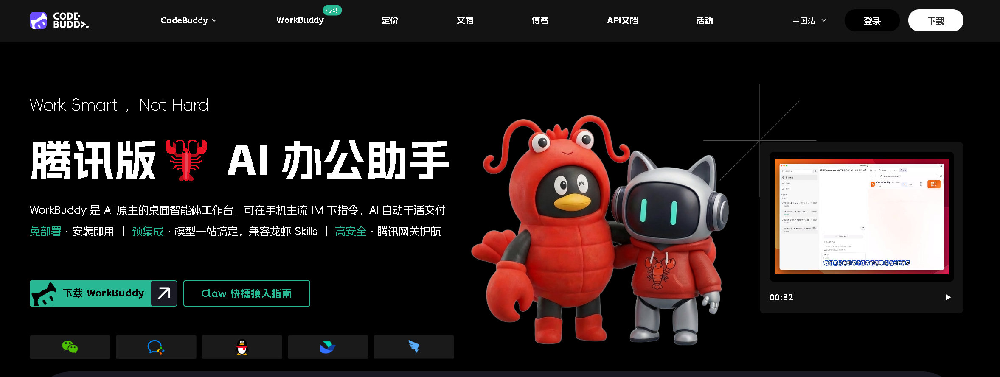
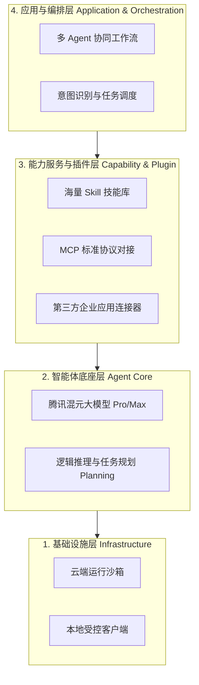

# 腾讯 WorkBuddy 办公智能体洞察报告

> [!NOTE]
> **概念澄清**：虽然常被外界冠以“办公一体机”的称呼，但腾讯 **WorkBuddy** 并非物理层面的实体硬件，而是一款由腾讯推出的**全场景 AI 办公智能体桌面工作台（软件客户端）**。其“一体机”的概念更多是指软件层面上对办公生态、多Agent协同以及软硬件环境的深度“一体化”整合。

## 1. 产品定义与形态

*   **产品定位**：WorkBuddy 被定位为“开箱即用的智能数字同事”或“AI 原生办公桌面工作台”。
*   **产品形态**：它是一个安装在电脑端（或通过网页/移动端访问）的**软件产品**。通过常驻桌面的沉浸式工作台，为用户提供一个统一的操作门户。
*   **核心价值**：推动 AI 从传统的“对话式 AI”（如大模型聊天框）向“行动派 AI (Agent)”演进。它的核心不仅仅是回答问题，而是通过自主规划和调用工具，交付可以直接验收的工作成果（如处理好的数据、排版完成的PPT等）。
*   **行业类比（办公领域的 Claude Code）**：从底层逻辑来看，WorkBuddy 犹如办公领域的 Claude Code 或 OpenCode。它们都具备基于 MCP 协议的智能体工作流（Agentic Workflow）和系统级控制权，核心区别仅在于 Claude Code 面向开发者调用 Git/终端等代码工具，而 WorkBuddy 面向普通白领调用 Office/IM/浏览器等办公工具。

## 2. 核心主要特性与功能矩阵

### WorkBuddy 九大主要特点

WorkBuddy 的核心产品特性可以高度概括为以下九点，这奠定了其作为“智能体工作台”的基础：

*   **极简部署**：免部署安装即用，预集成主流模型并兼容龙虾 Skills，一站式搞定配置。
*   **安全护航**：依托腾讯网关技术，为数据处理与交互提供企业级的高安全保障。
*   **全角色覆盖**：适用于所有职场角色，仅需下达指令即可自动生成多模态可视化办公成果。
*   **自主交付（自主任务拆解与执行）**：具备自主规划能力，可独立拆解并交付多步骤的复杂任务结果。例如，当用户输入“分析这三份财报，提取核心数据并生成对比图表”时，WorkBuddy 会自动将宏大任务拆解为多步子任务，自主调用工具逐步完成。
*   **并行提效（多专家/Agent协同）**：支持多个 AI Agent 并行工作，大幅提升多任务处理效率。系统内置了 100+ 领域专家智能体，面对复杂任务时，WorkBuddy 能够像项目经理一样调度多个不同的 Agent 并行工作。
*   **能力无限扩展（生态集成与零代码扩展）**：内置主流 MCP 协议与 Skills 扩展能力，可灵活突破功能边界。它深度打通了腾讯文档、腾讯网盘等原生生态，并支持企业微信、飞书等主流 IM；同时支持普通用户通过自然语言“教”它新技能，快速搭建自动化工作流，无需任何编程基础。
*   **本地数据自动化（系统级操作）**：能自动批量清洗、分类和汇总电脑内无序的本地文件与数据（如Excel清洗、票据提取、文件归档）。在用户授权的前提下，它具备极强的本地硬盘级操作权限，可直接读取、移动、重命名甚至清洗繁琐文件。
*   **外部调研与创作**：可自动从网络搜集分析信息，直接生成结构清晰的行业调研报告或完整 PPT。
*   **业务洞察与响应**：能深度分析业务数据日志，提炼问题规律并自动生成指导方案与策略建议。

### 详细功能清单（内置 Skill 矩阵）

落地到具体的操作层面，WorkBuddy 预置了超过数十种高频办公功能插件，覆盖了以下典型场景：

*   **文档与文件处理**：
    *   **PDF/Word 深度解析**：批量阅读文档、提取关键信息结构化输出、生成长文摘要。
    *   **Excel 自动化操作**：数据清洗、格式调整、多表合并、透视表生成及复杂公式/Python计算。
    *   **PPT 自动生成与排版**：根据文本大纲自动匹配模板生成幻灯片初稿。
    *   **本地文件管理**：根据规则自动归档、批量重命名、清理或移动本地文件夹中的碎片化文件。
*   **网络与信息获取**：
    *   **网页深度抓取**：自动抓取指定 URL 的网页全文、提取特定字段或监控页面更新。
    *   **全网智能检索**：基于大模型的语义搜索，自动汇总行业动态或竞品资讯并生成聚合页面。
*   **企业应用与通讯联动**：
    *   **IM 远程操控 (OpenClaw)**：正如《OpenClaw平民化》一文所述，它支持通过企业微信、微信、QQ 等通讯工具**远程下发自然语言指令**，让电脑端的 WorkBuddy 在后台自动挂机执行任务并返回结果，实现真正的移动办公。
    *   **邮件自动处理**：自动总结未读邮件摘要、草拟回复、提取/分发邮件附件内容。
    *   **日程与会议管理**：自动提取聊天记录时间线并写入日历，自动拉取并整理在线会议的速记纪要。
*   **创意设计与代码辅助**：
    *   **多模态图文生成**：直接在工作台中一键生成各类营销海报、配图、插画。
    *   **极客代码模式**：继承 CodeBuddy 的纯正研发能力，可编写/审查 Python、SQL、Shell 脚本，辅助前端网页原型设计，甚至直接执行本地数据爬虫与分析脚本。

## 3. 差异化竞争力点

相比于市面上的其他大模型助手（如文心一言、Kimi等）或普通的办公 Copilot，WorkBuddy 的差异化优势在于：

> [!TIP]
> **核心壁垒：任务交付闭环与深度的桌面级控制力**

*   **“结果交付”而非“文本回复”**：市面上大部分 AI 仍停留在“我给你建议，你去操作”的阶段，而 WorkBuddy 强调“我帮你做完，你来审核”。
*   **双模运行与隐私安全**：兼具**云端大模型算力**与**本地任务执行能力**。敏感文件可在本地沙箱环境中处理，无需全量上传云端，极大缓解了企业对数据泄露的担忧。
*   **脱胎于研发效能工具**：WorkBuddy 在架构上继承自腾讯内部打磨多年的代码助手 CodeBuddy，因此在逻辑严谨性、长任务执行稳定性和复杂系统调度上具备天然优势。
*   **深度的企微生态绑定**：借助腾讯企业微信在B端的庞大占有率，WorkBuddy 可以实现“手机企微下发任务，电脑端桌面自动执行”的跨端协同体验。

## 4. 技术架构设计

WorkBuddy 强调“同源底座、分层解耦”的设计理念，其技术架构大致分为以下四层：

*   **基础设施层 (Infrastructure Layer)**：提供云端运行沙箱与本地客户端环境。双端无缝切换，保障长周期自动化任务在后台的稳定挂机执行。
*   **智能体底座层 (Agent Core Layer)**：主要由腾讯混元大模型（如混元 Pro/Max 等版本）驱动。具备强大的多模态理解、长文本上下文处理以及复杂任务的逻辑推理与规划能力（Planning）。
*   **能力服务/插件层 (Capability & Plugin Layer)**：包含海量的 Skill（技能）插件和 Connector（连接器）。通过标准化的协议（如 MCP）与外部应用（GitHub、Notion、Office套件、各类SaaS服务）进行对接，实现工具调用的灵活扩展。
*   **应用与编排层 (Application & Orchestration Layer)**：管理多 Agent 的协同工作流（Workflow），负责将用户意图转化为具体的工具调用链，并监控执行状态和结果纠偏。

## 5. 收费与商业化策略

WorkBuddy 目前采用经典的 **Freemium（免费增值/订阅制）** 与 **B端大客户定制** 并行的商业模式：

*   **C端个人版订阅体系**（近期已进行体系升级）：
    *   **体验版（免费）**：提供基础算力积分，可体验核心功能，但有请求频次限制，适合轻度尝鲜用户。
    *   **付费订阅版（分标准版 / 高级版 / 旗舰版等梯度）**：采用月付/年付模式。不同档位的核心差异体现在：算力积分额度、可并发的自动化任务数量、云端存储空间大小、以及是否能优先调用更强大的旗舰级大模型。
*   **B端企业版服务**：
    *   **SaaS 企业版**：面向中小团队，按坐席（Seat）收费，提供团队知识库共享、成员权限管理、统一资源分配、团队数字员工管理等协作功能。
    *   **私有化/专有云部署**：面向金融、政务、大型制造等对数据安全有极高要求的头部企业。提供独立部署方案，支持对接企业内部私有数据和遗留系统，满足定制化与合规需求。

## 6. 目标客户群体

WorkBuddy 的目标受众实现了从“个人”到“组织”，从“小白”到“极客”的广泛覆盖：

*   **非技术背景的普通职场人（核心盘）**：如 HR、行政、财务、运营等。他们面临大量的数据整理、文档撰写、跨系统录入等繁琐工作，WorkBuddy 可作为他们的“全能助理”。
*   **管理层与业务骨干**：用于快速生成业务分析报表、竞品分析调研、会议纪要总结，提升信息处理和决策效率。
*   **中小企业与创业团队**：在人力资源有限的情况下，利用 WorkBuddy 的 SaaS 版替代部分基础岗位的人力支出，实现降本增效。
*   **大型政企客户**：利用专有云版本，解决内部系统烟囱林立、跨部门协同效率低下的痛点，实现企业知识资产的盘活和业务流程的智能化重塑。
*   **开发者与极客群体**：由于其继承了强大的编码与逻辑基础，具备技术背景的用户可以利用其开放能力构建极具个性的复杂自动化工作流。

## 7. 底座模型与私有化算力需求

WorkBuddy 的核心能力依赖于腾讯自研的**腾讯混元大模型（Tencent Hunyuan）**，尤其是参数量极大、能力最强的版本（如混元 Pro 或 Max 版），以支撑其复杂的长文本理解、多模态任务处理及 Agent 规划推理能力。

对于有数据隔离需求、考虑**私有化/专有云部署**的政企客户，其部署底座模型所依赖的硬件算力需求跨度极大，主要取决于业务并发量与模型选型：

*   **完整旗舰版私有化部署（超大模型：百亿到千亿级参数以上）**
    *   **适用场景**：大型央国企、金融机构，要求在内网隔离下保持复杂任务处理能力。
    *   **算力需求**：极其庞大。通常需要构建**多节点 GPU 集群**，单节点至少需 8 张 80GB 显存的顶级算力卡（如 NVIDIA A800/H800/H200 或昇腾 910B 集群），并辅以 InfiniBand (IB) / RoCE 高速网络与分布式存储。
*   **行业/业务定制版部署（中大型模型：30B - 70B 参数）**
    *   **适用场景**：垂直领域专属处理（如内部检索、代码辅助），使用剪裁或微调后的模型。
    *   **算力需求**：较高。单节点通常需要多块 40GB/80GB 显存的专业显卡（如 4-8 块 A100/L40S），可结合 INT4/INT8 量化技术降低显存占用。
*   **轻量化/边缘侧部署（小模型：7B - 13B 参数级）**
    *   **适用场景**：局域网轻量级数字员工、单点基础自动化任务。
    *   **算力需求**：相对亲民。单张 A10 (24GB) 甚至 RTX 3090/4090 消费级显卡即可支撑推理。

> [!TIP]
> 对于中小型企业，推荐直接使用公有云/SaaS版本以免去高昂的硬件与运维成本；大型企业则可采购腾讯云提供的专有云软硬一体机或 TKE 弹性容器集群方案。

### 补充：模型的开放生态（自带模型 BYOM）

WorkBuddy 同样具备极高的生态开放性，并不强制绑定腾讯混元，它原生支持用户“自带模型”：
*   **接入第三方模型 API**：支持兼容 OpenAI 格式的第三方接口。用户只需在设置中填入其他平台（如 ChatGPT、Claude、智谱、DeepSeek等）的 API Key 和 Base URL，即可在工作台中无缝切换调用。
*   **接入本地开源模型**：借助 Ollama 等本地推理引擎，用户可以一键将本地部署的开源模型（如 Llama、Qwen 等）对接至 WorkBuddy，从而获得零云端算力消耗且完全保护隐私的本地化 AI 体验。

## 8. 总结

虽然被俗称为“办公一体机”，但腾讯 WorkBuddy 的实质是一场**“桌面端办公入口的革命”**。它代表了 AI 应用从单纯的“Chat（对话）”向“Agent（智能体/行动派）”演进的必然趋势。通过将大模型的理解能力与深入系统的控制权限深度结合，WorkBuddy 不仅打破了不同软件之间的壁垒，更正在重新定义未来职场人机协作的边界与范式。
